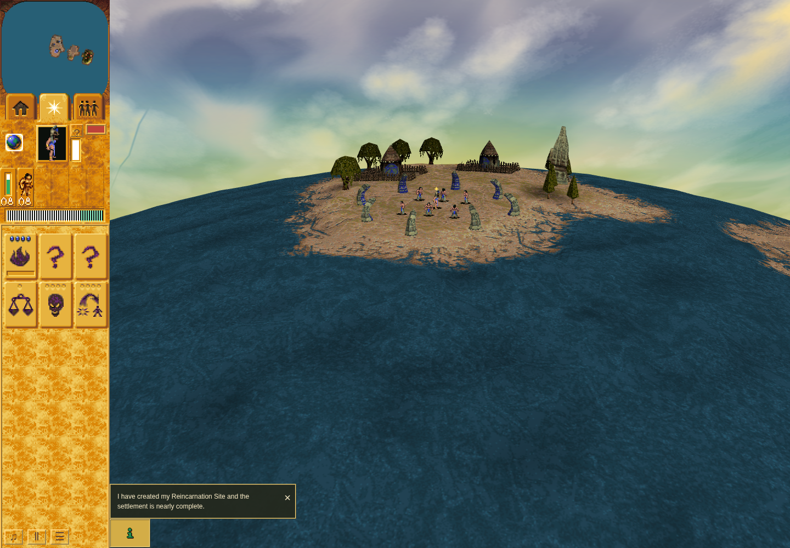
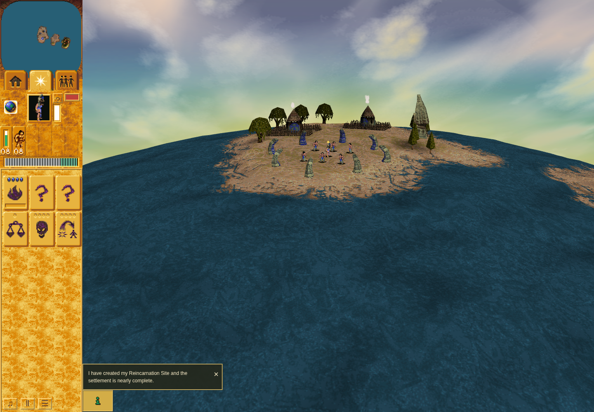

# Issue 214: sprite timing baseline

This evidence accompanies [issue214](https://github.com/JohnDeved/populous-new-dawn/issues/214).
It observes the reported/deployed-source commit
`596475b6839c948604897f8b68ff89c6290cf39d` (tree
`50a8a20de1b348124d7e060025022ce71ce7ecdb`). It is not a fix or acceptance of native
absolute sprite speed. Later main `71b3860e7025a9534d56248c194aa18610b5df4d` was
not rendered by this run.

The [24Hz provenance and current-main correspondence](provenance.md) preserve the
originating adapter choice, speed/fallback/visibility owners, and source adoption
without relabelling baseline receipts. The independently reviewed
[original caller-pacing investigation](native-pacing/findings.md) adds19 finite
native boundary cases with a byte-identical independent replay. Startup requests
draw40 separately from simulation12; application readiness is not a half-rate
gate. Potential DirectDraw/semaphore/device waits are established as dependencies,
with no supplied duration or achieved-rate claim. No runtime rate correction is
justified by these observations alone; the reported visual issue remains open.

## Corrected observation

The independently reviewed read-only observer uses ordinary Mission1 startup,
normal speed1, and public Pause/Resume. It takes an independent RAF snapshot of
existing native pose fields, selected mesh frames and smoke/effect UVs. It does
not replace the game's callbacks or advance its clocks. Chrome Headless Shell
154.0.8037.92, normal sandbox, ANGLE/Vulkan SwiftShader, viewport1440×1000,
canvas1240×1000, DPR1. The inner/outer limits were120/150seconds.

| Segment | Measured interval | Shared animation visits | Simulation turns | Native-backed visible frame/draw matches |
| --- | --- | --- | --- | --- |
| Natural opening |7.983s|192|96|932|
| Public pause |1.5165s|0|0|189|
| Public resume |3.9831s|96|48|434|

Across the complete corrected run, all1,555 native-backed visible Brave/Shaman
samples match the native draw ID and an imported directional-chain frame at the
observed `f2`. The Shaman's actual frame progression matches192/0/96 visits with
no full-cycle sampling gaps. All230 visible hut-root smoke samples match their
expected atlas UVs (134/27/69 by segment); both roots expose all16 frames while
active. All27 paused rows freeze every sampled field except observation times.
Twenty ordinary native-backed walking samples occur naturally.

Heading/camera were not captured: frame checks establish membership in the valid
direction set, not exact chosen direction.344 samples without a native/mesh pair
are excluded. No world-effect or smoke-puff samples were present. Fallback-only
frames, other unit classes/actions, native absolute cadence, the user's actual
device and hardware performance remain unproved. Software callback gaps were
approximately66.7ms median; this is not a60/120/144Hz hardware test. Mesh/UV
correspondence is not complete framebuffer-to-original equality. Eight warnings
remain in the raw browser receipt; there were no page errors.

The original process finished with exit0. Source and bound checker/browser/core/
lock inputs matched before and after; the owned port subsequently refused
connections. The pure observer and its final result were independently accepted
within the limits above.

- [Raw observations](browser-readonly/sprite-observations.json)
- [Browser receipt](browser-readonly/receipt.json)
- [Outer command and input hashes](browser-readonly-command.json)
- [Terminal verification](browser-readonly-terminal.json)
- [Raw frame verification](browser-readonly/rendered-frame-verification.json)
- [Independent raw-data validation](validation/audit.json)
- [Frozen observer](observe-sprites-readonly.mjs)

These are contextual current-game images, not original-game references or
before/after fix comparisons.

## Native per-visit and source checks

The original EXE is verified as SHA256
`3a5065c7420b3fcde208bf220bc86dfbac95e025ab2492caf9c7ea5308dfbe4f`.
The bounded Unicorn2.1.4 check executes `004ee7b0` only, never the original OS:

- All49 imported animation descriptors match the original table.
- All792 frame counts and2,512 imported directional chains retain the exact
  VSTART/VFRA sequence, including repeated artwork.
- Nine representative sequences ×48 native calls match the TypeScript updater.
  The loaded frame-count boundary is supplied from original chains; the real
  level flag disables the independent footprint branch. No callee is intercepted.

[Native raw result and hashes](native/result.json), [probe](native/probe.py),
[source fingerprints](source/identity.json) and
[existing clock regression output](source/game-clock-test.log) are retained.
The four existing clock regressions passed at the recorded source across their
synthetic schedules, proving consistency rather than the right absolute rate.

Ordinary native descriptors14/15 advance each visit; Firewarrior descriptor18
advances every second visit. Main596 samples native records at24 visits/second,
while age-based fallback person/effect artwork uses12 frames/game-second and
simulation runs12 turns/game-second. Game speed multiplies simulation/game age,
not that shared24-Hz clock. Import/updater equivalence and frame-rate independence
do not prove that24Hz matches intended original ordinary-game cadence. Original
outer configuration/readiness/presentation pacing remains separate research.

## Preserved first attempt

The first [observer](observe-sprites.mjs) and its
[outer](browser-command.json)/[inner](browser/receipt.json) receipts remain as
qualified diagnostic history. It functionally passed, but its strict read-only
claim was rejected: `s.screen(u)` queried default height through `nativePosition`
and `syncNativeTerrain`. The corrected observer removes only that call and its
screen-coordinate fields. [Qualification](browser/purity-review.txt).
The first attempt is not an independent pure timing trace.

`manifest.json` records exact published-file sizes and SHA256 values. Scripts are
captured with their original relative paths expected under
`work/orchestration/sprite-animation-timing-214` in the pinned source checkout;
the independent validator originally lived under
`work/reviews/sprite-observer-result-independent`. Reproduction needs that source
checkout and, for the native probe, the separately supplied original game inputs.
This evidence branch contains no game binary, browser profile, credential or
installed dependency. It is not intended to merge into main.
