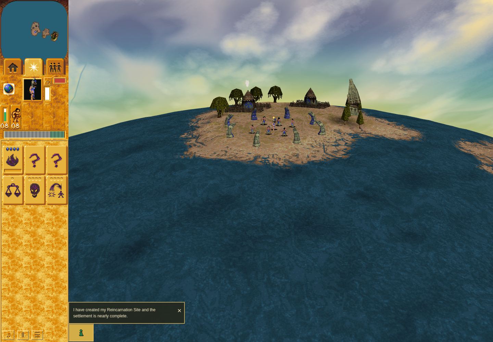

# #214 ordinary native-backed sprite cadence: baseline and candidate

The frozen ordinary Mission 1 observer exposes the missing logical-visit gate on
the **a53 baseline** and passes the finite repaired-person predicates on candidate
**d8897cf**. The same shipped 1×/2×, pause/resume and settings controls are used.
This packet owns bounded ordinary browser evidence. Native composition,
portable lifecycle/refresh/restore tests and final implementation review retain
their separate scopes.

- [Candidate report](candidate-d8897cf/report.md), tested source
  `d8897cf8eeac1886d2f653af2cad0674c6bfa91a`
- [Original immutable baseline report](https://github.com/JohnDeved/populous-new-dawn/blob/8b5e2134e21b1e128e5e100e4530af1042b75ee5/README.md),
  tested source `a53fa05587c4c1d363e3596162b41fcb9f26e3e8`
- [Separate accepted native packet](https://github.com/JohnDeved/populous-new-dawn/blob/681ecb825b997517363b9ab52ac216e394d7b59a/native-logical-gate/findings.md)
- [Complete file manifest](manifest.json)

The baseline commit and raw files are preserved. Its ordinary observer passed
basic controls/render checks; its untouched rows deliberately **fail** the repaired
candidate predicate. That failure-first label is retained. No native packet,
profile, cache, dependency tree, original game/tool binary or authentication data
is included here.

## Matched predicates, separate raw captures

The unchanged observer is [observe-sprite-visits.mjs](observe-sprite-visits.mjs),
SHA256 `cb57bd7076cedb08b042b6f8ad843b088fc613ae6863f3fed3742944eb88a060`.
The same [finite candidate checker](candidate-d8897cf/analysis/analyze-candidate.py),
SHA256 `3aaf2a16871eccbb381dd849bac1ce9a020e95be8c5865f0c1cdc4394106c93d`,
was applied to the untouched a53 rows as a negative control and to d889 rows.

| Candidate predicate failures | a53 negative control | d889 candidate |
| --- | ---: | ---: |
| Missing person gate bit | 2,079 | 0 |
| Stable same-turn logical frame/stamp advance | 95 | 0 |
| Stable Shaman logical cadence mismatch | 164 | 0 |
| Completed logical-turn stamp mismatch | 1,430 | 0 |
| Frame/draw/UV, controls, pause or presentation/smoke mismatch | 0 | 0 |

See the [exact negative-control result](candidate-d8897cf/analysis/a53-negative-control.json)
and [candidate result](candidate-d8897cf/raw/candidate-cadence-attribution.json).
The two independent real-RAF captures have different sample counts; this is not
an FPS or hardware-performance comparison.

The candidate retains f1/f2/stamp in **284 sampled stable logical-owner pairs**
where presentation advances without a logical turn. **1,544 completed-turn stamp
pairs** match the current World.turn. All **2,480 native frame selections and mesh
draws**, **4,960 person-layer UVs** and **447 partial hut-smoke UVs** match their
recorded source/imported artwork. There are **22 genuine native walk samples**.
Shipped 2× and pause/resume checks pass. The presentation and secondary smoke
clocks retain their observed 24 Hz accumulator behavior.

Only **partial hut smoke** is observed. **Splash, full hut smoke and damage smoke
remain unobserved** and are not promoted to ordinary-coverage claims. Source,
object, draw, state and flag transitions are explicitly excluded from stable-owner
cadence attribution. The boundary counter includes missing native endpoints; it
does not count actual source swaps. Sparse RAF rows cannot reconstruct every
intermediate processor visit. No original-OS wall-clock claim is made.

## Comparable rendered views

All images use the unchanged ordinary Mission 1 driver, 1440×1000/DPR 1,
sandboxed official Chrome 154 and software SwiftShader. Still images show genuine
rendered output, not cadence by themselves.

| a53 normal-speed opening | d889 normal-speed opening |
| --- | --- |
|  |  |

[Candidate public resume](candidate-d8897cf/raw/normal-speed-resumed.png) and
[candidate shipped 2×](candidate-d8897cf/raw/shipped-2x-speed.png) retain the other
requested views. Original baseline views remain in `baseline-a53-raw-owners/`.
Console errors are absent. Retained warnings include software-WebGL fallback,
ReadPixels stalls and texture-image warnings; candidate also reports a preload-as
warning. No unsafe sandbox/renderer flag was enabled and no blanket texture or
hardware-GPU acceptance is implied.

## Reproduce the saved-data checks

From this evidence branch with a local game Git checkout containing both source
commits, run these finite offline commands. No dependencies or browser are needed:

```sh
python3 analysis/reproduce.py /path/to/game-git-checkout
python3 candidate-d8897cf/analysis/reproduce.py /path/to/game-git-checkout
```

The wrappers run the exact frozen checkers, read hash-bound imported data from
local Git and require byte-identical saved results. The historical launchers and
absolute paths in receipts identify original execution; they are not instructions
to start an uncoordinated shared-resource capture.

[Candidate command](candidate-d8897cf/command.json),
[inner receipt](candidate-d8897cf/raw/receipt.json),
[corrected launcher receipt](candidate-d8897cf/launcher-receipt.json) and
[terminal record](candidate-d8897cf/terminal.json) bind source/runtime/input hashes,
raw streams, original session 81430 and verified cleanup. The candidate launcher
requires inner passed status with no failure plus separately verified closed
IPv4/IPv6 port 4374 in the same namespace. The browser lane was released before
analysis; dependency inode 925605 remained at the author's checkout.

The [baseline findings](baseline-findings.md), original receipts, preflight review
and transfer summaries retain their original labels and limits. Candidate source
correspondence/checker review and negative-control preparation live under
`candidate-d8897cf/review/` and `candidate-d8897cf/analysis/`. These are evidence
records, not a claim that this sparse branch is the complete game or release.
