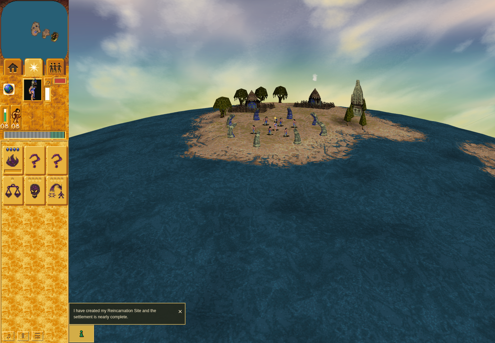
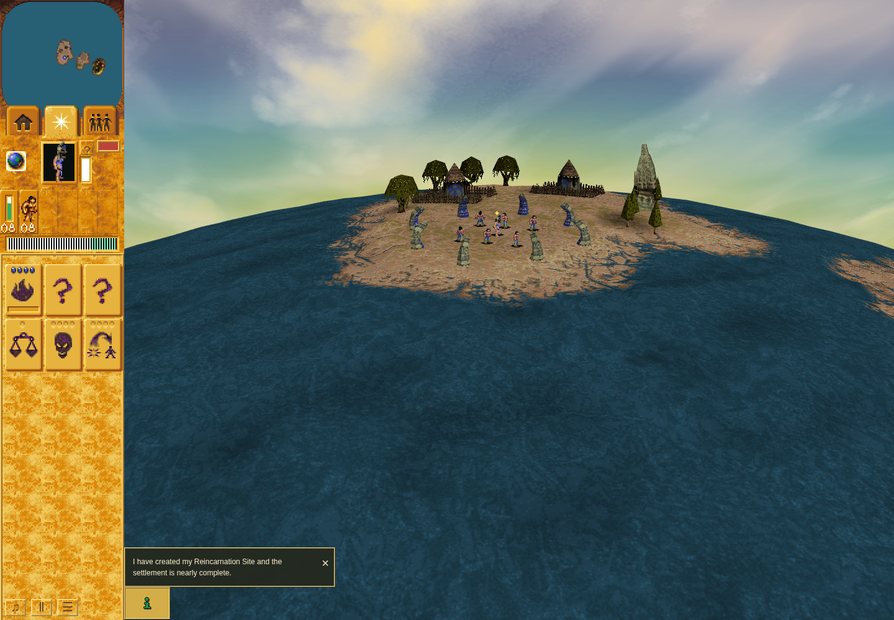

# #214 ordinary native-backed animation gate: fresh a53 baseline

Ordinary native-backed people exhibit the missing logical-visit gate at **1×**:
actual person frames advance in sampled adjacent rows without a logical turn.
The **2× and pause/resume controls passed** their ordinary observation checks.
This packet is the unchanged old-adapter baseline; **no candidate fix is accepted
by this evidence**.

Tested game source: [`a53fa05587c4c1d363e3596162b41fcb9f26e3e8`](https://github.com/JohnDeved/populous-new-dawn/commit/a53fa05587c4c1d363e3596162b41fcb9f26e3e8).
Reviewed pure driver: [`observe-sprite-visits.mjs`](observe-sprite-visits.mjs),
SHA256 `cb57bd7076cedb08b042b6f8ad843b088fc613ae6863f3fed3742944eb88a060`.

The separately published [accepted native producer/dispatcher/gate packet](https://github.com/JohnDeved/populous-new-dawn/blob/681ecb825b997517363b9ab52ac216e394d7b59a/native-logical-gate/findings.md)
provides native interpretation. Its evidence is linked, not copied into this
ordinary browser packet.

## What was observed

- 2,079 raw native-person samples: actual `flags3=0` and `stamp=0`. Sampled owners
  are class1 Brave/model2 and Shaman/model7; 16 genuine native walk samples occur.
- Opening: 8.033 s, 193 presentation visits and 96 logical turns. Sixty adjacent
  same-turn pairs with identical owner/object/draw advance f1/f2 and the displayed
  frame. Public resume adds 35 such pairs.
- Shipped 2×: 97 presentation visits and 97 logical turns in 4.0165 s. No same-turn
  advance was captured there. Paused/settings segments freeze the sampled native
  state and actual frame/UV selections. Restored 1× advances 48 presentation visits
  over 24 turns.
- All 2,079 frame selections match imported native direction cycles at f2; all
  2,079 mesh draws match the selected raw owner; 4,158 visible-layer UVs match their
  recorded imported atlas pieces. Repeated artwork can share pieces/UV despite
  a changed frame number.
- Partial hut smoke is the observed unaffected control. **Splash, full hut smoke
  and damage smoke were not observed.** No artificial effect was created.

Counts describe observed RAF pairs, not every intermediate visit. The source
owner identity is local to each segment. The capture neither measures original
OS wall-clock cadence nor establishes hardware-GPU performance. See the exact
predicates, examples and limitations in [offline attribution](baseline-a53-raw-owners/baseline-cadence-attribution.json)
and [findings](baseline-findings.md).

## Comparable screenshots

Each image is an ordinary Mission 1 screenshot from a53 with the unchanged driver,
1440×1000 viewport/DPR 1 and sandboxed official Chrome 154, using SwiftShader.
They show actual rendered state; a still image alone cannot establish cadence.





## Reproduce only the offline attribution

From a checkout of this sparse evidence branch, with a local game Git checkout
that contains the tested a53 commit:

```sh
python3 analysis/reproduce.py /path/to/game-git-checkout
```

The wrapper reads only the exact commit's imported unit/rule JSON, verifies their
recorded hashes, stages the **unchanged** frozen checker and raw rows in a private
temporary directory, and requires byte-identical analysis output. It needs no
dependencies, browser, server or original executable. The imported source data
are not duplicated in this sparse branch.

`manifest.json` binds every packet file other than itself. Original paths in raw
receipts identify the executed inputs; they are historical provenance, not a
claim that this sparse branch contains the game/runtime at those paths.
`launch-baseline.py` is the exact historical launcher and is **not a portable
instruction to rerun a shared-resource job**. A future rendered run needs its own
source-bound runtime and coordinated isolated resources.

## Receipts, history and limits

[Command receipt](baseline-command.json), [launcher receipt](launcher-receipt.json),
[inner receipt](baseline-a53-raw-owners/receipt.json) and [terminal receipt](baseline-terminal.json)
retain the exact command, source, input/runtime/browser hashes, raw streams,
original session 20513 and terminal success. The same launcher namespace verified
port 4374 closed before and after. Source/input bytes remained stable. Dependency
inode 925605 returned to its donor with unchanged lock hashes; both transfer ends
were receipted. The [transfer summaries](transfer/return.json) retain that result.

The planning snapshot predates execution and the driver preflight acceptance is
limited to observer purity. Neither is a fix review. Console errors were absent;
the retained diagnostics include software-WebGL fallback, ReadPixels stalls and
two texture-image warnings. No unsafe sandbox/renderer option was added.

The older [596475b baseline](https://github.com/JohnDeved/populous-new-dawn/blob/0a4189633e96740006754b278208855625a248bb/README.md)
keeps its historical labels and limits. It lacked flags/stamps and is not relabeled
as this fresh a53 capture. No historical files are overwritten by this packet.
Profiles, caches, dependencies, original game/tool binaries, authentication data
and the native research packet are excluded. Issue 214 remains open for candidate
implementation and acceptance, plus any unsampled families requiring their own proof.
