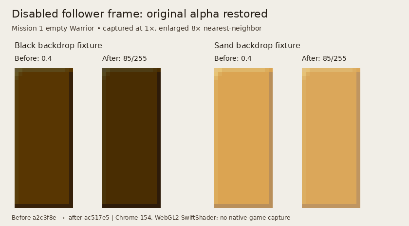
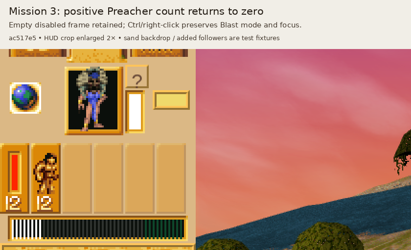

# Disabled follower frames: ghost alpha, not palette tint

Issue #60 follow-up on accepted base `7dcd89f9858600d9bd889d00a758fb78baa13f73`.
Executable SHA-256: `3a5065c7420b3fcde208bf220bc86dfbac95e025ab2492caf9c7ea5308dfbe4f`.

## Result and correction boundary

The ordinary D3D follower frame uses white diffuse RGB. Enabled frame vertices have
ARGB `ffffffff`; disabled frame vertices have ARGB `55ffffff`, alpha **85/255**.
All nine pieces, including the four corners, use that same alpha. The browser's
inherited `button:disabled { opacity: .4 }` is therefore too opaque. The bounded
correction is a follower-strip-only alpha override. No palette tint, importer,
training knowledge, simulation, or Followers task-table change is needed.

`00516270` does have a palette-derived tint branch, but it is conditional on using
an AL table rather than `ghost0_mem`. Inferring that branch from `vertices_flags & 8`
alone was incorrect. Keep the pointer, alpha, and final queue state in the proof.

## Upstream state and real native consumers

- Ordinary display/game setup at `005004ad..005004c2` and `00500858..0050085d`
  pushes `00974560` (`ghost0_mem`) into `00516270`. Its ghost branch writes
  `vertex_palette_color = 00ffffff` and stores that pointer at `005d5708` and
  `005da0e8`. The alternate branch reads `palette[table[2f82]]`; the follower
  callback itself never selects an AL table.
- `005d570c` (`color_related_1`) is initialized in the executable to `00000055`.
  A bounded direct-reference scan of the executable code finds its writes only in
  `004fdbc0`: the pulsing presentation branch changes it temporarily when
  `0089c66c & 80` is set, then restores `55` at `004fdffd` before returning.
  The unflagged path does not change it. This is separate from the follower state.
- World/effect AL uses return the pointer to ghost, including terrain's shared
  `0046c178..0046c185` restore and the restores retained in `0041e5b0`,
  `00475860`, `00480ea0`, and `0049daf0`. The generic menu font restoration at
  `0045916e` is not a follower-table selector.
- `00522570` draws the HUD through `0044ac00`; that dispatcher calls each visible
  live control's `+53` draw callback. `004a1170` sets a class visible regardless
  of count, and enables it only for a positive live total.
- `004a0510` sets or clears flag 8 from `control+8`. It passes the actual normal,
  hover/held and selected tables (`005caba8`, `005cabc0`, `005cabd8`) to
  `004a1dd0`. Hover/held wins over selected; normal applies otherwise.
- `004a1f50` submits five tiled pieces via `0047dfd0`, with tiling flags
  `[12,4,4,8,8]`, and four corners via `005162e0` / `0047dc50`, tiling flags 0.
  All receive the same disabled vertex flag 8.
- Both queue paths execute `004f95a0`. With flag 8 and the ghost pointer it selects
  render type `51` and ARGB `55ffffff`; without flag 8 it selects type `11`
  and `ffffffff`. `0047dc50` replaces only corner RGB, preserving alpha.
- `004f98a0` prepares UVs/geometry and does not overwrite diffuse color.
  `004f9bc0` copies the queue's ARGB word unchanged into all four final vertices.
  The default state setup `005221e0` selects source blend 5 (source alpha) and
  destination blend 6 (inverse source alpha). `0047d6f0` retains inverse-source-
  alpha for this frame state; flag `40` selects modulate-alpha texture blending.

The original 15×36 pieces partition the frame without overlaps. The native probe
checks every pixel's coverage is exactly one and that native piece rasterization
matches all three retained imported PNGs. Therefore applying the same alpha once
to that composite background preserves the per-piece blend. There is no runtime
canvas, asset rewrite, or extra render pass.

## Executable proof

Run:

    python scripts/check-native-follower-frame-alpha.py /path/to/d3dpoptb.exe

The probe executes `004a1170`, `004a0510`, `004a1dd0`, `004a1f50`,
`005162e0`, `0047dfd0`, `0047dc50`, `004f95a0`, and `004f9bc0`.
It covers four tribes, all five class models, counts `0 → 1 → 3 → 0 → -1`,
and normal / hover / held / selected / hover+selected states: 500 cases,
4,500 queued pieces, and 18,000 final vertices.

Supplied boundaries are coordinate adapters at 640×480, source HFX dimensions,
texture-bank/cache handles, and the texture-cache upload leaf. After the real frame
has returned to `004a0510`, the probe stops before icon/font rendering; existing
population/count checks own those consumers. It does **not** intercept any color,
alpha, frame selection, piece geometry, native queue initializer, or final vertex
emission. The ghost setter executes natively; its upstream selection is established
by the static setup and pointer-writer trace above, not by a full game launch.

This improves on `check-native-hud-population.py`, whose `005162e0` and queue hooks
capture frame geometry before the relevant tint/alpha decisions and whose class
cases force the enabled field. That older proof alone cannot establish disabled
frame appearance.

The browser scenario `scripts/check-browser-follower-frame-alpha.mjs` exercises
shipped Mission 1 startup and Mission 3 startup with explicitly added preachers.
It compares every disabled-frame pixel against source PNG art blended at 85/255
over black and sand backgrounds, plus unchanged enabled/hover/selected borders,
1× and 2× HUD size, wide viewport / DPR 2, and positive-to-zero recovery.
Disabled Ctrl-pointer and right-click must preserve mode, selection and focus.
Injected followers establish presentation/interactions, not natural training parity.
Headless SwiftShader results do not establish desktop hardware performance.

## Export provenance

The four newly retained exports were produced on 2026-10-04 using Ghidra 12.1.3,
Temurin JDK 21.0.12.1 and a fresh project containing the exact executable above.
No community metadata was imported into that project; names remain raw. The
two already-retained exports (`0044ac00`, `004f98a0`) remain unchanged; their
new raw exports were inspected only. Other existing named exports are reused. Wrapper completion and
raw logs are retained with the task's source-bound check receipts.

    python scripts/decomp.py export 0047dfd0 0044ac00 004fdbc0 004f98a0 \
      --project-dir <verified-projects> --project-name populous-restored \
      --output <task-native>/exports
    python scripts/decomp.py export 004a1170 004f9bc0 \
      --project-dir <verified-projects> --project-name populous-restored \
      --output <task-native>/exports

Hashes are indexed in `decomp/exports.json`. No full original-game screenshot,
software renderer equivalence, or broad UI parity is claimed by this bounded work.

## Rendered acceptance — 2026-10-04

The first development run exposed two checker setup errors: initial Shaman
selection contaminated the selected-frame case, and the native icon's y=3 row
partly overlaps the top border. The repaired checker clears selection through
Escape and excludes the known native icon rectangle only for enabled border
comparisons. Every disabled-frame pixel remains checked. A second unchanged-code
baseline was captured before applying the production correction.

- **Red:** local `a2c3f8e0934359a4f144bf7f882590923b193349`,
  inherited opacity `.4`: exactly 12 disabled comparison groups fail, maximum
  channel error 17 on black / 9 on sand; enabled/hover/selected borders pass.
- **Green:** local `ac517e53373534ca99433e0261230d2d50c63425`, tree
  `6e6eb3ea5bb6e1b8ea3e9c389bae0b30ce12909a`: all 26 crops pass with maximum
  channel error 1 (8-bit compositing rounding), no errors, and computed disabled
  opacity `0.333333`. Enabled controls remain at opacity 1.
- Mission 3 injected Preachers select through ordinary Ctrl-click, then returning
  their live count to zero removes icon/count art while retaining the frame.
  Disabled Ctrl-pointer/right-click preserves `mode=blast`, empty selection, and
  every focus cursor. Mission 1 begins with real empty specialist controls.
- Viewports: 1440×1000 at HUD 1× / 2×, and 1920×1080 at HUD 2× / DPR 2.
  Chrome Headless Shell 154.0.8037.92 reports actual WebGL2 ANGLE/Vulkan SwiftShader.
  The world RAF is suspended after real startup; HUD interactions still run through
  shipped React controls. This is a focused presentation test, not performance QA.

The images above are actual browser control screenshots enlarged with nearest-
neighbor sampling, with their exact before/after source labels. They are not
original-game captures. The full Mission 1 scene had a frozen sky-facing camera,
so only its relevant HUD crop is used for review.

The Mission 3 image is an explicitly labelled crop from the corrected game scene.
The flat sand backdrop and added followers are presentation fixtures. The unedited
full screenshots and source-bound raw `browser-red/receipt.json`,
`browser-red/pixels.json`, `browser-green/receipt.json`, and
`browser-green/pixels.json` are retained under the task's local review artifacts.
The production change is one follower-only opacity declaration; the global disabled
rule, existing assets, enabled artwork, interactions and simulation remain unchanged.
