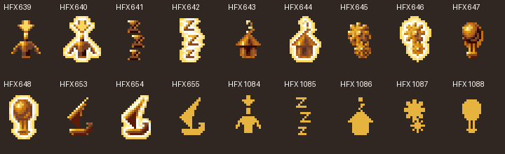
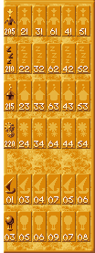
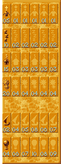

# Native Followers task panel

Issue #60 evidence recovery on base `c373fa1ba1512ffd8a3e63fcca7df47e63221add`.
No production UI/CSS, imported runtime assets, browser behavior or parity ledger is
changed. This note supplies the missing lower-panel evidence rather than reviving
the removed duplicate roster.

## Result and source boundary

The original lower Followers panel is a **six-column, six-row task/transport table**:

- columns: Total, Brave, Warrior, Firewarrior, Preacher, Spy;
- first four rows: Currently Selected, Idle, Housed, Busy;
- final two rows: Boats Occupied and Balloons Occupied.

This is established by the EXE's descriptors, executed callbacks, and original
English tooltip strings 777–812, not by issue summaries or visual guesswork.
The old `followers-tab.md` negative scan ended at `005cc000`; these descriptors begin
at **`005cc6f0`**, outside that bounded scan. The older finding correctly rejected
the duplicate class grid but never excluded this original task table.

Canonical EXE SHA-256:
`3a5065c7420b3fcde208bf220bc86dfbac95e025ab2492caf9c7ea5308dfbe4f`.
The Ghidra 12.1.3 project `populous-restored` was exported using Temurin
21.0.12.1 on 2026-10-04. `ExportFunctions.java` verified every canonical file-backed
section against `decomp/sections.tsv` before scoped six- and ten-routine exports
completed. The second window added `0044c650`, `00451080`, `004514f0`, `004a0bf0`,
`004a13c0`, `004a14b0`, `004a14e0`, `004a1580`, `004deb40` and `004e31f0`.
Preserved existing classifier export `004513e0`; new exports: `004a0200`, `004a0e70`, `004a11e0`,
`004a1240`, `004a1340`; hashes are indexed in `decomp/exports.json`.
Pseudocode is not original source; executable probes remain authoritative.

## Exact descriptors and artwork

Root record `005cd178` has ID 4, child pointers `005cc6f0`, logical rectangle
**(0,204,100,277)** and renderer `004a1720`. Each child is a 66-byte record.
There are 36 controls, followed by a type-9 terminator at `005cd038`.
All have 15×34 logical geometry and zero construction-mode byte at record `+65`.
Columns have x positions 0/16/32/48/64/80. Relative row y positions are
6/47/88/129/190/231. Root-relative **logical** placement gives row y positions
210/251/292/333/394/435. The gap before transport is present in original data.

The first 24 descriptors are stored column-major, with key `model*5 + row`, where
row is 0–3. Models are **0,2,3,6,4,5** in visual order. The last 12 are row-major,
with key `model` for Boats and `model+8` for Balloons. Tooltip IDs are row-major
777–812 regardless of descriptor storage order. The complete address, geometry,
art, callback, key and original-label inventory is in
[follower-task-panel/native-panel-contract.json](follower-task-panel/native-panel-contract.json).

Exactly eighteen missing sprites are consumed:

| Use | HFX |
| --- | --- |
| Total Selected normal/pressed | 639 / 640 |
| Total Idle normal/pressed | 641 / 642 |
| Total Housed normal/pressed | 643 / 644 |
| Total Busy normal/pressed | 645 / 646 |
| Total Balloons normal/pressed | 647 / 648 |
| Total Boats normal/pressed | 653 / 654 |
| Class Boats silhouette | 655 |
| Class Selected/Idle/Housed/Busy silhouettes | 1084 / 1085 / 1086 / 1087 |
| Class Balloons silhouette | 1088 |



Native input/pixel identities, sprite dimensions/RGBA hashes and disabled draw
contracts are retained in [native-panel-art.json](follower-task-panel/native-panel-art.json).

The class columns use the **task silhouette**, not repeated follower portraits.
`004a0e70` chooses `1083+category`, categories 1–4. Total cells use their own normal
or pressed pairs. Vehicle renderer `004a1580` chooses 655/1088 for class cells,
while Total cells use the descriptor pair. Some artwork is 17/18px wide despite the
15px cell: do not crop it to the button rectangle. Native framing uses the existing
`005caba8/005cabc0/005cabd8` frame families with **34px** height, not the persistent
strip's 36px height. Background/frame uses original root renderer `004a1720`.

The following image is a reconstruction of **executed native draw requests** with
supplied logical-coordinate adapters, raster consumers and synthetic counters. It is not a running-game or
browser screenshot. Original HFX and font pixels are retained.




## Construction, rounding and empty-cell presentation

Unhooked `0044c650(4)` creates all 36 child controls in both native display modes
(`0089c661` bit 8 clear/set), copies the exact callback/key data and links the
runtime child list in reverse descriptor order. Reopening reuses the same root and
36 controls. Native refresh changes Brave cells to disabled after its live total
becomes zero and hides transport rows when vehicle-presence flags disappear.
No construction knowledge gate is present in these records.

The constructor normalizes coordinates using truncated 16.16 fractions. Real
`0044a1f0/0044a210` conversion at 640×480 realizes column x positions
**0/15/31/47/63/80** and row y positions **209/250/291/332/393/434**, differing
from regular logical descriptors by up to one pixel. The exact per-control values
are in `constructorCases` in the contract JSON. The retained images deliberately
show logical-coordinate reconstruction, not this old rounding or a complete native
UI painter-order frame. Modern compatibility can use the regular logical grid,
but must identify that as a rounding correction rather than exact legacy pixels.

`004a0bf0` draws a frame and an opaque task/vehicle silhouette even for a disabled
class cell. The frame draws carry disabled flag 8, then `004a1dd0` clears it before
the silhouette submission. Six executed zero-count cases prove this for all four
tasks, Boats and Balloons. They format zero but submit **no number glyphs**. A
lower cell is therefore not visually equivalent to an empty persistent class button,
whose renderer omits the class portrait. This packet proves draw flags/geometry;
it does not reconstruct the disabled blend or silently dim the whole control.

## Task counts and enabled state

`004ecac0` rebuilds global task matrix at tribe+`0xaa5` (`0089dc6d` for player 0)
and nearby matrix at tribe+`0xb11` (`0089dcd9`). Each model owns six signed-short
buckets. Renderer uses category 1–4. Total row sums models 2–6 and excludes Shaman.
Nearby display is selected by tribe+`0x93d` bit `0x80`; radius is strictly less than
`0x2400000` squared toroidal position units (6,144 radius).

The producer requires an active registered person (`flags4 & 0x20000000`),
excludes Wildmen/model 1 and model 8, and excludes ghosts (`flags4 & 0x800`). It
adds the result of real classifier `004513e0`, then adds selected-bit `+0x7a & 0x80`
separately to bucket 1. A selected person can also be Idle/Housed/Busy: these rows
are not mutually exclusive totals. Some raw native state-table entries themselves
return category 1; crafted combinations can therefore double-count that bucket.
The probe preserves that arithmetic and does not claim every crafted state is
reachable during ordinary play.

Classifier `004513e0` uses the 46-state table at `005a6f78` (stride 5), state-10
command-status table at `005a7db8` (stride 22), state-21 inside-building descriptor
category (`005a725a`, stride 76), attached-vehicle `+0x9f` override and native
Preacher current-command predicate. A generic browser `inside` or `busy` Boolean
is insufficient evidence for these counts.

Class refresh `004a11e0` always shows a cell and enables it only when its **global
class total** is positive, independently of task count and nearby count. Zero live
class total clears the tooltip and disables the cell; a present class with zero
members in this particular task keeps its cell enabled. Total task controls have
no-op refresh `004a13b0`, not the class-live gate.

Vehicle counts are separate matrices: Boats at `0089dd9f/0089ddb1`, Balloons at
`0089ddc3/0089ddd5` (global/nearby). Executed full-producer cases count occupied vehicles with at least one matching
passenger class, not passenger headcount: two Braves in one Boat add one to Boats
With Braves. Empty and opposing-owner vehicles do not add occupied counts.
`004ecac0` uses vehicle `+0xa1` for the count/presence owner; selection/focus use
`+0x2f`. The test supplies consistent owner fields and does not erase this distinction.

## Click and focus contracts

All task cells use left callback **`004a1240`** and right callback **`004a1340`**.
Key decoding is model=`key/5`, category=`key%5+1`. Left dispatch goes through
`00450f30` to actual command handler `0043e8e0`:

- ordinary click: command `0x7d`, nearest matching task/class follower;
- Ctrl: `0x72`, up to five through category-aware nearest selection;
- Shift: `0x54` for Total, `0x55` for one class; Shift takes precedence;
- Selected row ordinary click **deselects one**; Shift **deselects all matching**;
- Selected-row Ctrl leaves selection bits unchanged: the five command sets the
  already-selected bit rather than toggling it. It still clears `flags3` bit
  `0x10000000` on the nearest selected target, so it is **not** an unconditional
  no-op. Its tooltip does not advertise Ctrl. Do not invent Ctrl-deselect-five.

The persistent strip's assignment-priority search does **not** govern these task
cells: nonzero category branches directly from `00451720` to category-aware
`004518c0`. Same original input gates remain: overview mode, level lock, blocked
input, drag/press modes. Exact allowed `flags3` changes are tested: selection clears
`0x10000000`; deselection clears `0x80`. Other person bytes are preserved.

**Total is asymmetric:** counts and Shift-all exclude the Shaman, but single/Ctrl
nearest task search and right-focus can include a matching model-7 Shaman. The
probe places a Shaman nearer than a matching Brave in every category and verifies
all four actions. Do not add an unconditional Shaman exclusion to the Total filter.

Right click dispatches `004de810(model, category, shift)` and remembers a separate
person per **model+category** pair. It finds a nearest match, cycles native tribe
list order and wraps, and lets Shift include reserved people. Initial nearest
focus applies nearby radius, while later cycle matching uses `00451ac0`, which
exempts the Shaman from the distance gate. The regression first focuses a nearby
Brave and then cycles to a matching Shaman outside the radius. It focuses camera and opens the person panel without changing selection
or orders. The current browser helper only implements category 0, so merely
reusing its existing signature would silently omit required task filtering/memory.

Vehicle rows have separate callbacks **`004a13c0/004a14b0`**, refresh `004a14e0`
and renderer `004a1580`. Left callback decodes model=`key%8` and vehicle kind
1 (Boats) / 3 (Balloons), then uses producer `00451080`:

- click emits `0x81`, Ctrl `0x80`, Shift `0x7f` (Shift precedence);
- model filter means a vehicle containing that class, not selecting only passengers
  of that class; native `004e31f0` selects every eligible passenger aboard;
- single/five uses `004514f0`: first prefer vehicles whose first passenger's command
  status is zero, then fall back to the others. Eligible matching passengers must
  be unselected/unblocked. Distance ranking uses the matching passenger's position,
  while nearby inclusion checks the vehicle's position. Both distinctions have
  targeted executable regressions;
- Shift iterates matching occupied vehicles and selects their eligible passengers;
- right click uses `004deb40(kind,model)`, independent per-kind/model memory and
  list cycling. It opens/focuses the vehicle, preserving passenger and vehicle bytes.
  The initial lookup uses the same nearest helper with its focus inclusion mode
  and accepts already-selected passengers. **Native variant caveat:** search/cycle
  lists include model2/4 as Boat/Balloon variants, but remembered focus validates
  exact model1/3. With three occupied model2 (or model4) vehicles, four right clicks
  all reacquire the same nearest vehicle; they do not cycle. Ten additional focus
  edge cases retain that asymmetry instead of assuming ordinary cycling.

Vehicle refresh `004a14e0` shows a row only when tribe+`0x941` has vehicle-presence
bit `0x100` (Boat) / `0x200` (Balloon). This can be set by an empty owned vehicle;
it is not a knowledge-unlock or occupied-count gate. Total remains enabled;
class cells use live global class existence, not count of class-containing vehicles.
144 refresh cases, 48 left producer cases, two mixed full count rebuilds, eight
focus cycles, ten variant/selected-passenger focus edge cases, six full
passenger-propagating commands and ten search-priority/nearby cases
bound this transport evidence. Broader vehicle gameplay/ownership transitions are
not established by these crafted cases.

## Reproduction and acceptance

With the verified local prerequisites selected:

```
python scripts/check-native-followers-panel.py "$POPULOUS_EXE" --output work/orchestration/follower-task-panel/native
python scripts/capture-native-followers-panel.py "$POPULOUS_EXE" work/orchestration/follower-task-panel/native/render
```

Passed: 36 descriptors/root; 1,152 left callback/producer cases; 48 right callback
cases; 80 class-refresh cases; 194 native classifier cases; 36 complete task commands;
184 full native count rebuilds; 16 complete category focus cycles; 31 additional
Shaman/mixed-category/nearby-cycle cases with exact flags3 masks; four 36-cell
normal/pressed × global/nearby native renderer captures; six disabled draw-contract
cases; two complete native constructions plus two reuse/refresh transitions; and
the bounded transport cases above. The raster probe intercepts
coordinate adapters, CRT formatting, bank lookup and final raster queues. It executes
native frame/icon/font-placement routines. Only enabled pixels are reconstructed;
disabled diffuse is asserted absent rather than approximated.

No runtime source changes means browser checks, app typecheck/build and hardware
performance are not evidence for this research change and have not been run.
Original-game runtime screenshots, full tab/input-loop and painter-order behavior,
all transport gameplay/ownership transitions, disabled lower-cell blend raster, live
browser classification adapters and playable UI integration remain open. Those limits block
production/parity claims, not the scoped recovered evidence above.

## Occupied-transport live integration

The transport-row work uses the actual `World.vehicles` and passenger slot owners,
not the follower-task classifier. `hud-transports.ts` compares directly with the
native count rebuild, complete command handler and focus owner in
`check-native-follower-transports.py`: 480 deterministic mixed-owner, mixed-class,
blocked/selected, model-variant, nearby and six-click focus cases. The global vehicle
list rebuild prepends each vehicle; browser search/cycling therefore traverses the
creation array in reverse without mutating that array.

`check-native-transport-ownership.py` adds 39 executed owner-transition cases.
Native vehicle `+0xa1` is the real count/presence owner; `+0x2f` is the apparent
selection/focus owner. Every successful boarding writes both; Spies publish their
disguise target bits immediately, even during the countdown. Every unboarding
writes the departing person's real tribe to `+0xa1` and preserves `+0x2f`.
Command16 changes only `+0x2f`, immediately. Countdown expiry and the isolated reveal
leaf do not write either vehicle owner. Destruction's passenger loop ends with the
last departed person's real owner; retained empty wrecks still establish row
presence until actual disposal.

The browser keeps `Vehicle.team` as its existing real-owner interpretation and adds
optional `apparentTribe` for the proved apparent-owner consumers. Missing legacy
values fall back to team; an unboarding captures that fallback before updating team.
The field is stored by the existing structured-clone checkpoint. The shared fallback
also feeds vehicle UV creation/frame-cache refresh, damage immunity (`00466f00`)
and the class4 Blast projection. Full native model dispatch in
`check-native-vehicle-materials.py` establishes that tribe textures consume `+0x2f`;
its live-model input must be genuinely captured, not synthesized. Computer inventory
and presence/count consumers retain real team. Tooltip owner is unused, and the
movement adapter's synthesized Boat bit has no proved apparent-owner contract;
neither is changed by this slice. This is not blanket vehicle-rendering or combat parity.

The owner probe executes initializer, boarding, unboarding, driver promotion,
destruction passenger loops, target-bit computation, count rebuild and search.
It supplies animation/list/terrain leaves, a fixed ejection destination, object
storage and animation tables. Command16 stops at its shared completion boundary;
Spy countdown executes only the updater prefix. It does not establish final
terrain-dependent disposal, allocator reuse, arbitrary mixed-tribe boarding
eligibility, or complete game-loop behavior.

The previously blocking state30 initializer and kind9 passenger panel/unload path
were accepted separately in PRs #186 and #187, now on main `b8465001`. Transport
right-focus therefore reaches the real vehicle panel. The new voluntary-unload
owner writer also captures a missing legacy apparent-owner fallback before changing
real team; a failure-first restored mixed-owner checkpoint demonstrates why this is
required. The optional field does not replace the real count/presence owner.

Controls use the accepted 18-sprite source atlas without regenerating assets. Each
kind appears only while a real-owned craft exists (including an empty retained wreck),
counts each occupied craft once for every class aboard, and retains global class
presence for enabled columns. Nearby inclusion uses craft position while acquisition
ranking uses the matching passenger position. The new per-kind/class remembered
focus is independent of population and task memories and clears naturally with a
new scene/checkpoint, matching those existing browser controller lifetimes. Inactive
zero-passenger wrecks cannot be acquired. Selection/drag/input gates retain the
accepted task-row behavior; only selection exits construction/spell modes directly,
while successful right-focus uses the existing camera focus cancellation owner.

Supporting tests cover current passenger class transitions, mixed-tribe first/later
boarding, exits and reuse, legacy/new checkpoints, Spy disguise completion aboard a
Boat, and count/read nonmutation. They do not claim arbitrary mixed-tribe gameplay
admission or a native boarding countdown. Full rendered and aggregate acceptance
is tracked in PR #185; issue #60 stays open until its complete acceptance is met.

### Modern height budget

The native Followers dock ends at logical y481. At720px and the previous1.5
HUD scale, the modern14px footer at bottom3 began at logical y463 and covered
the last Balloon digits. The scale helper preserves the original nominal auto
steps and saved manual preference, then clamps actual fit to a500px logical
height budget. That places the footer at y483 or lower without moving native
art or controls. Fractional-scale source pixels, footer nonoverlap, and actual
center/digit hit targets remain required rendered acceptance.

### Rendered fixture and owner-consumer boundaries

The rendered checker preserves the authored Mission22 population. Added crews
first board the actual authored craft through mesh clicks; it captures that result
before explicitly cancelling their command22 routes and putting those supporting
crews into state30. Extra craft/crews are controlled state, not natural acquisition.
Only the Boat containing the test Spy boards that Spy first. The ordinary disguise
control is established for this driver path. A prior executor observed a queued
non-driver command16 unchanged through64 ticks, while driver/sole-Spy completion
occurred after one tick. That observation does not prove the complete native
non-driver scheduler, and no scheduling repair is folded into these controls.
Balloon commandPosition remains separately unported.

The source-pixel oracle composes the original full native panel and lower cells,
then uses the actual DOM scale, origin and device-pixel ratio. Element screenshots
round clips outward in CSS pixels; padding is explicitly included without stretching
the native reference or changing its channel-error threshold. Responsive acceptance
also checks footer separation and actual center/digit elementFromPoint ownership.
The safe rendered run captures only the two already-focused actual vehicle meshes
for the maintained full native geometry/material consumer. Its live UV checks cover
creation, disguise refresh, checkpoint reload and the inverse real/apparent fixture.

After an executor reset, the unpublished historical screenshots/receipts and local
commits9f662ef/199ed20 were unavailable. The recovered branch starts from the verified
remote35c6075. Reconstructed changes have new hashes and new failure-first receipts;
historical failed attempts are not relabelled as a successful current run. Final
source-bound native/rendered/aggregate evidence must be collected again.
