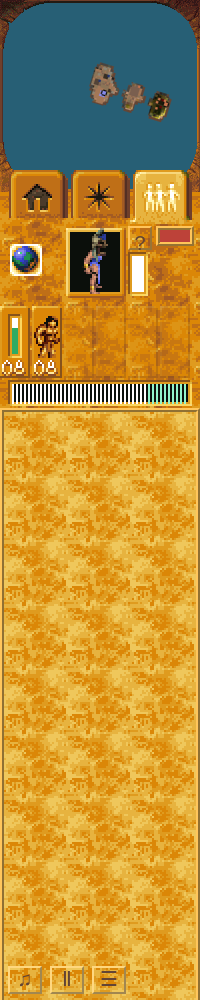
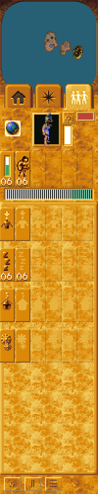
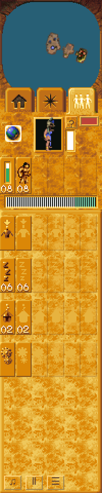

# Followers task rows: live integration

Implementation base: `12bdb1635126be60ed9d99fe29690b44622f2d50`, the accepted
`01bdd90` runtime plus the separately accepted `734309e` research packet.
The original [task-panel research](follower-task-panel.md) remains authoritative
for recovered descriptors and native boundaries.

## Bounded outcome

Restore the four task rows (24 controls): Selected, Idle, Housed and Busy, with
Total/Brave/Warrior/Firewarrior/Preacher/Spy columns. Occupied Boat/Balloon rows
remain a follow-on. This is not complete Followers-panel or issue #60 parity.
No parity ledger credit is requested.

The live path is `page.tsx` → `FollowerTasks` → `GameScene.chooseFollowers` →
`selectFollowerTask` / category-specific focus. The persistent selection strip
keeps its existing category-zero behavior and separate focus memory.

`hud-tasks.ts` ports the recovered classifier, native additive counts, task-nearest
selection/deselection and per-task focus. Native total counts and Shift-all exclude
the Shaman, while nearest single/Ctrl/focus can include it. Ctrl on Selected
reselects the nearest selected person and clears only its selection-work flag;
it does not deselect five. Task commands also propagate selection to the existing
occupied vehicle's passengers, even though transport-row controls are not added.

The count producer uses the raw camera/tribe position for the strict 6144-unit
nearby radius. Selection/focus-nearest use the containing cell's center instead.
`check-native-follower-tasks.py` compares both at non-cell-aligned camera positions
and exact-radius boundaries. Initial focus applies nearby range to the Shaman;
later per-task cycling uses its native range exemption.

## Live controller boundary

HUD reads never allocate, register or attach a person, change orders, or consume
RNG. Native state/status, current command, vehicle and inside-building descriptor
own classification. The native inside-building mapping distinguishes huts
(Housed) from training/working buildings and towers (Busy).

Some shipped browser actions retain separate legacy task owners. Their narrow
read-only classifier projections use explicit native command identities:

- G guard flag → command 30. `check-native-follower-task-adapters.py` executes
  key action 0xc1 → tribe command 0x82 → original producer 00443b40, which requests
  command 30 targeted at the Shaman. The browser's existing per-unit G toggle
  gameplay is unchanged and is not claimed equivalent to the original producer.
- Tree/harvest/delivery → command 7. The retained original 004340a0 keeps harvesting
  and its delivery tail in that command; cargo alone is not a task.
- BuilderTask activity → command 6, including an active builder whose person still
  has commandStatus0.
- The exact live building's pre-entry journey → command 8; an adopted native
  entry/dismantling person retains its actual command 8/10 state.
- Independent legacy movement → command 3. A native idle-approach route remains
  Idle and is not reclassified solely because it has waypoints.

Flight/fight and exceptional native controllers suspend these projections, as in
`world-turn.ts`. Dormant native Idle records do not conceal active legacy timber
work. State10/status0 remains category0 when no proved task owner applies.
Brand-new people without a controller likewise have no invented task category;
their first ordinary resting visit establishes Idle. Selection still uses the live
roster bit, and class existence follows the live registered-person lifecycle.

These projections provide task-category continuity; they do not claim complete
native legacy work/guard gameplay. Broader native command migration is separate.

## Artwork and compatibility

`scripts/import-follower-tasks.py` verifies the supplied executable and HFX/palette
hashes, checks all 18 RGBA hashes against the accepted research packet, and imports
a separate tiny atlas. Existing HUD atlas coordinates and pixels are untouched.
The task frames use 15×34 geometry. The native root background/frame is 100×277.
`check-native-follower-task-art.py` compares imported root and frames to executed
native logical draw requests and each atlas region to original source RGBA.

Regular logical positions (columns 0/16/32/48/64/80, rows 210/251/292/333) deliberately
avoid the old constructor's one-pixel 16.16 rounding. Artwork wider than 15px is not
cropped by the control. Disabled class cells retain their opaque task silhouette,
blank zero digits, and separately 85/255-alpha frame. The previously accepted
native ghost-alpha evidence applies to that frame family; no whole-button opacity
is used. Original Windows painter order/full UI input-loop equivalence remains
outside this bounded acceptance. Native reconstructions are not game screenshots.

## Verification

The retained pre-change browser run used real Mission 1, the shipped Followers tab,
and unmodified runtime at 12bdb16. It captured `followers-mission1.png` and failed
at 0 task controls versus the expected 24. It used the prior shared dependency-link
setup; this is functional failure evidence, not an isolation/performance claim.
Final browser and aggregate gates use an exclusively owned dependency tree.

Final commands, exact candidate identity, receipts and before/after evidence are
recorded in the completed review handoff. Portable/native checks, rendered browser
checks, and hardware-performance claims are separate. Software-rendered Linux
browser evidence cannot establish modern hardware FPS.

## Rendered before/after and review sources

These are actual browser HUD crops from the shipped Mission 1 startup, using
Chrome Headless Shell 154.0.8037.92 with WebGL2 / ANGLE SwiftShader. They are not
original Windows screenshots. Main captures use a 1440×1000 viewport with a 2× HUD.
The separate fresh DPR 2 capture uses a 1280×720 viewport and automatic 1.5× HUD.
The opening was frozen after input became available, rather than at a shared exact
simulation turn; counts are live and are not the visual-difference acceptance test.

Before, runtime `12bdb1635126be60ed9d99fe29690b44622f2d50`: no lower task controls.
The native research was present, but it made no production UI changes.

After, source `1a0869070b6fbafab1f16d03f33743819b656042`, captured at turn 107:
all 24 task controls are reached through the ordinary Followers tab.

Fresh DPR 2 startup on the same source:

The exact successful browser receipt is retained at
`work/orchestration/follower-tasks/final-1a08690/browser/receipt.json`, with the
same before/after source fingerprint, no browser errors, 14 source-pixel crops
with zero channel mismatches above 1, and 12 viewport/HUD-size combinations.
The scenario proves modifier precedence, per-task focus memory, cancelled Ctrl
presses, repeated tabs, inherited focus/tab targeting cancellation, per-person G
transitions, committed IndexedDB save and checkpoint reload, and the fresh DPR 2
startup. Class/occupancy and targeting-mode fixtures are explicitly supporting
adapter checks, separate from the real startup/selection/guard/checkpoint flows.

Failed attempts remain beside this receipt and are not reported as full passes.
They exposed test preconditions: the initially selected Shaman, existing camera
focus cancellation, pre-existing Busy people, and the fresh campaign selector.
No production behavior was changed to satisfy those assumptions. The first
expanded attempt briefly overlapped another functional check; that attempt is not
performance evidence. The terminal final run used the reserved lane.

The final build and native helpers also passed on source `1a08690`. Its first
full standard check passed 910 of 911 tests; the one failure was the generic
selection evidence packet exceeding its unchanged 24 KB budget after task-specific
check metadata was added. Task-specific routing now has its own bounded subsystem.
No assertion, native limit or budget was weakened. Final standard/quality receipts
and the independent decision are linked from PR #182; later routing/evidence-only
commits retain byte-identical runtime, artwork, importers and browser scenario.
