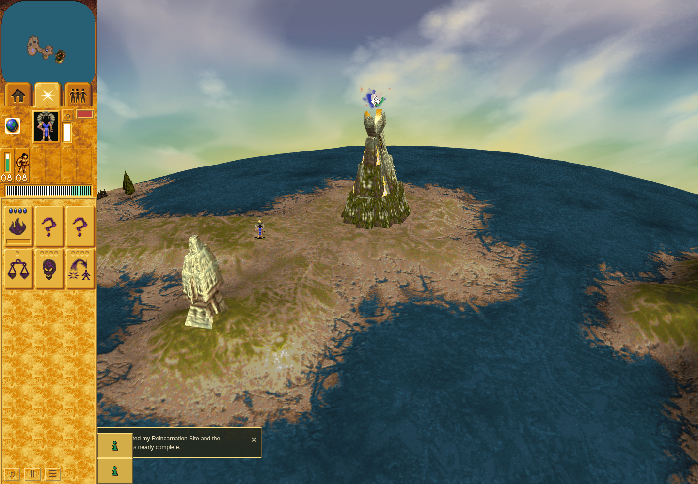

# Moving-enemy ordinary coverage remains incomplete

The Blast product is delivered in [PR270](https://github.com/JohnDeved/populous-new-dawn/pull/270).
This checkpoint records the final bounded Mission1 evidence attempt, not another
runtime change. The accepted friendly-target witness, static original proof and
[model-only successes](README.md) do not complete the moving-enemy ordinary gate.
The original trial freeze remains 2026-10-08 00:10:12 UTC.

## Repair proof and distinct failed outcomes

At QA commit `6d9e1c895ab838d4e7755dade9b72cbdd810a3f4`, the real approach at turn 873
successfully delivered command 3/order 13 to original Shaman 30. The attempt then
failed before hover: an episode observer tried to restore its picker wrappers
while the maintained moveGround dispatch observer still owned outer wrappers.
No approach acceptance, hover or person-cast credit is assigned to that run.

The [failure-first test checkpoint](https://github.com/JohnDeved/populous-new-dawn/blob/7e23997d41c3ef353eb704a08ac416ff22aec160/tests/blast-ordinary-observer.test.mjs)
reproduced that exact ownership failure through the real moveGround/dispatch and
episode helpers. It uses an authored M1 World, normal startup/public Skip and an
actual command 3; DOM/events are supplied and only callback module URLs are mapped
to local repository imports. This is composed source proof, not browser input.

The [sole-owner repair](https://github.com/JohnDeved/populous-new-dawn/commit/e8554cc8e6cd1b86e1f141a2f8b629ce1565ea82)
leaves approach picker tracing with moveGround. The episode retains synchronous
passive event snapshots, validates the returned restored receipt against actual
turn/point/context/recipient/native order, then arms the existing person trace.
The exact repaired source passed 66 focused cases with no failures/skips, plus its
scoped installed-tool preflight. Wrong/stale event, context, recipient, order and
restoration data are rejected. No shared wrapper tolerance or game code changed.

The fresh ordinary attempt on that source still **failed**. It did exercise the
repair successfully: approach 879 was validated and restored, arm 882 completed,
and the episode retained no observer errors. It stopped on the separate missing
stationary-hover prerequisite described below. Both failed runs and the original
failed regression remain failed; neither is relabelled by the later repair.

## Actual remaining prerequisite

Eight rows at 885, 886, 889, 891, 893, 895, 897, 899 retain the same stationary original
guard 38 pose (-256,-1280,75), 50 HP, visible/pickable status, native renderFlags 384 and
21×30 body bounds. A ninth row at 901 records its first model 21 displacement.
Across all nine rows, 81 sampled body-center points plus 9 retained-cursor points
were canvas-owned and returned null from person picking. Identity, camera/context,
approach ownership and the ordinary clock passed. Source range was **unprobed**
behind the missing-pixel gate; there is no observed range failure.

The declared method stopped when response began before stationary hover. It spent
no preparation mouse move and no person click or Blast. The Shaman remained 100 HP.
The terminal result is complete:false and diagnosticComplete:false. Source,
runtime and scenario bytes were unchanged; browser cleanup and profile continuation
checks passed. No further attempt or automatic camera/search change follows.

The source person picker uses body bounds, not sprite alpha samples. These rows
therefore do not support an opaque-texel or native pickability veto. A later model
winner or ground overwrite can still make pickPerson return null. The actual
consumed winner was not retained, so its identity/order and the exact occlusion
cause remain unresolved. Ninety misses do not show that every body pixel or any
alternate view is unpickable. The firstMoving summary field is not movement onset
in this preparation phase; the actual poses and turn 901 supply that distinction.

This is the unchanged genuine whole-browser screenshot taken at turn 844, before
the approach. The later sampled central body area lies on the visible Vault
model in this view, which supports occlusion as an inference. It is not a matching
picker-call frame or a hover/impact image, and cannot prove the winning command.
A future separately authorized diagnosis could reuse the existing passive
pick-observer/frame helper; no new diagnostic or camera sweep was run here.

## Scope and preserved identities

[Compact receipt/artifact hashes](ordinary-result-summary.json) bind both failed
ordinary prefixes, the failed composed regression, the 66-case pass, scoped
preflight and exact screenshot. The existing [immediate and chosen six-turn model
cases](README.md) remain model-only: cast 521 / impact 529 and readiness 517 → cast 523 /
impact 531 respectively. Each has just one flying visit. Neither proves actual
hover/release latency, natural owned-projectile pixels or subsequent enemy damage.

The runtime app tree remains `ba6df35a5a9fcd06b7c9004cd5a833d24f8d359c`, matching
delivered main 8b86. This evidence publication contains no raw archive, native
binary, browser profile or storage. Moving-enemy ordinary coverage stays open;
the lane is stopped pending a materially different decision.
