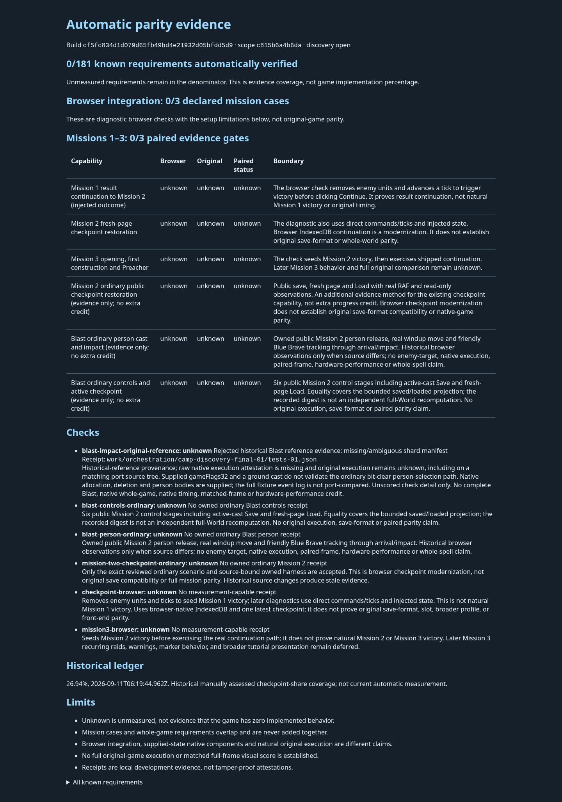

# Streaming parity discovery evidence

Source: [cf5fc834](https://github.com/JohnDeved/populous-new-dawn/commit/cf5fc834d1d079d65fb49bd4e21932d05bfdd5d9), tree `f345dc403617164d92d3204b1742cff9fa36d568`; [PR289](https://github.com/JohnDeved/populous-new-dawn/pull/289).

The maintained report now completes discovery of the current evidence snapshot with no warnings. It still records **0/181 whole requirements and 0/3 paired mission gates verified**. The actual command retains **exit 2 / receipt FAILED**, meaning incomplete evidence; this is not a gameplay or parity pass. The screenshot is the verified report render, not a game screenshot.

[Exact generated report](report.json) · [provenance and retained failure pins](provenance.json) · [projection/render review](reviews.md#actual-projection-and-render)

The complete reader audit validated 53 JSON files and 248,822,710 raw bytes, with no errors. The two large result containers contain 11,417,719 and 11,417,936 grammar tokens: 22,835,655 total. Their full streamed SHA-256 values match the preserved raw inputs. The fixed 256 MiB aggregate raw-byte limit leaves 19,612,746 bytes of headroom in that snapshot.

The initial eight/sixteen-million token guards failed on these inputs. A separately reviewed, single adjustment to sixteen million per file and thirty-two million per traversal allowed the one complete audit. The 64 MiB whole-object threshold, 256 MiB aggregate bytes, metadata/depth/key/number/time guards and owned-adapter requirements remain unchanged. Both the original four-failure baseline and the separately reproduced final-deadline failure are retained. [Reader/corpus review](reviews.md#complete-reader-corpus) · [token adjustment review](reviews.md#token-adjustment).

Independent final review accepts **1,675 passed tests across 279 files**: **642 fresh tests in 89 files**, plus **1,033 carried tests in 190 unchanged files** with their original source/input identities. All eight fresh test/static/build stages passed. The 122 focused cases are a separate overlapping check, not extra aggregate credit. [Exact final aggregate](final-aggregate.json) · [carry correspondence](carry-correspondence.json) · [final verdict](reviews.md#final-standards).

The earlier changed-path strict preflight remains FAILED with three inherited CLI findings; the exact current parser/test lint passed. The original interrupted standard07 remains UNKNOWN with zero credit; its accepted recovery supplies the carried row. No whole-repository lint pass is claimed.

The historical 373-file raw corpus remains unavailable. This packet includes no raw large result files, original game data, archives or profiles. Successful discovery and standard checks add no gameplay or original-parity credit.
