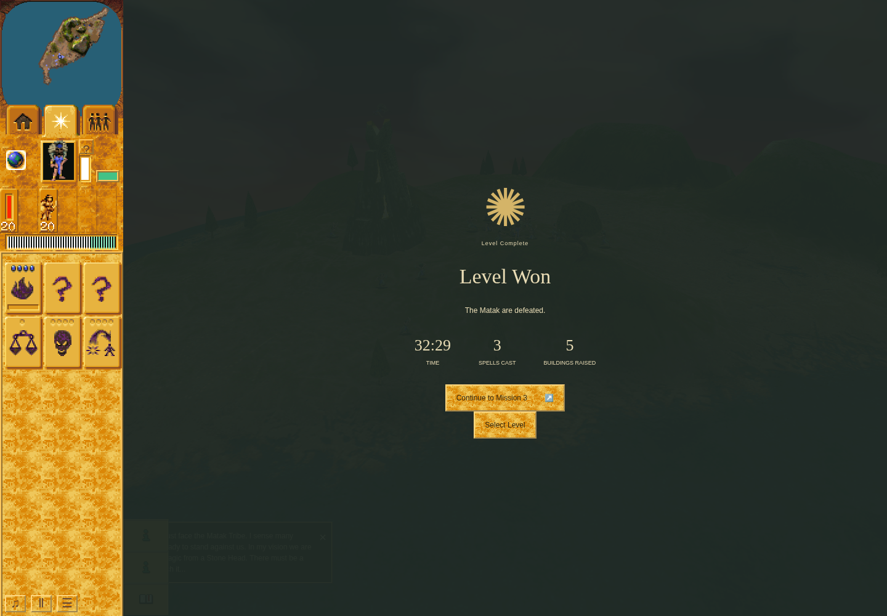
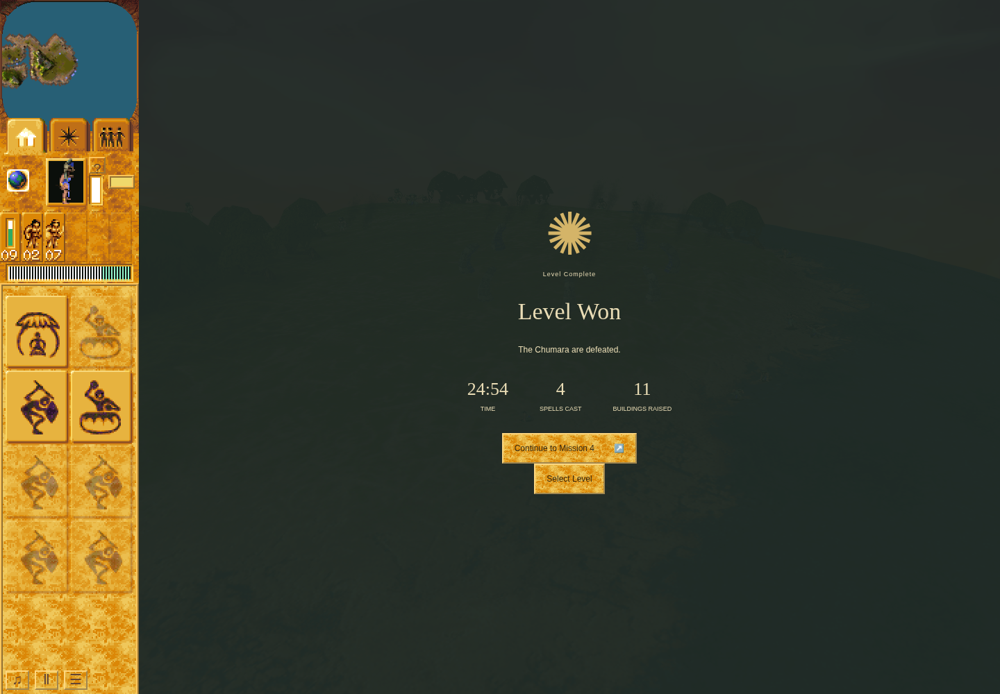
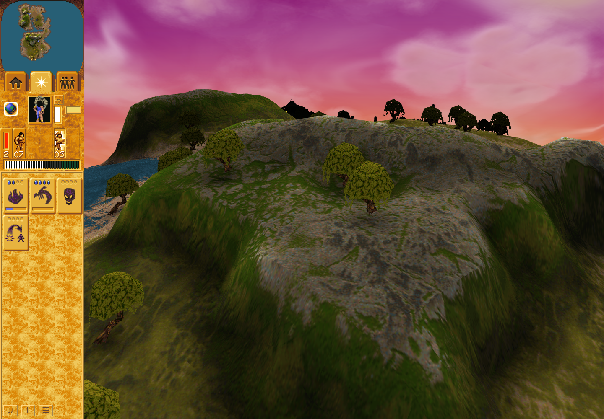
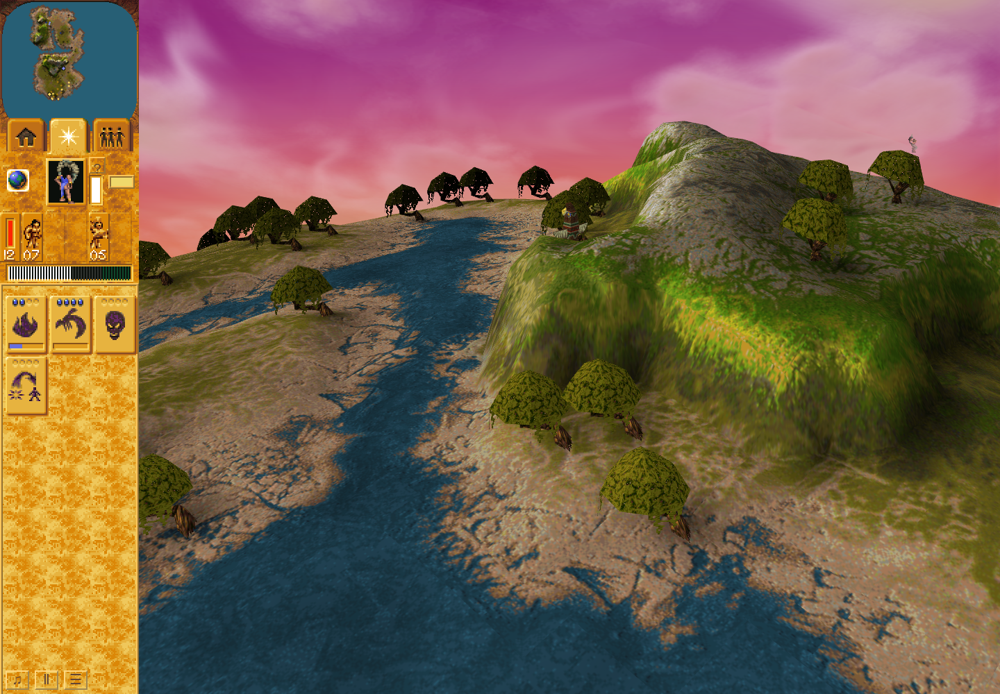

# Current Mission 2 to Mission 3 campaign proof

PR [181](https://github.com/JohnDeved/populous-new-dawn/pull/181) tested source `401bcf4ff4a102595fd0ee9623ff6f43c3659ac5` with application tree from main `fc0f29b2f5c752ecc9738772446749f7edd953bd`. Final feature `969e0ba14b035ce2f153846f65bc70ff59972e71` changes only two coverage/limit prose fields. Published main `14077605612ccf2572c63b5a66356cf3e7967976` matches final source tree `636a2c7aaee3c72ab98f21d7d052346ca622acd4`.

The route won Mission 2 at turn23200, used the shipped Continue action, won Mission 3 at turn17568, recorded completion marks [2,3], and displayed the Mission 4 offer. It uses ordinary game orders and simulation-owned outcomes, with direct diagnostic tick stepping, suspended RAF and camera/picking assistance. No entities, resources, AI or victory/profile state was injected. It is not a real-clock or native timing/raster/hardware performance acceptance. No Blue Preacher conversion was observed; victory is not conversion proof.

The 404 KB archive preserves 90 files: all six attempt receipts/reports/adapters/raw logs, final933-test aggregate, metadata and scoped ESLint proof, build-input correspondence, and original-commit source bundle. SHA256: `9ef8284e59d0de2d5f2f6ada1a0a4f84f42f821de7b7e3cc4ed16fe52e08e82f`. Every included file and the four separate selected PNGs have hashes in the adjacent manifest. Build proof is carried from accepted58c3686 with13 identical build inputs; it was not rerun at the QA-only head. The bundle requires already-published fc0f29b2 and25491a5 commits.

## Mission results

## Erosion Head visibility through ordinary camera controls

Both frames are the same successful401bcf4 run. One right-button drag rotated the camera while preserving simulation turn, RNG and selection; actual native/DOM picking and subsequent worship remained required.

No original game binaries/data, dependency caches, credentials or private notes are included. Earlier failed screenshots remain in the retained local evidence; their exact failed receipts/reports/logs are in this archive.
