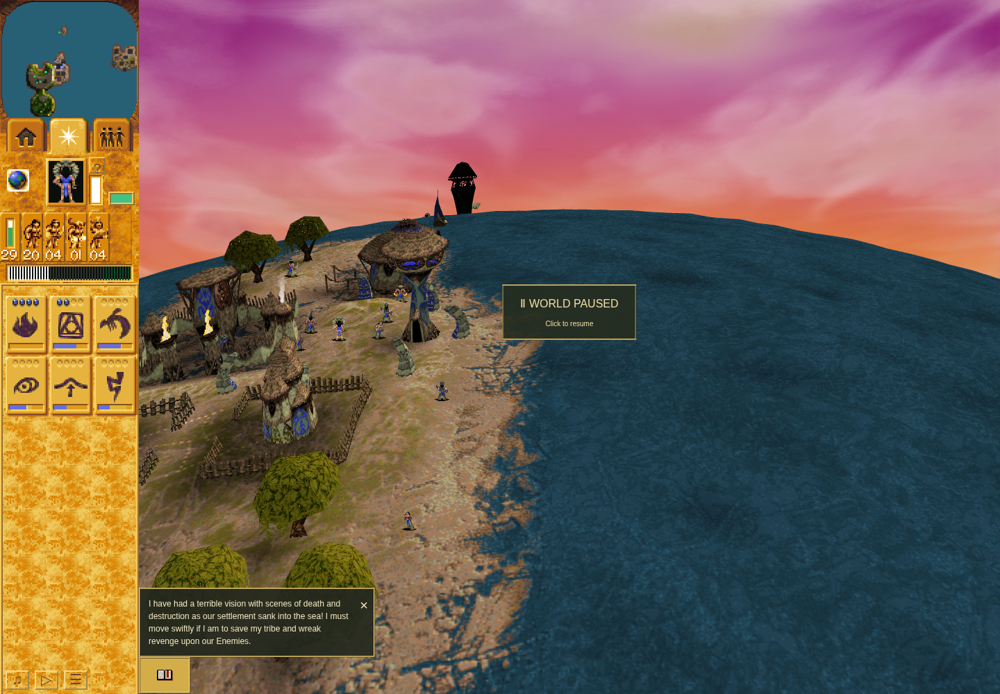
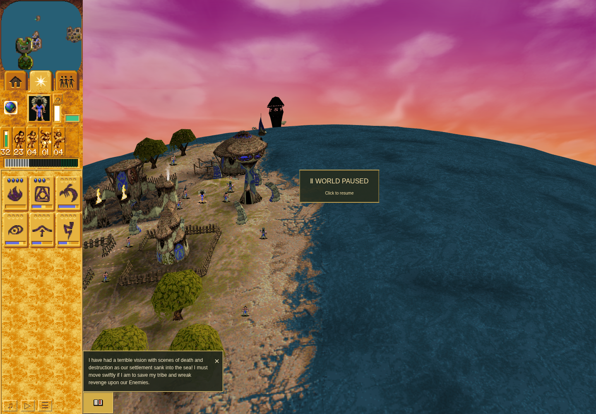

# Firewarrior resting artwork, source720

The original model6 resting producer selects animation object163, which resolves
to VSTART720 and descriptor18. The browser already retained the native person and
phase, but its artwork omitted720. The renderer therefore used a named idle or
selected pose instead of native `f2`. This repair imports the actual720 chain and
adds `restingGesture` for Blue/Red Firewarriors through the existing native-frame
lookup. It keeps the established728 entry, renderer, controllers and clocks.

Base: `89e68606a406f93715b930550317519818ddc081`.
Tested production candidate: `b0208188b8de345a6ad5e86cb7c49769624dda86`.
Candidate app tree: `70ca3233de4be0a958d47b84b9723b69291d1b34`.
The [independent review](independent-review-b020.md) accepts exact b020.
The later evidence commit changes evidence only. Issue214's wider timing and
other-family scope remains open; ordinary G ownership was already repaired by220.

## Original evidence and append preservation

The [source audit](../firewarrior-source720/README.md), retained exactly from proof
commit `6fbcd4e35b3e6d687feec8e87a8b641b53f3831e`, binds the canonical EXE, ANI
banks, original producer/object/descriptor/render lookup bytes,720–727 cycles and
728–735 control. Its24 retained ordinary720 samples have native owners; source96
override and disguise predicates do not apply.720 and728 are different original
animations. No frame relabelling or fallback-FPS adjustment is justified.

The bounded importer appends70 frames and38 pieces:5021→5091 frames,4004→4042
pieces, atlas2048×8064→2048×8128. Every old frame, layer, piece index/RGBA and
animation entry remains exact; only the two named entries are added. The
[pixel/preservation result](checks/static-pixels-result-01.json) checks all4042
pieces against original assets and retains the576 existing fixtures.
[Idempotent import](checks/idempotent-import-01.json) reproduces the same three
generated files. [Failure-first](checks/failure-first-01.json) records the missing720
entry before generation. No fixture or parity rerecord occurred.

The [native layer receipt](checks/native-layers-01.json) passed928 cases:
896 unscaled and32 representative scaled cases, Blue/Red owners,720/728,
directions, phases and shadow on/off. It executes the existing original layer
routine at0045f9d0 with supplied raster submission leaves. The fixture applies
the source-proved loader normalization
`(raw & 0xfff0) | (raw & 3) | ((raw & 4) << 1)` to represent loaded VELE flags.
There are464 explicitly retained shadow-flag differences: raw bit4 belongs to
the existing shared HSPR22 shadow. New body artwork has no such bit. This is
geometry/layer/variant evidence with that qualification, not full original
loader/raster execution or a general blending repair.

## Ordinary before and after

Both fresh Mission10 sessions used public controls, natural Brave→Firewarrior
training, ordinary Move and event-based G/adoption/cancellation, then one ordinary
Move to separate the Firewarrior from the Shaman and one minimap camera adjustment.
No actors, RNG, game time, phase or overlay were injected. The real Pause button
was pressed in advance and released once after a passive720 observation. Trusted
down/up/click records verify the actual handler and early phase; cleanup never
retries an uncertain release. The [accepted checker](browser/checkers/accepted/scenario.mjs)
and [preflight](browser/checkers/accepted/preflight.json) retain the120-second
search, `f2≤5`, ownership, frame, canvas and continuation gates under360/390-second
harness/outer bounds.

| Observation | Baseline89 | Candidate b020 |
| --- | --- | --- |
| Native source/draw at Pause |720/18 |720/18 |
| Logical turn / nativef2 |1539 /3 |1890 /3 |
| Direction |4 |6, mirrored |
| Idle rendered VFRA |85, fallback |3738, native `f2` |
| Selected rendered VFRA |139, fallback |3738, native `f2` |
| Native phase after Resume |7→10→13, then48 |7→11, then48 |
| Raw720 samples |107 |120 |
| Null/mismatched native source owners |0/0 |0/0 |

[Summary](ordinary-summary.json), [baseline receipt](browser/baseline-03/outer.json),
[candidate receipt](browser/candidate-01/outer.json), and
[candidate cleanup observation](browser/candidate-01/terminal-cleanup-observation.json)
retain exact source/input hashes. Both runs passed and closed their owned browser
and server; later read-only port checks found neither4394 nor4395 listening.
Ephemeral runs have no persistent-profile `cleanupVerified` field.

The actor is near client(576,433), outside the Pause overlay and about104.5 screen
pixels from the Shaman. Both images were visually inspected. These are comparable
ordinary scenarios at the same viewport and native phase, with different natural
headings/turns; they are not a pixel-aligned comparison. Independent RAF sampling
retains gaps and duplicate paused turns, not every successive native visit.
Headless Chrome154 uses software rendering; no hardware performance or full
original-game pixel equivalence is claimed.

Baseline idle,89e6860, native720/f2=3/direction4 but fallback VFRA85:

Candidate idle,b0208188, native720/f2=3/direction6 mirrored, VFRA3738:

The corresponding [baseline selected](browser/baseline-03/run/natural-source720-selected.png)
and [candidate selected](browser/candidate-01/run/natural-source720-selected.png)
images keep native phase unchanged. The candidate retains the native pose; the
ordinary yellow selection marker is expected.

## Gates and preserved failures

- [Full check](checks/final-gates-02/full-check.json): PASS,1298/1298 tests plus
  typecheck, parity and orchestration. [Build](checks/final-gates-02/build.json): PASS.
- [Changed-JavaScript quality](checks/final-gates-02/affected-js-quality.json): PASS.
  Both whole-app lint commands remain **FAILED**. Their1409 normalized diagnostics,
  including671 errors, are exactly equal: [paired comparison](checks/final-gates-02/paired-lint-comparison.json).
  No broad quality cleanup or zero-error claim is made.
- [Baseline01](browser/baseline-01/outer.json): FAILED, zero720 observations in the
  declared window. Formation fields were absent; no causal attribution is made.
- [Baseline02](browser/baseline-02/outer.json): FAILED, genuine720 occurred but
  public Pause arrived atf2=7. Overlap/overlay also prevented accepted before pixels.
  Both failed runs, exact checkers, images and raw rows remain intact.
- [Full-check01](checks/final-gates-01/full-check.json): FAILED,240-second timeout
  and a stale Shaman aggregate/count assertion. The reviewed test-only repair keeps
  the original legacy digest, excludes only the two new keys, and pins all5021 old
  frames/4004 old pieces from clean89. [Correspondence](checks/shaman-preservation-test-correspondence.json)
  binds unchanged production/native bytes; no accepted native proof was rerun.

[Artifact index](artifact-index.json) maps the original files to stored hashes.
JSONL streams are losslessly compressed with original-byte hashes; PNGs and
receipts are unchanged. [Packet manifest](packet-manifest.json) checks all retained
files. This packet and its Git bundle are local backups until normal Git
publication is available; they are not reset-durable or a claim of push/merge/deploy.
