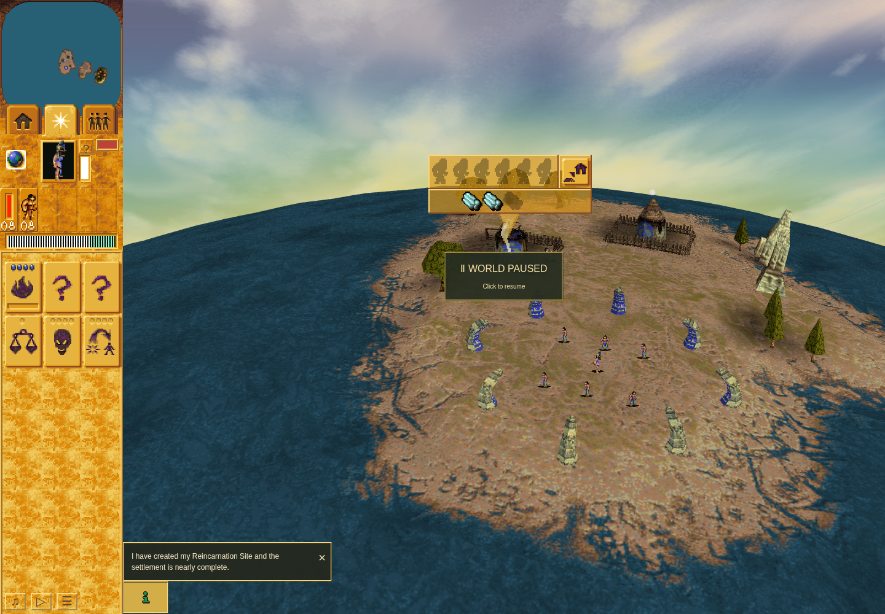
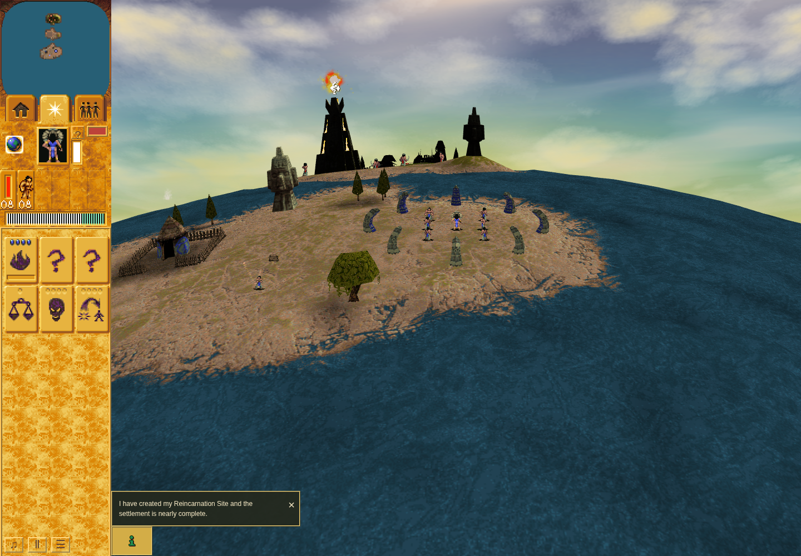

# Mission 1 Hut dismantling: PR #295 evidence

**Status: ordinary02 PASS and independently ACCEPTED.** This bounded episode
establishes one normal Mission 1 Hut dismantle with public partial Save/Load,
natural completion and exact recovery/cleanup. Ordinary01 remains FAILED.

## Source and review binding

- Repository: `JohnDeved/populous-new-dawn`, PR #295, related issue #25.
- Main base: `1a9314fc0a047f9f1effba6826ccfd46e07ad39c`.
- Accepted QA source: `b0344af55af0c0d62f55804fb31a8c8e3635a753`.
- Accepted tree: `0c9d373b5579df0b74d9c12fc7f00130a691c2a7`.
- Evidence branch: `evidence/mission1-hut-dismantle-20261009`.

Independent review accepted the synchronous endpoint repair and the explicit
carried/fresh validation correspondence. All 3,818 existing base paths retain
their exact Git blobs and modes; only seven QA/documentation paths are added.
Application, existing tests, checkpoint helpers, renderer, packages and
dependencies are unchanged. This adds no runtime fix or native parity credit.

| Review or source | SHA256 |
| --- | --- |
| Final source proposal | `3a72c112e0d951249dfa8acf39011f48c1d10391d366c51bdda930d836fec926` |
| Accepted wrapper method review | `28225312838ea4aff34a90d700818743c24cf4bdb002c8eba64cbd51b6304252` |
| Ordinary01 failed-result review | `245acfb7b1fb957be077b4dab59488030c83ca135c724b0fc530ef8bad1c7130` |
| Final repair/focused review | `bdb73aebf30b66e58ed11fbc6baf6a1e5514af07fbe8e61c51badc35254f104f` |
| Standard carry review | `92cf99f7e51511f9102ffb52c12506e53570e77f71565769762466e4fccdcd91` |
| Fresh02 binding review | `20f60a695c230cb3b1bc79d040c5559cb354e43eea23b15bb264efd7be073c6c` |
| Fresh02 result review | `36151209c607b1857617468046f0cbc09942e3549a625dd19feaaa6482d2e13b` |

## Ordinary01 remains FAILED

The attempt used source `aef6c7caa4748ae5a4ae1daae58508153eee615e`.
Trusted public input selected authored Hut index 41, live Hut 36, and its natural
resident Brave 1186. Public Save at turn 325 retained 200 timber units and loose
log 1190. Its full typed digest matched committed IndexedDB readback. Public Load
matched the production-migrated Save expectation at the synchronous boundary
before the replacement Scene's first frame.

The full snapshot at turn 445 satisfied the completion contract: the Hut was
gone, the same Brave survived, work/order/occupancy/footprint and target UI state
were cleared, and recovery totaled 300 native units (100 carried plus 200 in
logs 1190/1191).

The observer remained attached during the terminal screenshot await and then
rejected a drop because its strict oracle required a preceding command10. By
close at turn 456, the final 100 units were in log 1192. The actual failing
adjacent pair and callback were not retained; the offending visit is bounded
only to turns 446–456. The existing resting path is a source-supported
explanation, not a measured identification of that browser callback. These
bounded observations do not convert ordinary01 into a pass or establish a
product defect.

## Repair and validation

The repaired driver validates the unchanged full endpoint and detaches its
owned turn observer in one synchronous browser task before awaiting a screenshot.
Prior errors, overflow, invalid ownership, missing Save/Load or Scene handoff,
and cleanup failures cannot produce a successful finish. The first successful
close freezes the snapshot and contiguous visit accounting; later cleanup cannot
replace them with resting state. The command10 drop assertion remains strict.

The actual-caller Node regression finishes at supplied turn 597, then continues
real `advanceGame` until the same worker's native resting path drops its cargo at
turn 612. Original callbacks continue and endpoint evidence stays frozen. Those
turns belong to the Node fixture, not the ordinary browser attempt.

Validation represents **1,747 cases across 286 unique files: 10 fresh and 1,737
carried** through reviewed byte/input correspondence. This is not an all-fresh
full-suite run. Fresh checks include the two Hut test files, scoped ESLint,
seven-file formatting, 135 structural checks and the current repository plan.
Typecheck, parity and build evidence carry from unchanged accepted inputs.
Strict product Oxlint remains failed on 20 inherited warnings.

## Ordinary02: independently accepted PASS

The fresh attempt reports PASS on the accepted `b0344af5` source and
`0c9d373b` tree, running 2026-10-09 23:38:54.023–23:40:10.529 UTC under the same
360-second inner, 400-second outer and 15-second termination-grace bounds.
The following episode facts are bound by the independent result review.

Trusted input at turn 250 selected authored Hut index 41, live Hut 36, and
Brave 1186, with `sameResidentPerson=true`. Paused Save at turn 325 contained
200 remaining timber units and 100 carried units, with no dropped log yet.
Committed full typed readback matched Save; public Load matched the expected
production-migrated digest. This checkpoint differs from ordinary01's Save.

Transfers occurred at turns 313, 378 and 447. Drops created logs 1190 at turn 328
and 1191 at turn 392. The target disappeared at turn 447 and entry/order ownership
was released at turn 448. Atomic finish at turn 450 retained exactly 300 units:
100 carried plus 200 in the two logs. Brave 1186 had 50 health; target, order,
work, staff, footprint, reservations, target panel/record/latch/hover and menu
were clear.

Epochs covered turns 217–325 (109 visits) and 326–450 (125 visits), without
errors or overflow. One Scene-start hook attached and restored; the old Scene
reported disposed. Independent review verified the outcome, exact source/input
binding and owned-resource cleanup. Browser, observer and cleanup error lists
were empty; owned profile cleanup and checkpoint preservation were verified.

| Ordinary02 artifact or boundary | SHA256 |
| --- | --- |
| Receipt | `13ab0374457938127a7e0628ed3bfef16afc0b15cf96d703c07cec0c04d16e18` |
| Episode | `272fe620a2f3628b732fd211f996c3d495b53fd8979951147f4f8ed9938f14ad` |
| Committed full typed Save | `9676bf22f2f0d699929e60cb304f114d5037c6655502ec6dbcff921c513ddd20` |
| Expected migrated / public Load | `290462528d5882c7d691e8b29cf07fe77783a81f58070263c453e09c40da0194` |
| Original partial PNG | `334b0e5f7f632e19f6a53c31255f16014a10a5a367d30beb669a40d1b362f0eb` |
| Original terminal PNG | `7b8c93a48873889e847a23ed531b546748abb91aa7f465f0f966d8c39f21116d` |

Paused partial-work view at turn 325: 200 units remain in the Hut and 100 are
carried. This is the original captured game-UI image.

Terminal rendered view captured after the validated turn-450 endpoint. Public
Load changed the camera, so the images are not a fixed-camera comparison. These
later pixels do not identify the exact endpoint turn, prove every log's identity,
or establish native pixel equivalence.

The run used software WebGL. It makes no hardware-performance, native-pixel,
full original-history, cancellation or restart claim. The public Load was in the
same session; the exact native cleanup proof is supplied by scalar observations,
not by reading every identity from the images.

This evidence directory is limited to this report, a compact source/hash
summary and reviewed original UI PNGs. It excludes raw reports, browser profiles, dependencies and original-game
assets.
