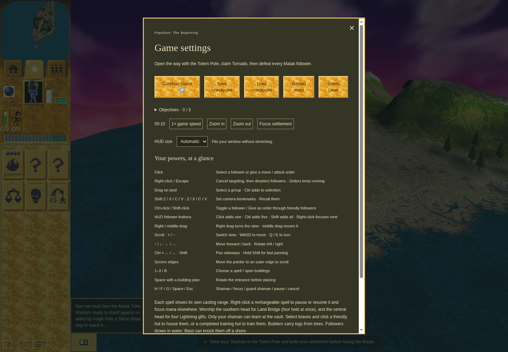
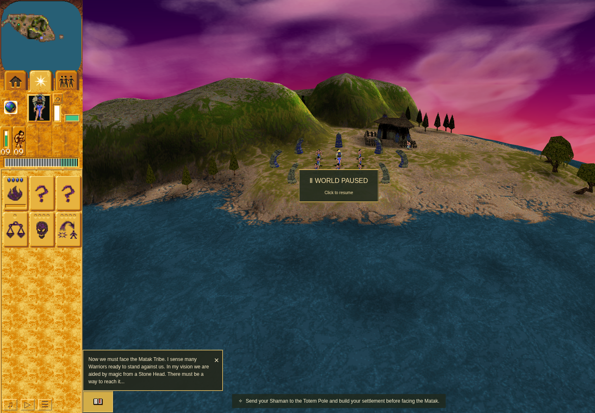

# Mission 2 selection-radius checkpoint witness

The ordinary Mission 2 Save/Load path preserved the new computer radius byte and
building-reference membership. At turn 129, the Green queue held radius **37**,
base **0x8436**, and five authored buildings. The public Save control committed the
full typed checkpoint; the first synchronous public Load replacement matched the
production-migrated expected clone before the game resumed. All five references
still aliased their live buildings, with exact current coordinates. Real simulation
then reached turn 162 before the public Pause control.

This is bounded initialization/rebuild and modern storage coverage. It does not
claim a distinguishing recruitment/battle improvement, an ordinary removed-member
episode, original binary-save reconstruction, universal allocation history, original
caller cadence, hardware performance, or full Tornado damage parity. Legacy missing
or malformed history and removed-member behavior have separate caller tests.

## Exact source and result

- Product: [91604757](https://github.com/JohnDeved/populous-new-dawn/tree/91604757ca7060bc94f27c9db918e3f30ee50441), tree `3ee8317ab37bdaf44e29b85f67fc7831bdf49ba4`.
- Actual QA: [4decb7c2](https://github.com/JohnDeved/populous-new-dawn/tree/4decb7c2c84f7d266cb5f0dbba2030227e944378), differing only in the scenario, supported native Vite config loading, and task-private optimizer cache.
- One sandboxed Chrome 154 attempt, CPU 5–7, port 4392; 180-second scenario, 220-second outer limit plus 15-second kill grace, maximum turn 2048.
- Outer receipt: **PASS**, exit 0, `2026-10-10T04:35:37.594Z`–`04:36:38.003Z`. Inner terminal: `04:36:35.312Z`. Later tool collection at `04:36:38.914Z` is separate.
- Full typed checkpoint SHA-256: `5a924378bba5f9ffe48824b7f43f68c9e392da98ef82203500bdaf8b622baf10`; Save, committed IndexedDB, migrated expectation and first Load are equal in this run.
- Authored source indices `1, 3, 5, 24, 79` map to live building IDs `1, 2, 3, 22, 71`. The actual source/header hashes and every member record are retained in the result.
- Observer and harness errors are empty; listener/subscription cleanup, browser/server cleanup and profile release were verified. Software WebGL/texture warnings remain in the receipt. The profile and IndexedDB bytes remain local.

[Independent ordinary review](ordinary-review.json), [result](ordinary-result.json),
[command receipt](ordinary-command-receipt.json), [harness receipt](ordinary-harness-receipt.json),
[one-attempt declaration](ordinary-launch.json), and [artifact hashes](manifest.json).

## Product validation

All 17 standard stages are accepted: **1,822 tests across 294 files**, counted once.
The 13 test stages ran on `ac7e894b`. A subsequent typecheck exposed a too-wide
`Team` argument. The retained failure led to an independently reviewed two-line
substitution of the existing four-tribe tuple; the full tests carry by exact runtime
equivalence. Fresh typecheck, parity, orchestration and build pass on `91604757`.
The additional 53-case focused rerun passes and is not added to the standard count.
The 39 unchanged early AI cases also passed. Strict scoped ESLint remains failed
with 210 inherited diagnostics and Oxlint with 440 inherited diagnostics; no new
signatures remain. [Aggregate](standard-aggregate.json) and [independent standard review](standard-review.json).

The original source/math/list ownership proof is preserved in the
[accepted static packet](https://github.com/JohnDeved/populous-new-dawn/blob/9694f1f2156c4c06a6128278f16c6eac1dd35ba2/decomp/research/selection-radius-source-20261010/README.md).
This advances [issue 256](https://github.com/JohnDeved/populous-new-dawn/issues/256)
and does not close its wider stored-origin/save scope.

## Actual ordinary screenshots

QA `4decb7c2`, product `91604757`, 1440×1000 sandboxed headless/software rendering.
These images show the shipped controls and restored world. Typed evidence above
establishes internal radius and aliases. They are not native references or an
identical-camera before/after comparison.

Saved Mission 2, paused Game settings with public Save/Load controls:

After public Load, natural resume and public Pause at turn 162:

