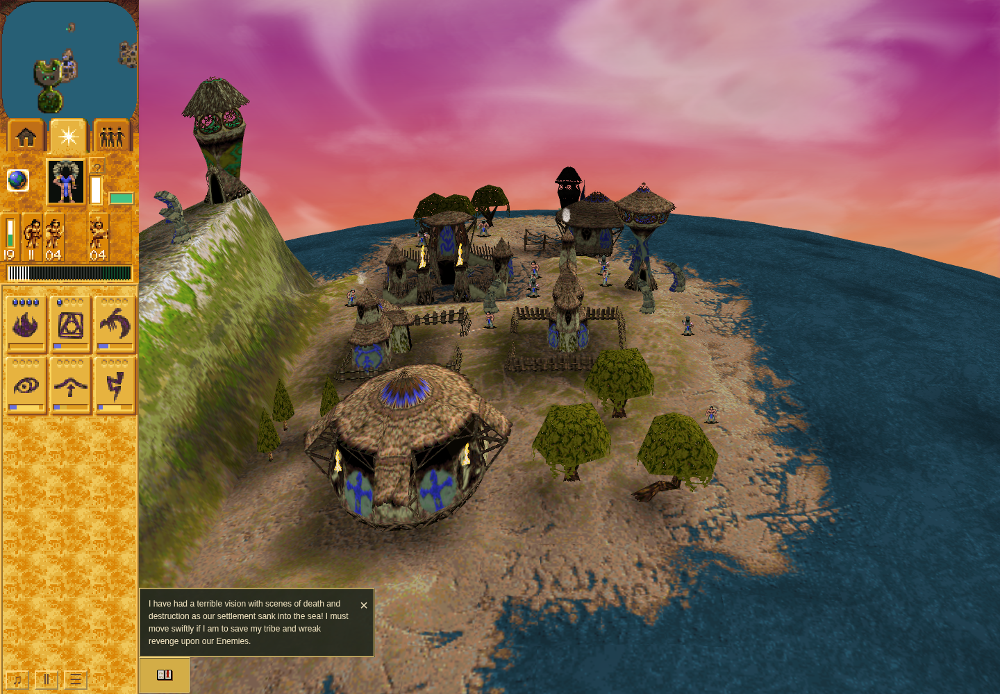
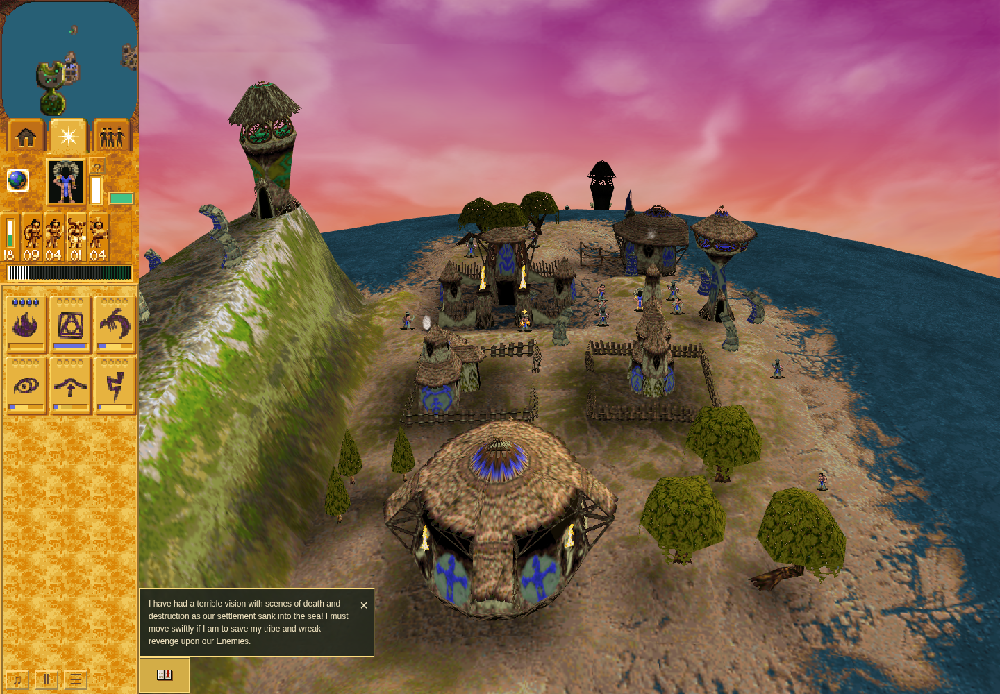
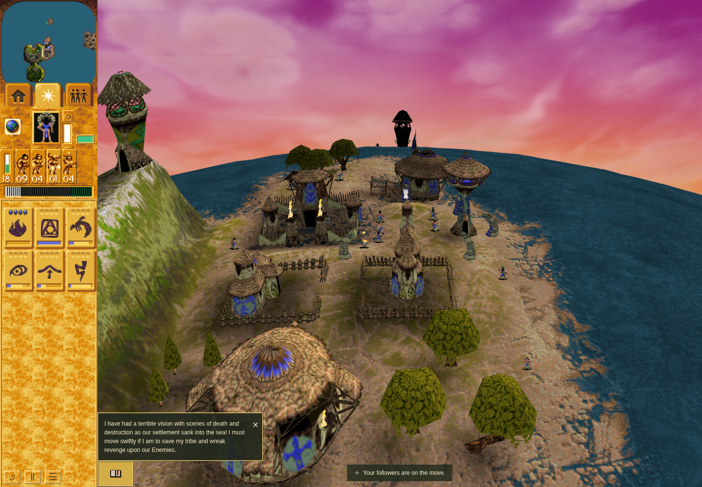

# Bounded native Shaman Guard input: source, package and partial control evidence

[PR220](https://github.com/JohnDeved/populous-new-dawn/pull/220),
[issue219](https://github.com/JohnDeved/populous-new-dawn/issues/219).
Candidate [c20a297](https://github.com/JohnDeved/populous-new-dawn/commit/c20a297f5f815ce404f796b08f77ea56396f96da),
tree `9af7241660efc11eb8969845ab7e587231d906bc`, based on accepted
`3b899125cc8cedef938823718ad5d44f49957b66`.

**Ordinary G now adopts native command 30; repeated G replaces it, and empty or
Shaman-only G clears it.** The matching baseline uses the legacy boolean, toggles it
off on repeated G, and leaves an active boolean on after Shaman-only G. These are
observed control-prefix results from **failed baseline04 and candidate05 runs**.
Following and both Save/Load cycles did not run in either capture. Independent
source/focused-runtime and final package ACCEPT, full check and build remain as
recorded below. This packet is not a merged, deployed or whole-Guard completion
claim. Broader issues #4, #60 and #214 stay open.

## Result

The candidate uses one shared native command30 for a whole supported ordinary
on-foot selection. Repeated G replaces the order. Empty or Shaman-only selection
cancels adopted native guards. The same person and phase survive pending
replacement/cancellation until their genuine visit. Old boolean saves and whole
unsupported/mixed batches retain their prior legacy behavior.

Native consumer corrections cover target vehicle occupancy, a Shaman inside a
building through its outside point, saved-target completion/cancellation anchors,
and separately sign-extended distance comparisons. A new same-turn input clears
discarded G before the legacy resting initializer. The original deferred bit16 is
preserved for legitimate replacement preparation, as independently proved in the
supplemental original caller composition.

Read the [full frozen review](review/review-c20a297.md), SHA256
`176ed5311d69e98120ef83447384fbc18f25755f9626824b2bc8e667d304f3d6`,
the [maintained scope/research note](candidate/decomp/research/shaman-guard-input.md),
and [full source patch](candidate.patch). The patch applies cleanly to the exact
base; this evidence branch does not apply it to its own runtime.

## Source-bound evidence

- [Final author104/104 focused tests](receipts/focused-supersession-final.json).
  The reviewer independently repeated104/104 and exercised the original
  Tower-entry repro and four supersession commands through three visits.
- [Expanded unchanged-main live regressions](receipts/baseline-regressions.json)
  fail20/45;25 existing busy/legacy controls pass. The [signed-boundary comparison](receipts/baseline-distances.json)
  fails five of28 cases, matching the original-native findings. The first eight
  live failures were retained before implementation in [failure-first.log](baseline/failure-first.log).
- Review repairs have separate failure-before/pass-after receipts for
  [Tower entry](receipts/contained-target-before.json),
  [corrected Tower/vehicle/anchor behavior](receipts/contained-target-after.json),
  [same-turn supersession](receipts/supersession-before.json), and
  [corrected supersession](receipts/supersession-after.json).
- [Native same-turn caller result](review/native-supersession.json) and
  [probe source](review/check-native-supersession.py) retain exact bytes/hashes.
  They execute the original move3 caller, clear/attach/initializers and next
  preparation, with acknowledgment, destination and UI leaves explicitly supplied.
  They do not prove original entry/attack/worship scheduling or full physics.
- [Exact extraction check](receipts/vectors-ddd0904.json) verifies three frozen
  original-result hashes. The candidate compares19 retain1 producer cases/26 G
  entries and28 distances. All11 lifecycle cases/64 stages remain recorded;
  only three phase cases are compared by the live setter tests. The raw proofs
  and independent producer/caller review are [published separately](https://github.com/JohnDeved/populous-new-dawn/blob/b6ee17f0d4392a3f52bf825ac6b1e1262941c5fe/evidence/native-shaman-guard-lifecycle/README.md).
- The [current source manifest](manifests/source-manifest-c20a297.json) binds all
  changed paths and current receipts. Earlier manifests remain historical.

Retained source artifacts are byte-exact copies, except the two complete row files
stored as deterministic gzip; decompression reproduces their original bytes.
[manifest.json](manifest.json) records stored hashes/bytes and original row-file
hashes/bytes/line counts. The explicitly derived [control index](control-prefix-summary.json)
is only a navigation aid alongside the raw sources. Receipt paths still describe
their original execution locations. No original game binary, animation asset, tool
distribution, profile or credential is included.

## Final package gates and review

The [final independent package/launcher review](final-gates/native-shaman-guard-final-review/review-c20a297-gates-launch.md)
accepts the exact clean c20a297 source and the following retained gates:

- [Full check](final-gates/receipts/fullcheck-c20a297.json): 1,238 tests pass, zero
  failures/skips/cancellations, plus typecheck, parity and orchestration checks.
- [Production build](final-gates/receipts/build-c20a297.json): exit 0.
- [Scoped formatting](final-gates/receipts/final-format-scoped-c20a297.json): all
  eight changed runtime paths pass. Global formatting retains failures in
  unchanged `render-view.ts` and `viewport-bounds.ts`.
- [Final comparison](final-gates/receipts/final-quality-comparison-c20a297.json):
  ESLint output is byte-identical to the fixed base; Oxlint has 394 baseline and
  394 candidate diagnostics, zero introduced. These are retained failed/advisory
  tool statuses, not claims of a clean repository. The earlier 388 count covered
  seven files; the final eight-file set additionally includes `world-tasks.ts`.
- Fallow health and duplication commands exit 0. Unused/circular analysis exits 1
  with disclosed advisory findings; no equality-to-baseline claim is made.

The [112-check disposition](final-gates/native-shaman-guard-final-review/verification-c20a297.json)
records commands covered by full check and the bounded native/browser scope.
Pre-existing `clock-portable` names a nonexistent interpolation test and is blocked
as written. The actual game-clock/unit-motion tests pass within full check. This
separate metadata defect does not imply that its exact command was executed.
Fullcheck/build source fingerprints are exact; those two receipts do not themselves
contain explicit dependency-input hashes. The final comparison and launcher bind
the installed/root locks separately.

## Historical quality correspondence

Earlier ddd0904 typecheck and scoped formatting passed. Its exact app-only diff
equals the receipt fingerprint [703249dc…](manifests/prior-quality-source-correspondence.json).
Scoped ESLint was byte-identical to baseline world-turn findings; normalized
Oxlint reported388 baseline and388 candidate diagnostics with none introduced.
These are corroborating earlier receipts, not exact-head quality claims for later
repairs. Unchanged global-format failures in render-view.ts/viewport-bounds.ts
remain disclosed. The final c20a297 gates above supersede the pending status of
this historical checkpoint without relabelling its receipts.

## Ordinary pilot 01: retained failure, candidate not run

The [reviewed revision 3 scenario](pilot-01/revision-03/scenario.mjs) ran on the
unchanged baseline under the [accepted sequential launch plan](final-gates/native-guard-browser-execution/launch-plan-rev3.json).
Its entry-time assertion failed before training or any Guard input. Original
session 88672 ended normally with exit 1; source/inputs stayed unchanged and both
loopback forms of port 4392 were closed. The conditional candidate was not run.
See the [raw launcher](pilot-01/baseline/launcher.json),
[outer receipt](pilot-01/baseline/outer.json), [browser receipt](pilot-01/baseline/run/receipt.json),
[passive witness](pilot-01/baseline/run/witness.json), and
[source-bound diagnosis](final-gates/native-guard-browser-diagnosis/failed-pilot-01.md).

The last read was actually ready and unpaused at turn 592/inputMask 0. The
checker measured total entry elapsed time; the maintained helper can wait 45 seconds
for a nonexistent introductory Skip button. That stage duration is source-inferred,
not separately measured in this attempt. Two later prerequisites were also invalid:
authored hut index 149 becomes live building 98, and five original Braves had six
natural births by the last read. A [construction observation](final-gates/native-guard-browser-diagnosis/mission10-construction.json)
ties the hut's authored model/native anchor and original Brave identities to the
retained runtime. It is initialization evidence, not a gameplay replay.

Screenshot: exact baseline 3b899125, fresh 1440×1000 sandboxed headless context,
ordinary Mission 10 before training. It is not a Guard before/after comparison.
Software WebGL warnings limit performance interpretation. Warrior 113 already has
30.7 HP near a Green Tower; the training area is not established as safe.

The [revision 4 source preflight](prepared-revision-04/native-guard-browser-preflight-review/review-revision-04.md)
now **passes independent review**. Its [frozen source packet](prepared-revision-04/native-guard-browser-preparation/plan.md)
and [source/mock receipt](prepared-revision-04/native-guard-browser-preparation/preparation-receipt.json)
retain all prior revisions and add only conditional public entry, native-identity
hut binding, separate original-Brave/birth observations, and passive timing/threat
reads. Four new entry/identity cases and six retained owner/target cases pass.
Housing remains allowed for real Brave training. Existing Guard/checkpoint
requirements and the 60/300/330-second limits are unchanged.

The [accepted revision 4 launch plan](prepared-revision-04/launch-plan-rev4.json)
uses fresh attempt-02 outputs on the same baseline 4392 then candidate 4393,
with the same sandboxed browser and fixed sources. It ran as pilot 02 below and failed before its first Move/G input. Public
move/G/deselect/repeat/cancel/following, both pending Save/Load cycles, and paired
screenshots remain required. Source preflight does not predict runtime
success. Controlled Node fixtures do not substitute for the rendered gate or
hardware performance. PR220 remains draft.

## Ordinary pilot 02: genuine training, then invalid Move destination

Revision 4 entered ordinary Mission 10 within the unchanged deadline: Shaman ready
at 28.651 seconds, roster/hut binding at 31.572 seconds. Original Brave 122 received
real training input at 37.655 seconds. The passive observer captured actual
occupancy and 4000-mana cost; the Brave was removed and new model-6 Firewarrior 176
exited at 55.104 seconds. [Raw actions](pilot-02/baseline/run/actions.jsonl),
[196 unmodified sampled rows](pilot-02/baseline/run/epoch-0-rows.jsonl) and the
[failed witness](pilot-02/baseline/run/witness.json) preserve this bounded result.

The initial requested Move point (25,-9) returned no eligible ground pixel. No Move
click or G was delivered. The selected Firewarrior was healthy at 35 HP, outdoors,
orderable, native class 1/model 6/state 19/status 0, vehicle 0, with no busy owner.
Shaman 63 remained at 100 HP. [Pure retained-footprint analysis](pilot-02/diagnosis/ground-footprints.json)
proves that the requested point is cell 16 inside Firewarrior Hut 98's footprint;
its friendly completed-building context is command 8, not Move 3. The failed helper
did not retain individual pixel/context rejections, so the exact visual rejection
branch remains unknown. Clear footprint alone does not prove valid terrain or input.

Original session 95486 ended normally with exit 1 at 21:34:25.627159 UTC. Both port
4392 loopbacks closed; source and locks remained unchanged, with no browser errors.
[Launcher](pilot-02/baseline/launcher.json), [outer receipt](pilot-02/baseline/outer.json)
and [browser receipt](pilot-02/baseline/run/receipt.json) retain the failed status.
The conditional candidate did not run, and the shared lane was released.

Exact baseline 3b899125, fresh 1440×1000 sandboxed headless context. This proves
ordinary acquisition in this attempt, not Guard behavior or a successful before
capture. A bounded source-only correction is being reviewed: retain existing
finite-pixel rejection diagnostics and prospectively declare a small set of nearby
Move destinations, including the later Shaman Move. Every chosen point must still
pass current model-3 context, integer interior, fresh dispatch/acknowledgment and
recipient checks. Guard/Save/Load assertions and all time limits stay mandatory.
No replay of revised inputs is included in this checkpoint.

## Ordinary pilot 03: real Move, missing marker observation

The [revision 5 source review](pilot-03/review/review-revision-05.md) accepted the
fixed six-point policy and diagnostic-only probe changes; all 18 focused cases
passed. The [frozen inputs](pilot-03/revision-05/preparation-receipt.json) and
[launch plan](pilot-03/launch-plan-rev5.json) remain distinct from earlier pilots.

Pilot 03 repeated genuine training. Its first ground destination had no accepted
5×5 interior, including actual competing Hut 97 picks. The second point passed
integer-interior, enabled model-3 context and fresh revalidation. The actual picked
point was (31.045209205924266,-11.975819335895324). The real pointerdown/up handlers
ran at turn 428 with no competing picked object. `lastOrderTurn` advanced 140→428,
ground acknowledgment targeted 0, and Firewarrior 176 received native command 35,
model 3, target (9996,1018). By after-read turn 433, its x position moved 23→24.3671875
while native/renderer owner identity 69 remained. These are positive retained
input/recipient facts, not full checker acceptance.

The mandatory acceptance check failed: **No fresh ground marker at the requested
cell.** No marker was prospectively retained. Source gives markers four processor
visits, while the after-read occurred five turns after dispatch. The copied
acceptance helper supports an epoch marker journal that this dedicated observer
omitted. This supports a lifetime/observation explanation, but does not recover or
prove an unrecorded marker. No marker predicate is waived. The complete copied
input-helper/observer contract audit and reviewed revision 6 below address the
observation boundary before any further replay.

[Raw actions](pilot-03/baseline/run/actions.jsonl),
[passive training rows](pilot-03/baseline/run/epoch-0-rows.jsonl),
[failed witness](pilot-03/baseline/run/witness.json),
[browser receipt](pilot-03/baseline/run/receipt.json),
[outer receipt](pilot-03/baseline/outer.json), and
[launcher](pilot-03/baseline/launcher.json) preserve the failure. Original session
45056 exited 1 normally at 21:51:49.058585 UTC, with source/locks unchanged and both
4392 loopbacks closed. No G was sent and the conditional candidate did not run.

Exact baseline 3b899125, fresh 1440×1000 sandboxed headless context. The movement
message and actual walking actor corroborate the bounded input result. This is not
a successful before capture, Guard acceptance or hardware-performance proof.

## Reviewed revision 6: synchronous input evidence, replay pending

The [independent revision 6 source review](prepared-revision-06/native-guard-browser-preflight-review/review-revision-06.md)
**ACCEPTs the complete adapter correction**: 12 source/provenance checks and all
28 focused cases pass, including 10 cases executing the actual adapter/listener/
finish/acceptance path. Read the [complete contract audit](prepared-revision-06/native-guard-browser-preparation/contract-audit.md),
[frozen preparation receipt](prepared-revision-06/native-guard-browser-preparation/preparation-receipt.json),
and [independent result](prepared-revision-06/native-guard-browser-preflight-review/source-checks-revision-06.json).
The byte-exact review retains its original workspace file-line links; their portable
source equivalents are [pointer handling](https://github.com/JohnDeved/populous-new-dawn/blob/c20a297f5f815ce404f796b08f77ea56396f96da/app/scene-input-runtime.ts#L375)
and [marker lifetime](https://github.com/JohnDeved/populous-new-dawn/blob/c20a297f5f815ce404f796b08f77ea56396f96da/app/world-effects.ts#L119).

The existing pointer observer now captures passive command snapshots immediately
before and after the actual handler. Source proves command, marker insertion and
acknowledgment are synchronous before that existing post-handler listener. Exact
scene/world/epoch, selection, dispatch turn, acknowledgment, real new marker and
secondary ownership, and the selected actor's actual command-owner/current-cursor
record must agree. The generic acceptance helper remains byte-identical, including
legitimate fresh input to an unchanged same-target order. Diagnostics preserve
original picker return/error behavior and do not add picker, renderer or clock calls.

Command ownership is recorded separately from renderer ownership. A captured
model-3 queue assignment does not establish native adoption. A later empty queue
with the same ordinary idle owner does not prove completed movement. Delayed health,
ordinary eligibility, continuous renderer identity, Guard adoption/following and
Save/Load checks remain separate requirements. The unchanged independent RAF
observer still owns phase evidence. Missing/stale/wrong-cell/wrong-owner markers,
old-only/later-slot orders, wrong epochs, Load reset, diagnostic errors and original
picker exceptions have executed negative tests.

The [revision 6 launch plan](prepared-revision-06/launch-plan-rev6.json), SHA256
`f1bf383242780847e8d8f47068a6d2b3bdda1e0a1ceb441ac4262e2ba8b2f216`,
keeps the same fixed sources, sandboxed browser, ports 4392/4393, CPU allocation,
six prospective destinations and 60/300/330-second limits, with fresh attempt-04
outputs. At that historical publication checkpoint it was **prepared, not run**.
It subsequently ran as failed baseline04, retained below. Its source acceptance
does not relabel pilot 03 or establish whole Guard, checkpoint, performance or
merge acceptance. The distinct revision7 candidate also remains failed.

Raw command30 payload b remains unchanged in original snapshots. Independent
consumer audit permits excluding only that unused word from semantic comparison;
the port retains reused b. World.units ordering remains an explicit approximation
to the original tribe linked list, including which person gets a failed slot0.
Fully settled native Guard movement, busy-controller handoffs and continuous
historical idle phase remain outside this acceptance.

## Ordinary control prefix: baseline04 and candidate05

The public-input sequence genuinely trained Firewarrior 176 from original Brave
122, observed occupancy and the 4000-mana cost, and strictly accepted the initial
Move at the same picked point `(31.045209205924266, -11.975819335895324)`.
The ordinary input prefix is unchanged through the scheduled 38-second G reissue,
before revision7's added 40.5-second preparation boundary. This describes matching
input boundaries, not identical execution times; candidate's final reissue
completed at 40.950 seconds. The [derived index](control-prefix-summary.json)
retains exact action-line references, actual timings and screenshots alongside the
raw [baseline actions](baseline04/run/actions.jsonl) and
[candidate actions](candidate05/run/actions.jsonl).

- Baseline first G sets `Unit.guard=true`, with native status 0/count 0 and no
  native renderer source. Escape retains it; repeated G toggles it off. The later
  Shaman-only G leaves the reissued boolean active. Empty-selection G occurred
  while that boolean was already false, so it is **not standalone proof of failed
  active-order cancellation**; accepted native and failure-first proof covers
  that separate branch.
- Candidate first G adopts record 36/model 30/status 30/state 10/count 1. Escape
  retains it, repeated G replaces it with record 38/count 1, and empty-selection G
  clears the queue to state 19/status 0/count 0. Reissue allocates record 40;
  Shaman-only G clears it again; final reissue allocates record 44. `Unit.guard`
  stays false. Native and actual renderer-source identity 68 agree throughout
  these control observations. Native adoption/current-target and owner assertions
  passed before the later timing failure; queue assignment alone is not used to
  claim adoption.

Before/after images below are original, visually inspected PNGs from exact baseline
`3b899125cc8cedef938823718ad5d44f49957b66` and candidate
`c20a297f5f815ce404f796b08f77ea56396f96da`. Both used fresh 1440×1000 sandboxed
headless Chrome 154.0.8037.92 contexts; software WebGL warnings preclude hardware
performance claims. Pixels corroborate the scenes and HUD, not native phase
correctness or original-game pixel parity.

| Boundary | Baseline04 before | Candidate05 after |
| --- | --- | --- |
| First G | [Original image](baseline04/run/guard-06000-first-G.png); image-stage entry 6.322 s, capture turns 516–529 | [Original image](candidate05/run/guard-06000-first-G.png); image-stage entry 6.082 s, capture turns 505–517 |
| Shaman-only G | [Original image](baseline04/run/guard-36000-shaman-cancel.png); image-stage entry 36.931 s, capture turns 884–896; HUD still says followers will guard | [Original image](candidate05/run/guard-36000-shaman-cancel.png); image-stage entry 37.047 s, capture turns 876–888; HUD says followers stop guarding |

The seconds above are the recorded scheduled-entry times relative to each run's
own Guard window, not screenshot exposure instants. Raw screenshot before/after
page times remain in the witnesses and index. The four linked PNGs are included;
other screenshot entries remain in the unmodified raw witnesses but are outside
this bounded supplement.

**Both runs retain FAILED, exit 1.** Baseline04 delivered the later ordinary Shaman
Move, then exceeded its unchanged four-second action window. Candidate05 completed
selection preparation but missed the next Move-entry slot; it never delivered
that Shaman Move. Neither reached following observation or either pending
replacement/cancellation Save/Load cycle. No full paired timing, full physics,
complete Guard, checkpoint or merge acceptance follows from this prefix.

- Baseline04: [launcher](baseline04/launcher.json), [outer receipt](baseline04/outer.json),
  [inner receipt](baseline04/run/receipt.json), [failed witness](baseline04/run/witness.json),
  [all 724 epoch-0 rows](baseline04/run/epoch-0-rows.jsonl.gz).
- Candidate05: [launcher](candidate05/launcher.json), [outer receipt](candidate05/outer.json),
  [inner receipt](candidate05/run/receipt.json), [failed witness](candidate05/run/witness.json),
  [all 693 epoch-0 rows](candidate05/run/epoch-0-rows.jsonl.gz).

All native phase rows are retained, including beyond the claimed prefix. The gzip
files use level 9, timestamp 0 and no original filename; original uncompressed
SHA256, byte count and line count are recorded in the manifest and verified by
decompression. Launcher stdout/stderr, outer stdout/stderr and browser server logs
are also retained under each run directory. Source, explicit checker inputs and
dependency-lock fingerprints remain stable in the receipts; both loopback forms
of each run's port were closed at terminal cleanup. The final all-runtime/checker
assertions at the end of the full scenario were not reached.

[Revision7 independent review](control-prefix-provenance/review/review-revision-07.md),
SHA256 `32341b1ec23a0290345d773111f5a821dbdfc360759bfddce2820f3183e815cf`,
accepts the bounded baseline before record and defines the still-required complete
candidate gate. Its original “candidate has not run” statement predates candidate05;
the failed execution above supersedes that historical status. The
[frozen revision7 scenario](control-prefix-provenance/revision-07/scenario.mjs),
[preparation receipt](control-prefix-provenance/revision-07/preparation-receipt.json),
[independent checks](control-prefix-provenance/review/source-checks-revision-07.json)
and [candidate launch plan](control-prefix-provenance/launch-plan-rev7-candidate.json)
are retained with all 29 immutable input files. Baseline04's 28 input hashes match
the already-published [revision6 packet](prepared-revision-06/native-guard-browser-preparation/preparation-receipt.json).
No active later QA packet was copied or modified. The final package gates above
remain unchanged.
