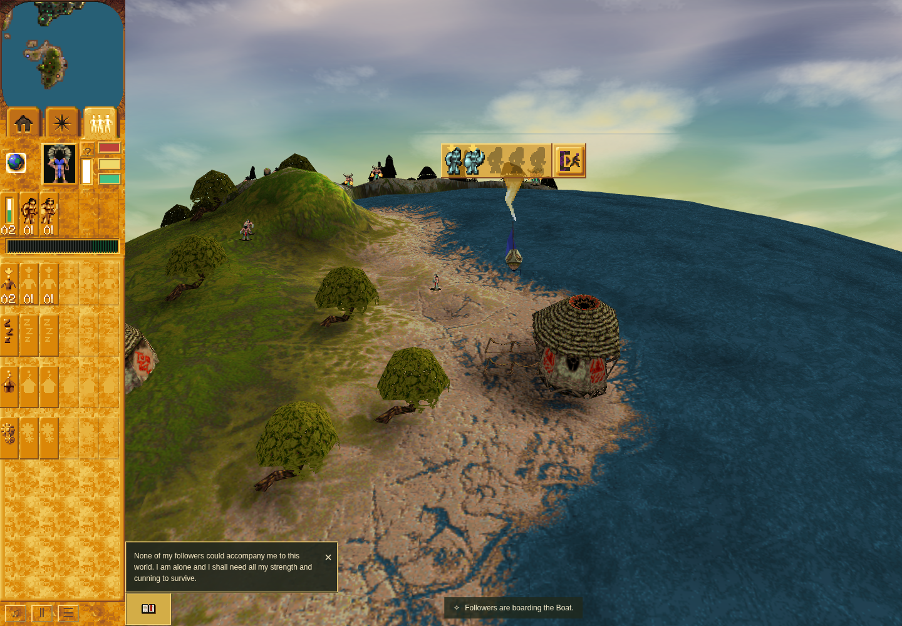
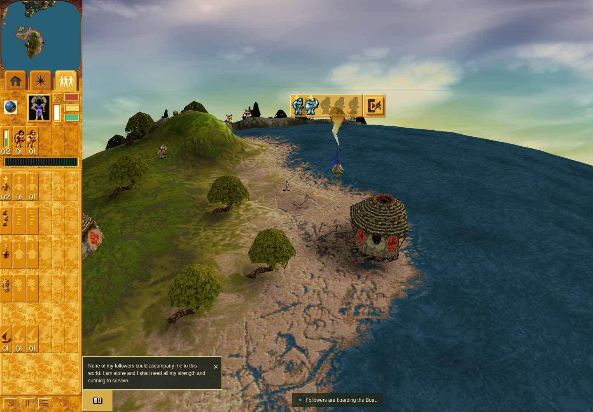
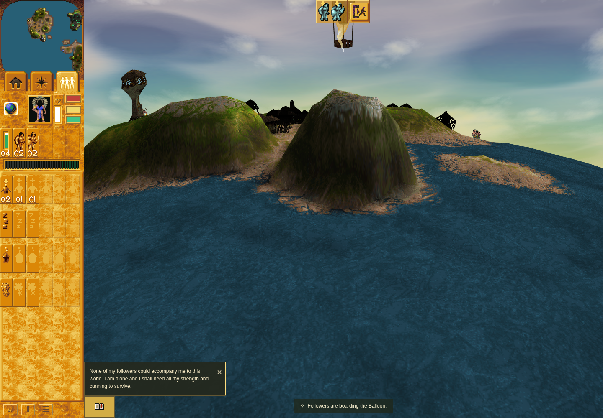
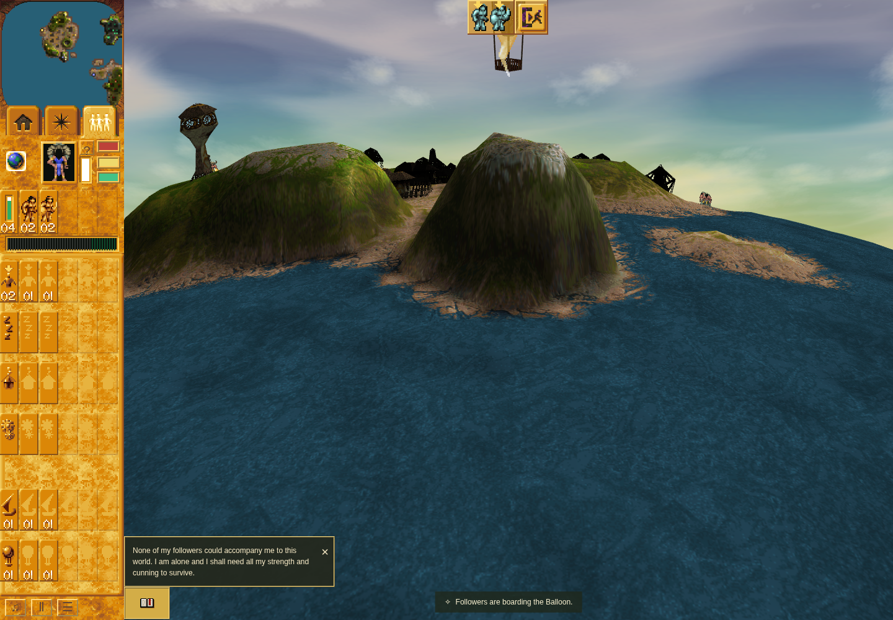
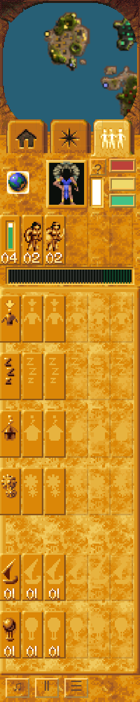
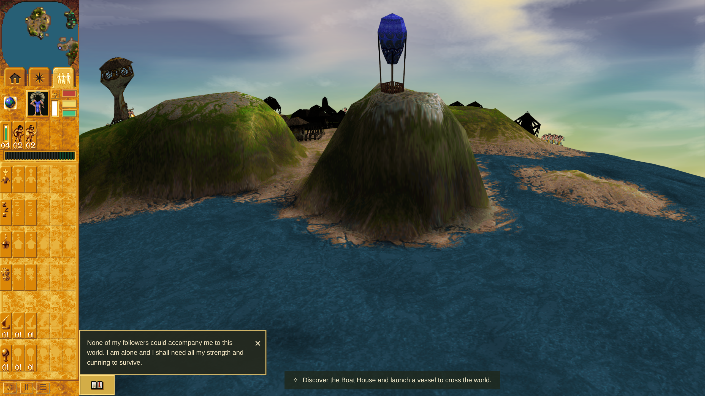

# PR185: occupied transport controls

[PR185](https://github.com/JohnDeved/populous-new-dawn/pull/185) is merged as
`76df601a76c54b291cc7867021c45022382720dd`, with independently accepted source
`cf4350944ac2d77fbe97ab5dfe9f78b4aa71c3b8` / tree
`0ecb4780bd481f55f46d73fa5d417c40b761e17d`.

The final12 Boat/Balloon cells restore presence-driven rows, occupied-craft counts
per passenger class, whole-crew selection, native priority/cycling and independent
focus. Right-click reaches the actual vehicle panel. The real/apparent owner split
preserves count/AI ownership while fixing the proved search, texture/cache,
damage-immunity and Blast consumers. Legacy checkpoints keep their fallback.
The complete native panel fits above the modern footer without changing saved
HUD-size preference.

## Verification

- Final check991/991 and production build pass.
- Full browser passes18 exact pixel comparisons,12 viewport/size cases plusDPR2,
  actual footer/digit hits and all57 authored-population/status invariants.
- Native count/selection/focus, owner, art, unload, damage, Blast and genuine model
  material proof pass. [Review disposition](REVIEW.md), [receipt manifest](manifest.json),
  [source correspondence](source-correspondence-final.json),
  [quality comparison](quality-comparison-final.json), and
  [check scope](planner-disposition-final.json).

## Genuine before/after gallery

Before: actual unmodified game `ab6e857553fd2a534bbe34b4ba600df8a40872ff`, external
checker `725d57e69da2a967765927017abe602d19ce64bf`. After: actual rendered game/checker
`416d2c40b4b2f133f7d2aea14febc800fcdd3434`; its runtime and executed inputs are
verified identical to the final source. Full scene pairs use1440×1000 and the same
controlled camera/boarding protocol. They are comparative views, not an assertion
that whole-scene pixels are identical.

The actual authored Mission22 craft are clicked in the world. Added two-person
crews and extra craft are supporting fixtures, not natural acquisition. Boarding
is asserted/captured before a disclosed state30 hold. Exact native pixel checks use
separate source rectangles and the recorded Chrome154/Skia raster; they never use
captured result colors as reference or relax the >1 assertion threshold.

### Boat, before

### Boat, after

### Balloon, before

### Balloon, after

### Actual DPR2, complete sidebar
1280×720 CSS viewport, deviceScaleFactor2, effective HUD fit1.44. The lower Balloon
digits and frame are visibly clear of the footer; actual center/digit hits are checked.

## Scope and retained failures

Sandboxed Chrome154.0.8037.92 with ANGLE/Vulkan SwiftShader. No unsafe browser flags,
original Windows full-frame rasterization or hardware-performance claim. Boat
driver-Spy command16 is covered; non-driver scheduling, Balloon commandPosition
and native boarding countdown remain separate boundaries.

Candidate725d57e failed its fractional Boat reference (flattened layers omitted
separate edge coverage); candidatee023252 then failed26 Balloon-edge channels by2
because float blending missed the pinned integer rule. Both overall runs remain
failed. The final416d2c4 full run passes, including the previously unreached final
population/status checks. Pre-reset unpublished raw evidence was unavailable and
is not carried as acceptance. Source art, thresholds and all pixels were preserved.

The larger allowlisted raw-evidence archive is being prepared; integration was
based on verified original local receipts and the independent final review.
