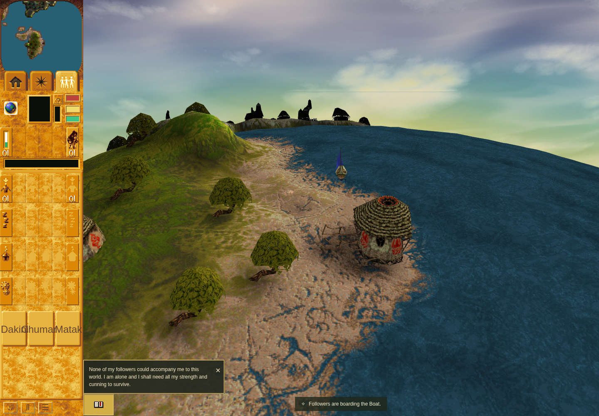
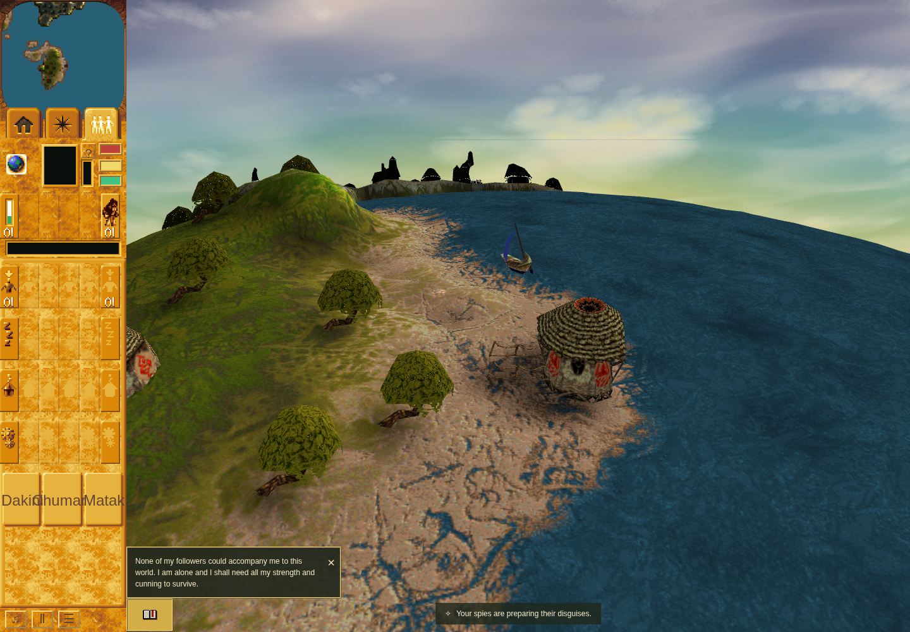

# PR #186: resting passenger evidence

The repair was tested at `e8d302827bbd12a6870c224cbe01cce8558d22d1` and integrated as
`0b0719f270649f688a07b791a8ff831ed0c91a46`; both have source tree
`abbdf1301f71f433a74348aa65ee7b66ad4eacd6`.

These images show **before and after the disguise action on the repaired build**.
They are **not** a before-fix/after-fix pair. The fixture stages a Blue Spy beside an
authored Mission22 Boat, boards through the real command consumer, then clicks the
rendered Followers disguise and replacement controls. Ordinary Spy acquisition and
a rendered boarding click are not claimed.

## Before the disguise action

## After the action and countdown

The Spy remains aboard in state30 at speed zero. Replacement disguise also passes,
with no page errors. Chrome Headless Shell 154.0.8037.92 used the existing sandboxed
local harness at 1440×1000/DPR1; the renderer was ANGLE/SwiftShader. These are functional
rendered checks, not hardware-performance measurements.

## Download and verify

- [Bounded raw receipts, logs and feature patch](pr186-proof.tar.gz)
- [Archive, image and per-entry SHA-256 manifest](manifest.json)
- [Merged research and native boundaries](https://github.com/JohnDeved/populous-new-dawn/blob/0b0719f270649f688a07b791a8ff831ed0c91a46/decomp/research/transport-idle-state.md)

The final e8d3028 receipts cover 938/938 tests, type/parity/orchestration, build,
9,216 native initializers (including 512 state30), 180 actual state30 dispatcher
cases, scoped quality checks and the sandboxed browser. Earlier retained failure-first
receipts establish the crash and distinct Balloon boundary. Root formatting/lint/Oxlint
failures remain disclosed; the maintained TypeScript diagnostic comparison reports
zero introduced ESLint diagnostics. Source identities inside each receipt are authoritative.

Boat disguise completion is verified. Balloon disguise still reaches a separate,
earlier unported airborne commandPosition consumer; its direct state30 idle-entry
test does not establish Balloon disguise completion. Direct detach coverage is not a
complete sailing/landing journey. Native world leaves are bounded and documented.

The archive contains no original game binaries/data, credentials, dependencies,
caches or private notes. Native input hashes and technical paths in command receipts
identify the tests without redistributing their original game inputs. No tests were
rerun for this evidence-only publication.
