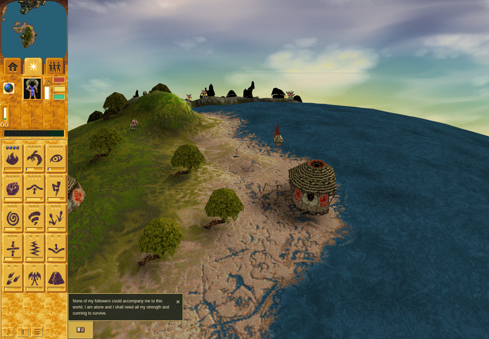
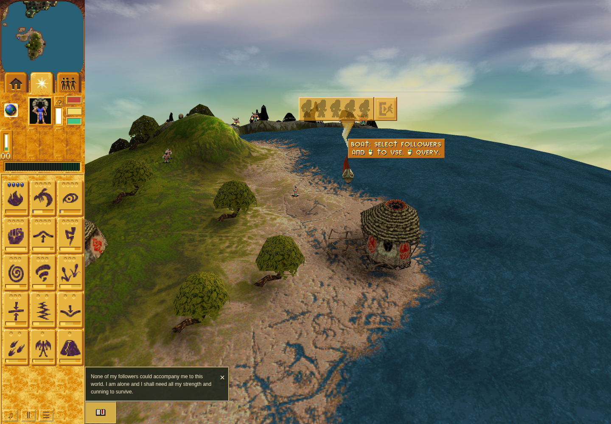
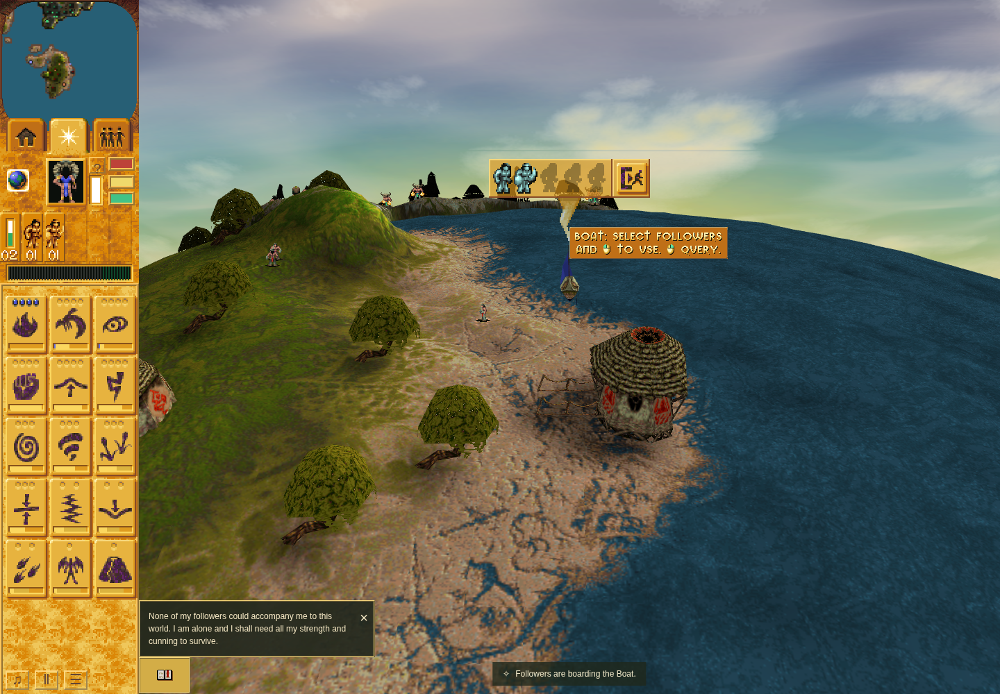
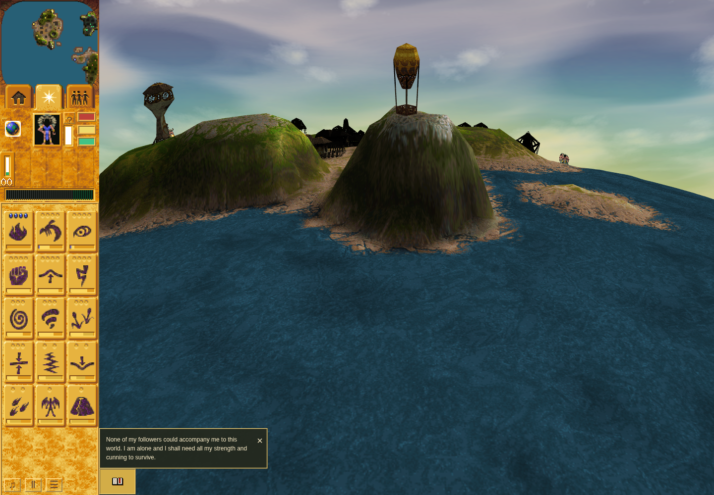
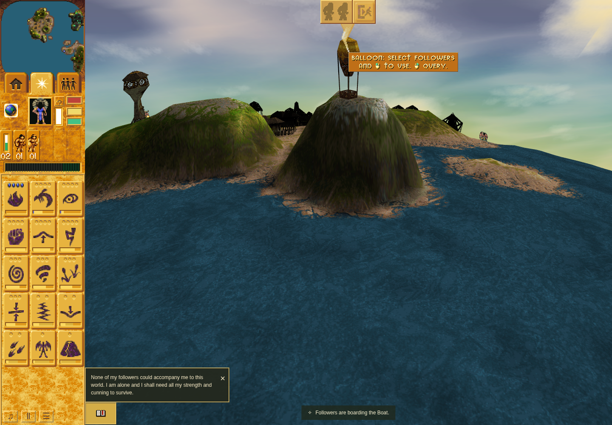
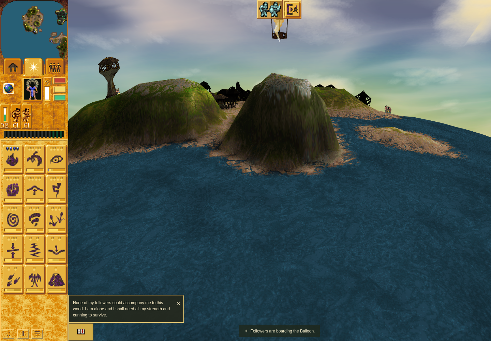

# PR #187: vehicle passenger panel and unload evidence

Accepted candidate: `1a6ae6835f2491fd2287b910e421744964066d1c`.
Integration base: `2a8211b88e278b70cffa7a7ee8489441516ea9d1`.
[Independent ACCEPT](review-final.md), [compact gate index](handoff-final.md),
[planner disposition](planner-disposition.md), [raw proof archive](pr187-proof.tar.gz)
and [SHA-256 manifest](manifest.json).

## Genuine before/after controls

The before captures are unmodified `0b0719f270649f688a07b791a8ff831ed0c91a46`,
after actual authored Mission22 craft right-clicks: no vehicle panel exists.
The after captures are the passed `d18ff90d426b2b54a25fb02f8551b1d7ea13dfb6` run,
using the same craft views at1440×1000/DPR1. Authored populations are retained;
mixed Brave/Warrior crews are supporting injected fixtures. The Balloon's later
occupied pose has advanced through real live turns; it is not pixel-aligned to the
empty capture. Images are original retained screenshots, with no synthetic before.

### Boat before

### Boat after, empty

### Boat after, occupied

### Balloon before

### Balloon after, empty

### Balloon after, occupied

## Checks and boundaries

Exact final candidate:955/955 tests, typecheck/parity/orchestration, production build,
five new native comparison suites, existing native destruction,31 scoped portable
tests, formatting and scoped source-art importer all pass. The original atlas's
1,744 prior rectangles and every1024×460 original pixel are unchanged.

The rendered run uses the sandboxed official Chrome Headless Shell154.0.8037.92,
ANGLE/SwiftShader and real pointer controls. Nine native-layout/source-atlas pixel
comparisons have zero mismatches. Passenger single/Shift/right actions, stale click
revalidation, no-camera inspection, person-panel coexistence,1280/1920/3440 viewport
widths, DPR2, occupied and airborne checkpoints, repeated/disabled controls and
living Boat/Balloon landings all pass. It does not establish natural crew acquisition,
Windows full-frame parity or hardware performance.

The final aggregate head differs from rendered d18ff90 only through equivalent
panel branch/projection cleanup, test/documentation changes and tooling-only main
adoption. [Exact correspondence](browser-correspondence-1a6ae68.json) and the fresh
review preserve both identities; screenshots are not relabelled as final-head runs.

[Quality correspondence](quality-correspondence-1a6ae68.json) retains the one identical
ESLint baseline finding and112 Oxlint findings versus114 baseline, with no additions.
Fallow advisories remain. Both unsuccessful browser attempts and the954/955 aggregate
are preserved in the archive. The first removed-population debris failure's cause
remains unproved; the second resize-readiness failure and corrected live hit test are
separately documented.

Current browser boarding attaches immediately. Original slowTurn interpolation and
short post-unload bob/splash presentation remain outside this bounded fix. Broader
#5/#25/#60 acceptance and occupied transport rows #185 remain open. No parity ledger,
GitHub Actions, deployment or paid-resource work is claimed.

The archive contains only bounded technical receipts, logs, screenshots, public
feature patch and research/review material. It excludes original game binaries/data,
credentials, dependency trees and caches. Native input hashes and technical paths
identify source evidence without redistributing original inputs. No tests were run
for this separate evidence publication.
