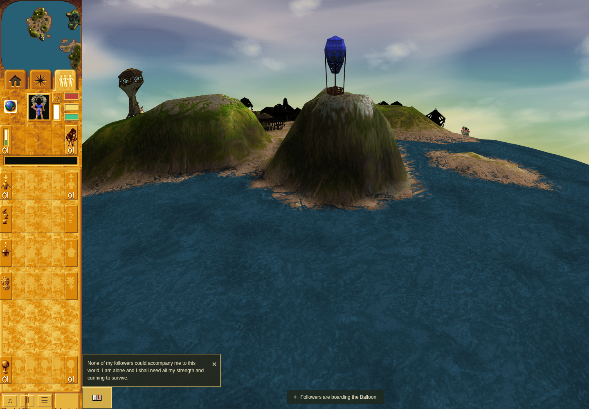
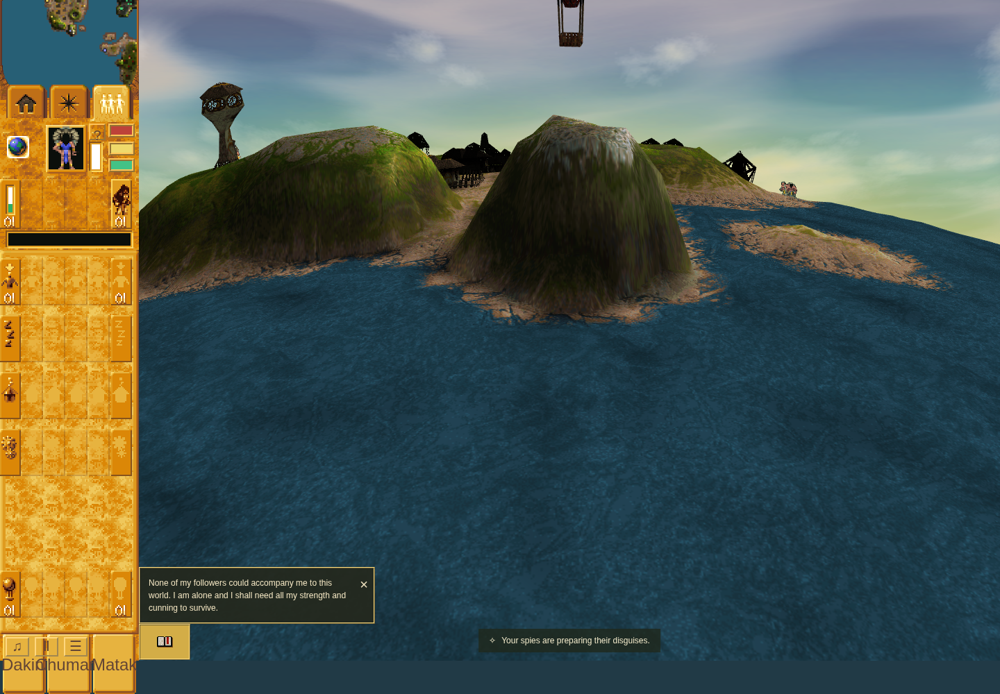

# Balloon driver disguise evidence

Tested gameplay/checker commit: `6b6eb684f4f010420a758cfe4fd481b6dfca9545`.
PR: https://github.com/JohnDeved/populous-new-dawn/pull/199

These are **before/after the disguise action on the same repaired staged build**,
not baseline-versus-fix images. One selected Spy was staged beside Mission 22's
actual empty Balloon; authored people were retained. Boarding used a rendered
vehicle-mesh click, and disguise/replacement used the actual visible buttons.
Camera focus, game flag 32, frozen RAF and deterministic turns are supporting setup.

The source-bound harness and outer command receipt both passed. The mesh click
accepted command 22, boarding took 10 turns, and the added Spy became the sole
driver. The Dakini UI click accepted command 16 with payload and destination
`[1,0]`; the next visit reached state 30 with speed 0 and disguise 127. After
63 more turns, disguise was 64 and craft X/Y stayed fixed. Replacement through
the Matak button reached state 30 with disguise 255. Page/console errors: zero.

Chrome Headless Shell 154.0.8037.92, sandbox enabled, ANGLE/Vulkan SwiftShader,
1440×1000 viewport, DPR 1. The second capture has different page framing after
the UI button scrolls into view, and most of the Balloon lies above its top edge.
These images support the action context; the retained state report establishes
functional completion. They do not establish pixel parity or complete visual framing.

## Boarded, before disguise

## After disguise and its countdown

[Exact functional report](result.json) and [file SHA-256 values](sha256.json).

Full check passed 997 tests and build passed on the same frozen source. No native
Windows screenshots, natural acquisition/campaign completion, full vehicle lifecycle,
encoded cell/object command positions, non-driver scheduling or hardware-performance
claim is made. The prior crash remains established by the preserved failure-first
source receipt. Pending-command checkpoint continuation has separate source coverage.

[Preserved raw proof packet](raw-proof/README.md) includes receipts, exact streams,
source correspondence, final review and a SHA-256 manifest.
