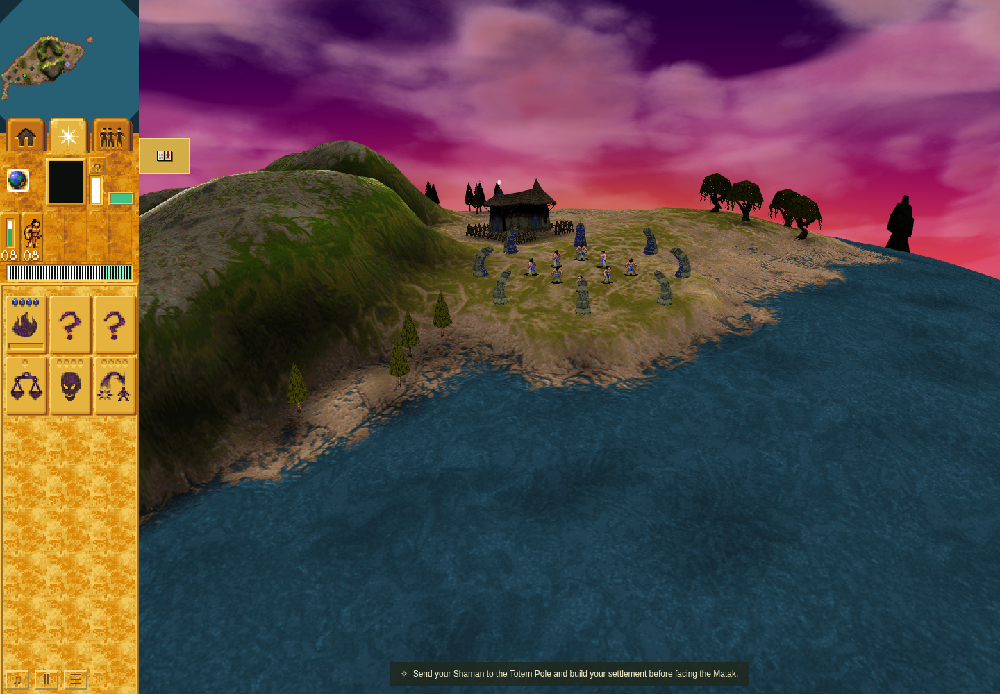
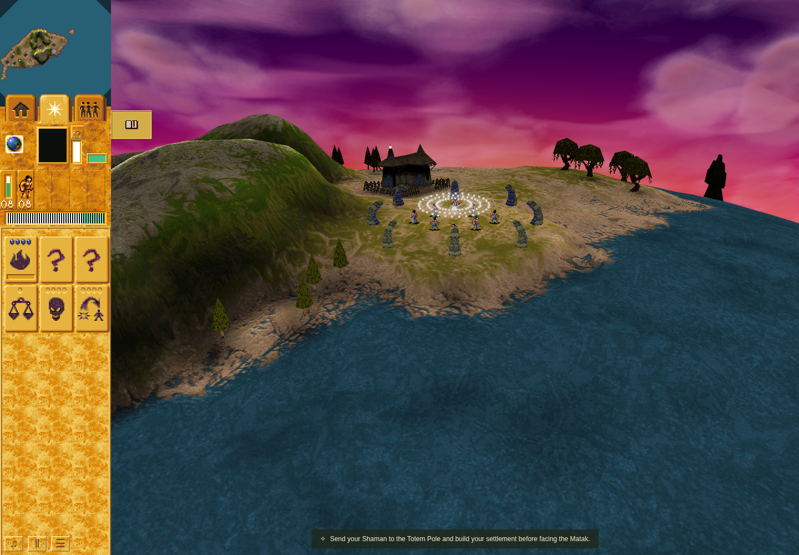
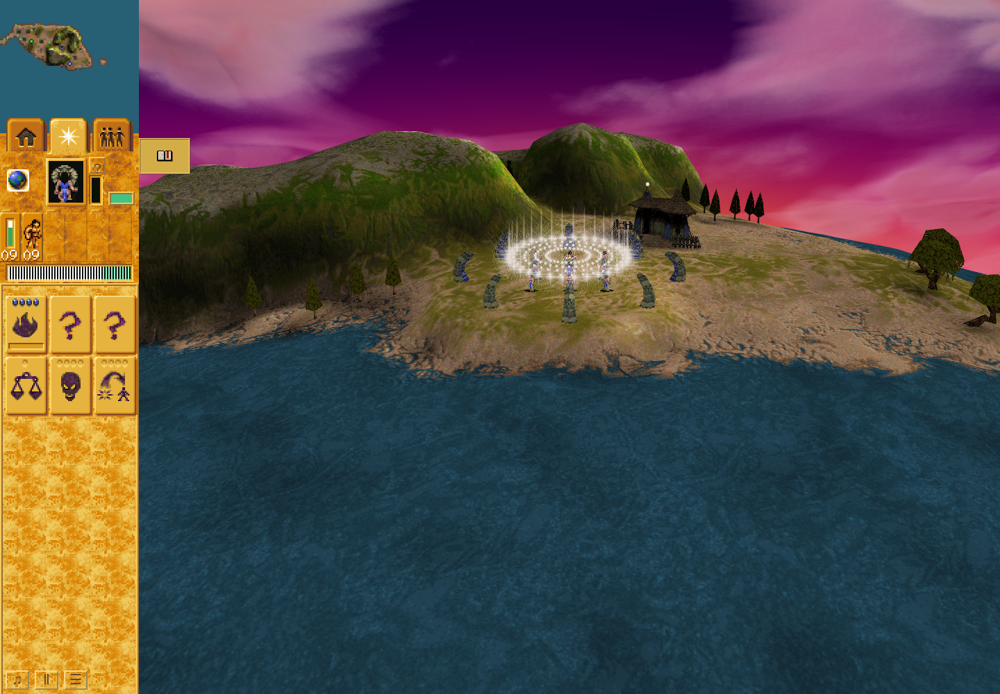

# Ordinary reincarnation site wave: bounded evidence

Feature PR: [#203](https://github.com/JohnDeved/populous-new-dawn/pull/203). Broader [#30](https://github.com/JohnDeved/populous-new-dawn/issues/30) remains open.

Rendered source: `8fe6631979f81dd462c6fa10468fca98d3b82361`. This separate evidence branch does not change the feature tip. The gallery shows successive moments in that candidate after real Mission 2 combat death; it is not an old-code or original-game raster comparison.

## Rendered gallery

Before the ordinary wave producer, turn 810, with the Shaman still absent:

Visit 4, turn 815: 32 orbit owners, visible particles, and an invisible controller. The orbit contribution is 13,074 framebuffer pixels:

After fresh-page checkpoint loading, turn 816: the new Shaman exists while the same wave continues at visit 5:

## Results and source correspondence

- Terminal rendered run: **passed**, 41.520 seconds, exact `8fe6631`, Chromium 154.0.8037.92 / SwiftShader. Zero page or console errors; retained warnings cover software WebGL/readback and pending texture images. Browser/server cleanup completed and port 4193 refused a fresh connection.
- Native level-start and reincarnation comparisons: **passed**, exact `7b96393433ed3e23ce06c9116da1837e3f10e592`, pinned original executable SHA-256 `3a5065c7420b3fcde208bf220bc86dfbac95e025ab2492caf9c7ea5308dfbe4f`.
- Full `npm run check`: **passed**, 1,050 tests plus parity/orchestration, at `32e511ba86b7611843164ac4b9b43a115125682d`; `npm run build`: **passed** at the same source. Independent review accepts their carry through the two-file style-only cleanup to `7b96393`. Later `8fe6631` changes only checker startup, with application/native/test bytes unchanged. These are correspondence claims, not relabeled reruns.
- Final focused groups: **26 wave/startup tests** and a separate **6 person-panic tests**, both passed at `7b96393`; typecheck also passed there. The original 26-test command incorrectly named a nonexistent panic filename and is retained, not presented as a 32-test command.
- Root formatting remains **failed** for two byte-identical accepted-baseline files; changed TypeScript passes. Root ESLint remains **failed** with 287 total diagnostics. Changed-path comparison has 213 errors before/after and no introduced ESLint diagnostics.
- Oxlint remains **failed**, including five genuine new cycle findings: the two new modules participate in the existing world/runtime component. Independent review verified deferred-only consumption of their imported bindings and successful fresh entry-point initialization. No broad cycle refactor or lint suppression is claimed.
- Fallow health and duplication scans exit 0. Unused-code scan exits 1 with advisory findings.

The natural sequence uses the visible Mission 2 entry, actual Skip introduction control and H selection. The Shaman dies in ordinary authored combat at turn 349. The ordinary producer allocates at turn 811 without processing; turn 812 is visit 1. Paused rendering leaves simulation state unchanged. A fresh page loads the committed checkpoint at turn 815, retaining owner/id, site height, visits/radii, RNG, next allocation identity, terrain and light owners; 13,086 restored orbit pixels remain visible. Successful Shaman spawn occurs at turn 816 while the wave continues. Independent cleanup removes controller/orbit effects, meshes and lights and clears the busy flag.

A separately labeled staged phase covers enemy/protected/friendly/Wildman/Shaman eligibility, exact damage/panic, visited Swamp removal, unchanged removed-Swamp counter/lifetime (proving it did not process later that turn), an unaffected outside Swamp, and visible orbit contribution at 1024×768 and 1920×1080. Staged fixtures do not count as natural gameplay evidence.

## Preserved correction history and limits

Earlier search-dependent native passes through `94e88b4` are **superseded**: a fixture reset overlapped the original mapped search table. The corrected guarded matrix at `3b947c1` is independently accepted, with the full search bytes and 244 configured constants checked after setup and every native call. The deliberately retained old three-hit assertion fails on intact native execution; the corrected original result is two protected hits at the repeated center endpoint. The later passenger proof uses the same guards.

The original allocator/classifier fixture failure, corrupted-search passes, intact-search failure, seated/entry handoff regressions, initial typecheck failure, stale context-list failure, root quality failures and first browser startup failure are retained in the source-bound evidence history. Selected bounded raw receipts are exported below; complete raw history remains with the review workspace. No receipts were overwritten.

This is a bounded mode 2 port. Startup mode 1 conversion and its existing Swamp omission are separate. Original full-game execution, whole-game pool exhaustion, original-versus-browser raster parity, pointer-picking acceptance and hardware performance are not claimed. Native helper composition, rendered behavior and software performance remain distinct evidence.

[Portable source/receipt bundle](bundle/README.md)
