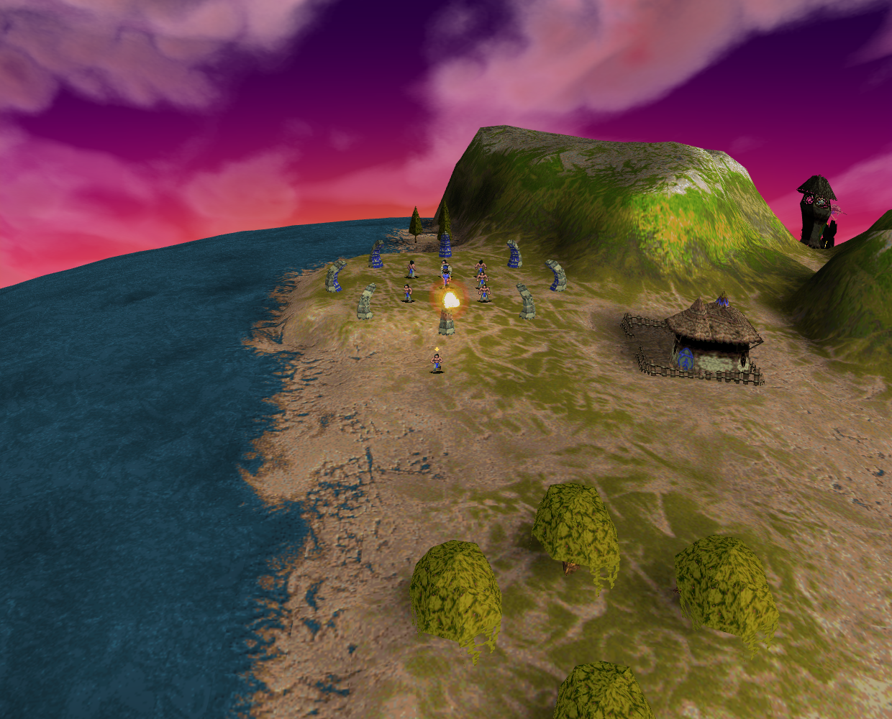

# Baseline19: useful observed history, failed acceptance

Status: **failed**. No natural arrival frame was captured, and the QA observer
sampled a missing person owner after its logical lifecycle had already retired.
This is not ordinary acceptance or an original-game execution.

Source: baseline `a036cf4e03a60ed757d08ee7a5e9900f4dda4154`, with current-main
application bytes and the reviewed ordinary-input checker. Chrome154 headless
software rendering; fresh Mission2 profile. The original Blue Shaman54 and the
single naturally present Blue Brave278 remained the bound actors.

| Actual turn | Retained observation |
| --- | --- |
| 328 | Proposed actual person pixel `(820,474)`; native target pose `(-23296,23808,96)`. |
| 330 | Trusted release matched original278, exact pose/context/pixel and source range; stock4→3; fixed-ground Blast1253 allocated with six windup visits. |
| 332 | Observer confirmed the accepted shot, cleared spell mode, selection `[278]` and four windup visits remaining. |
| 334 | Trusted public ground move reached the same person with two windup visits remaining; exact model3 payload `(43764,23801)` and same owner verified. |
| 335–336 | Target moved during windup; firing transition occurred at336. |
| 337–338 | Target moved during flight; exact logical arrival recorded at338. |
| 339 | Next parent visit allocated wave1260/flash1261 at baseline fixed point `(-101,-101)`; actual impact frame captured. |
| 342–345 | After lifecycle retirement, target278 had flight owner342–343, no owner344, then native owner345. Actor54 stayed native. The observer's unguarded order query threw during this post-objective handoff. |

The source explains the nullable handoff (`stepLiveImpulse` clears flight/native
on landing; a later resting visit owns the new native person). It does not show a
pre-impact identity failure. All nine adjacent release-to-impact visits, original
stock/cast count, unchanged fixed aim and both movement intervals were retained.

The missing arrival PNG remains a separate limit. Retained data cannot tell whether
no natural render occurred in that one-turn phase or its visibility predicate
failed. Simulation/animation visits can share a single later GPU render; no
per-turn render is implied. Future acceptance keeps exact logical arrival and
impact while requiring a genuine natural owned-projectile frame labelled flying
or arrived, plus impact. This failed run is not reclassified under that relation.

The image shows the actual rendered scene after the natural frame; it is not an
isolated-effect pixel measurement. The flash belongs to the retained effect1261
record. No profile, storage or raw original archive is included.

Evidence SHA256: episode `67895be4def07acbd5df1d1debe1eb504957c053598c077190140e3444ae896b`; harness receipt
`f15e18750128a04886a98e54746cccfe60addbc7efcd98b247cf415b6b801a0c`; setup trace `d18f6e4d0b27209a07e60245ccc95b37c32d6d4b2b0a915c0fd246171534eab2`;
impact PNG `fc83e04855f7f077eb9abc6548ad40a8dd9990248af643b08115df04c1567d05`. Full raw receipts remain with the review evidence.
