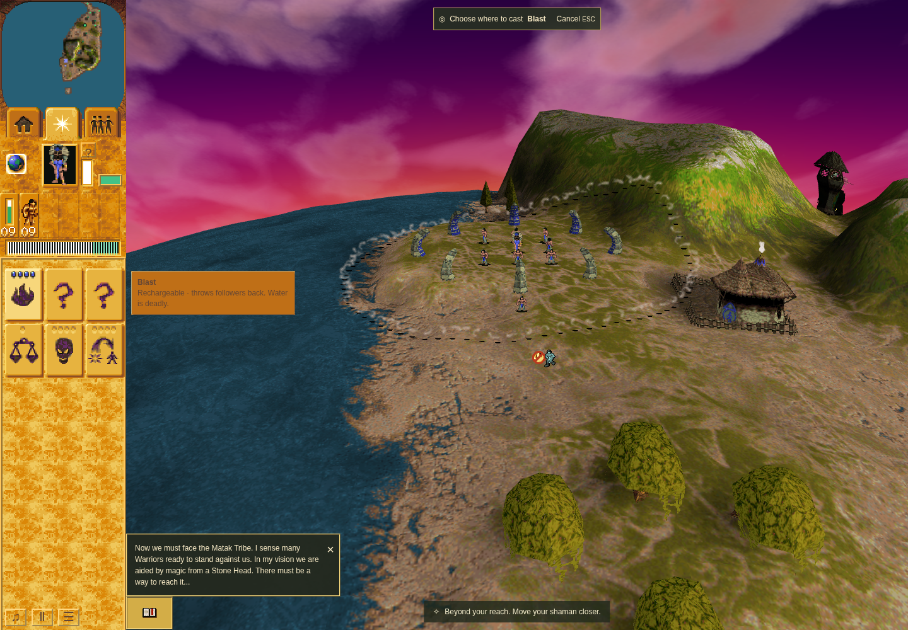
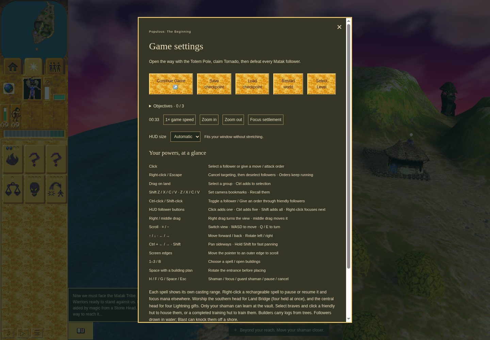
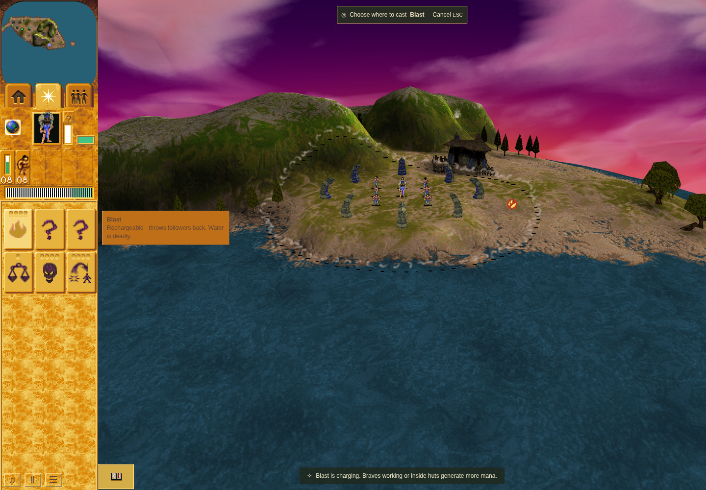

# Ordinary Blast controls02 result

Controls02 passed all six remaining ordinary-control checks on
`2e51cf0a024369221c534d0a72c1fcef7e0065ff` between 09:02:18 and 09:03:54 UTC on
2026-10-08. Source, runtime and scenario fingerprints were unchanged; game errors
and raw stderr were empty. See [the compact result and hashes](controls02-summary.json).

- Escape, canvas right-click and repeated hotkey input each performed their own cancellation transition.
- An out-of-range click retained four shots and allocated nothing.
- An empty-ground double-click allocated one cell-centered Blast; the repeated click issued no cast or order. Arrival, retirement and one flash/wave pair were recorded.
- Person 278 received shot 1266 at turn 395. Trusted Space followed 147 ms later, pausing turn 397 with four windup turns left. The real Save checkpoint and synchronous fresh-page Load boundary preserved the same bounded projection exactly, then normal simulation resumed without another debit.
- Four accepted casts exhausted stock 4→0 with charging disabled; the next ordinary valid-range click was rejected without allocation.
- The public pause button held simulation for one second and Resume restored turn progression.

The JSON includes both bounded saved/loaded projections and their equal canonical
hash, the complete scenario-projection equality/hash, source/runtime and retained
receipt/raw-stream hashes. It contains no browser profile or exported save database. The full checkpoint digest is recorded and matching at Save and run end; it was not independently recomputed from a full-World export.
Failed controls01 remains failed; its keyboard-coordinate observer error was fixed
before this separately bound attempt.

## Inspected screenshots

All images are original 1440×1000 captures from this exact source in headless
Chrome 154.0.8037.92. This is software-WebGL functional evidence, not hardware
performance or native parity. Software fallback, ReadPixels stall and two
texture-without-image-data warnings remain recorded in the retained harness receipt.

The range rejection message and four ready-shot markers are visible.

The real settings menu shows 00:33 and two remaining shots. The hidden active
projectile is proved by input/state/save/Load evidence, not this menu image alone.

Blast remains selectable at zero stock; the charging rejection message is visible.

These controls do not replace the separate moving-person pair/frame review or the
coordinator's final combined-tree standard gates.
