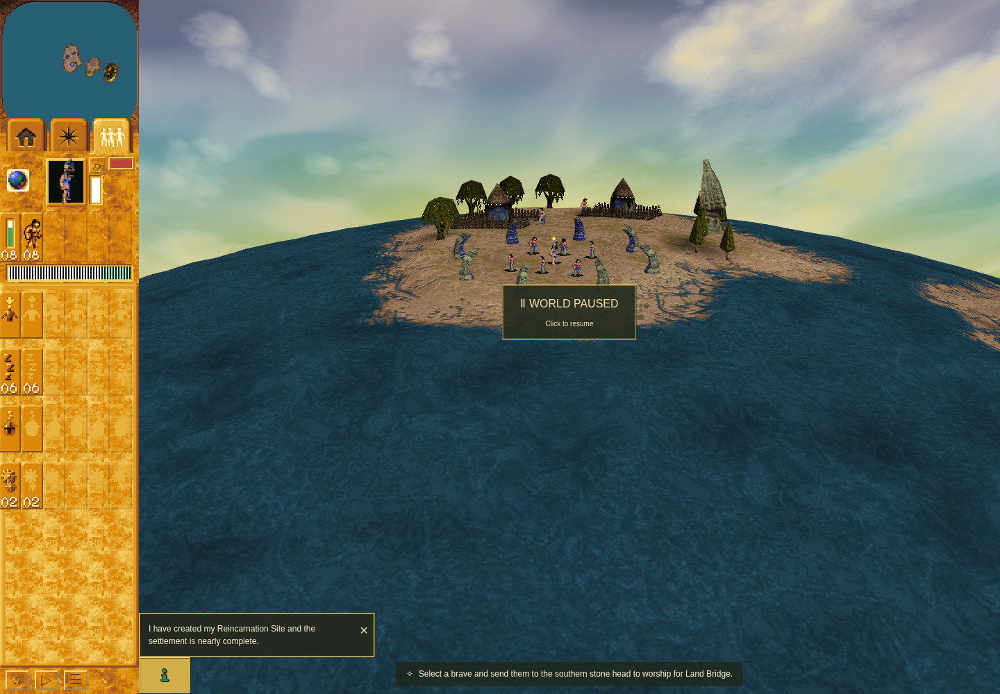
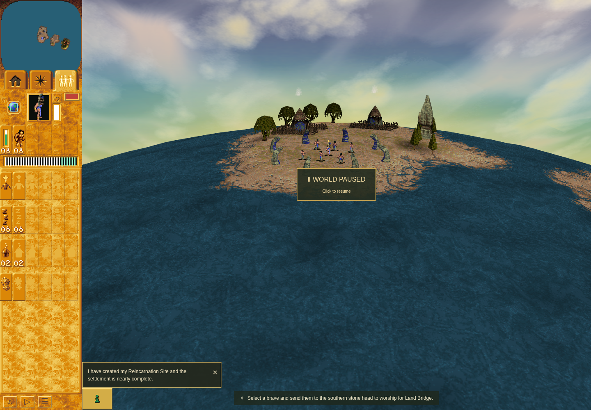
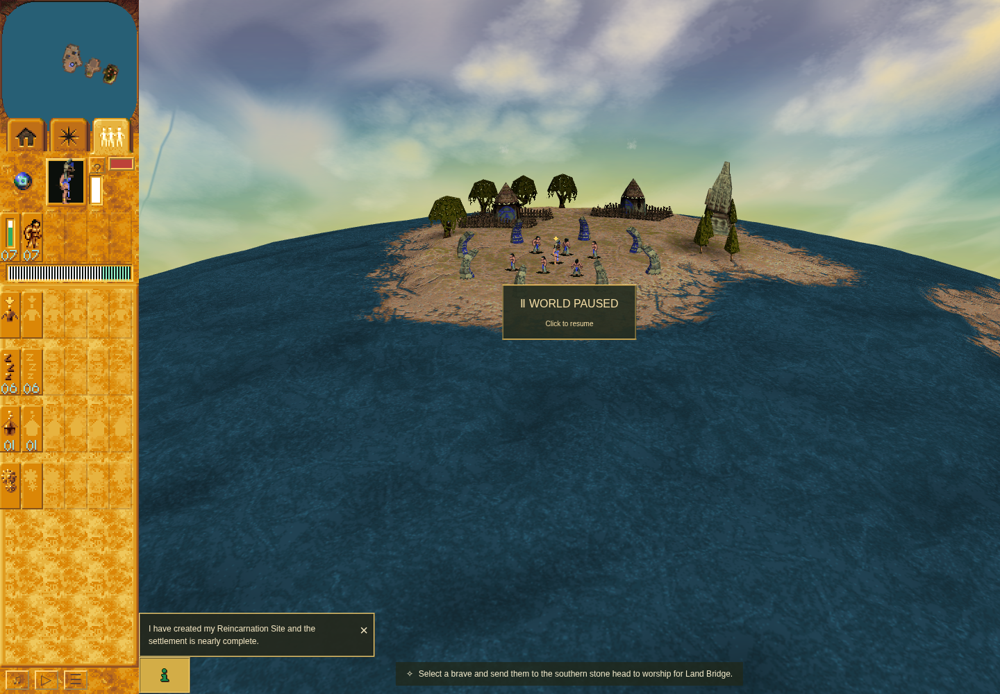
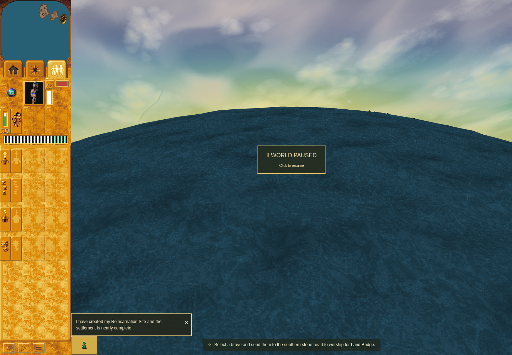
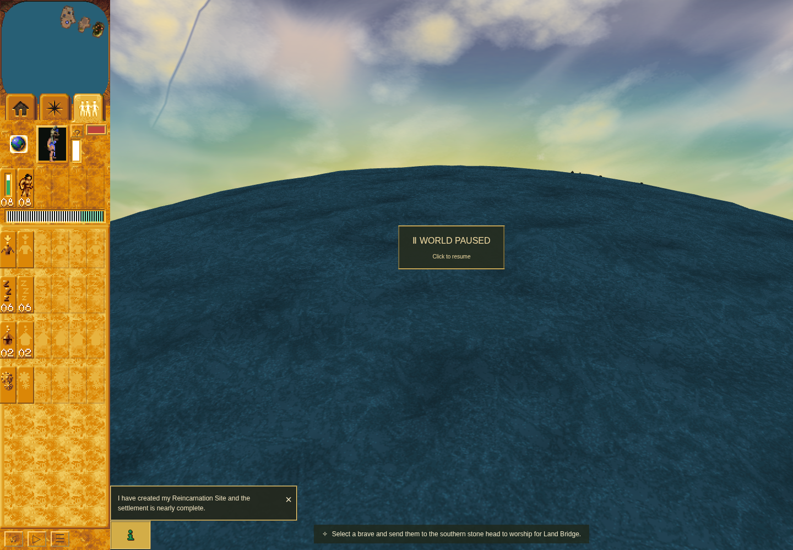
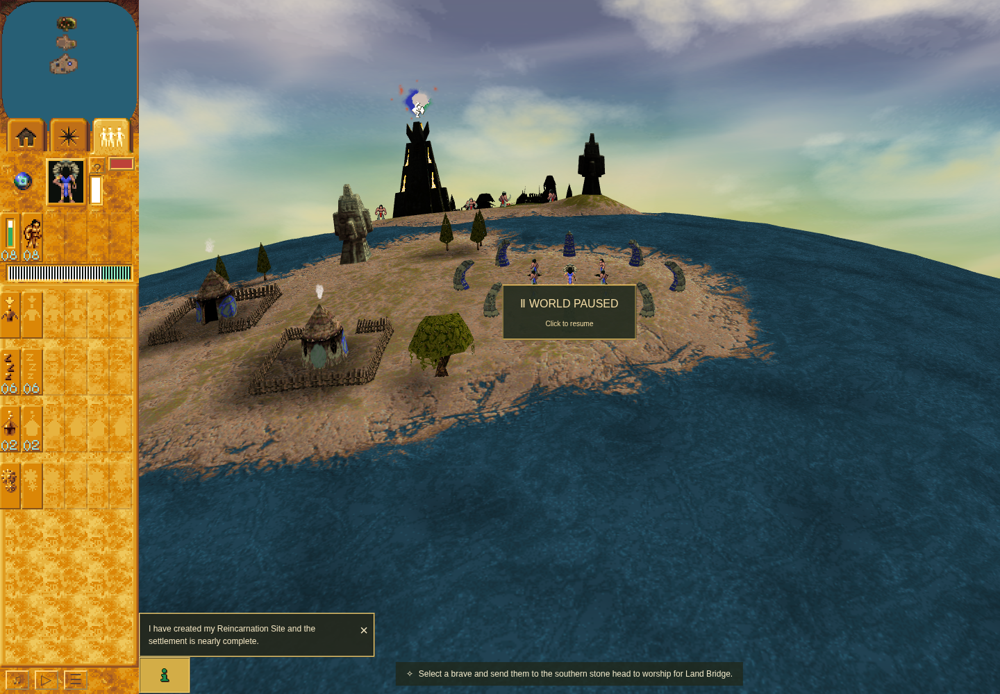
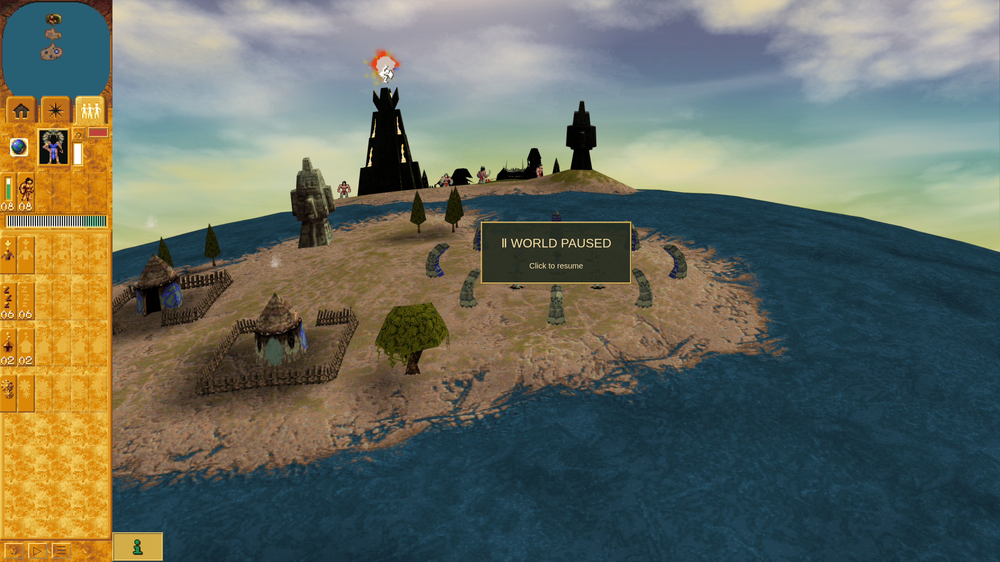
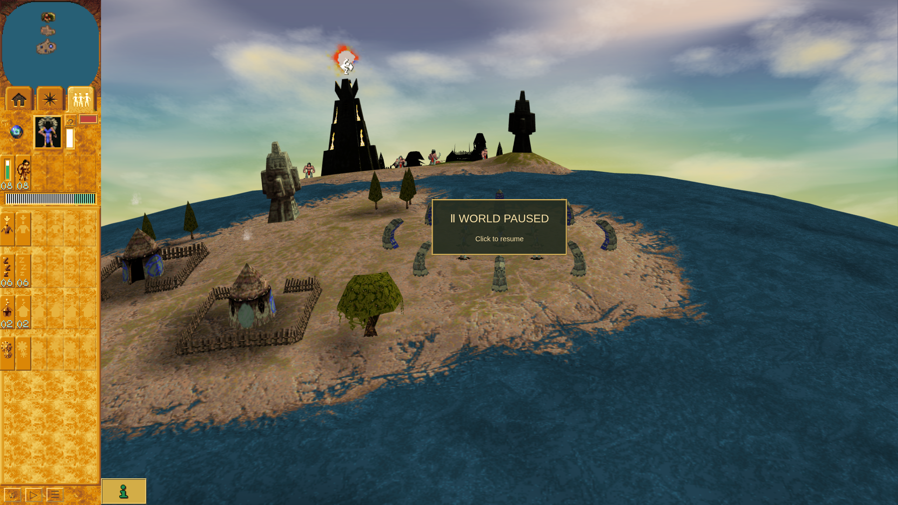

# Nearby Followers control evidence

This is the compact evidence packet for [PR #308](https://github.com/JohnDeved/populous-new-dawn/pull/308), the bounded nearby-control slice of [issue #60](https://github.com/JohnDeved/populous-new-dawn/issues/60). Product source, original artwork and the complete standard test profile are independently accepted. Ordinary Mission 1 core behavior, cleanup and the separate compact DPR 2 supplement are also independently accepted. Final publication review accepted this packet.

## Tested source and scope

- Product commit: `01fa014624be98eaac74a4f9a9268e8b32966973`.
- Product tree: `d6a1a8908770143136e8d223a955b78cfd9015ff`.
- Actual main base: `721c3b08950fee0e19e4117bc7c516fe73d773c8`.
- [Reviewed native source and exact implementation contract](https://github.com/JohnDeved/populous-new-dawn/blob/28d97dd17d959df59aeddab26007351ef3773db3/decomp/research/follower-nearby-source/implementation-contract-v2.md), revision 2 SHA256 `e2d9e598e257c2a8e415520455e12ea0fb50f27669b1f1ef6ebbad044f1b7330`.

The HFX875 globe now exposes Nearby followers. A matching primary release requests the desired mode; one transient Scene/World-owned slot keeps the first pending request. Committed tribe flag `0x80` controls counts, selection and visuals. HFX875–878 and the alternate number font distinguish the four button states and nearby totals. Globally present follower classes remain enabled even when their nearby display count is zero. The gameplay Enter shortcut retains Planet overview; Enter or Space on the focused Nearby button activates that button on key release.

An elapsed 12 Hz dispatcher runs before simulation, including while paused. This is an explicit port compatibility policy; the original consumer cadence remains unknown. Modal opening, hidden or inactive input and stale Scene ownership cancel pending requests. Saves clone committed mode only. These policies do not reconstruct the complete native command ring or original save codec.

## Accepted source, test and artwork results

The retained failure-first baseline has three actual Page failures: the button invoked Planet overview, HFX876–878 were absent, and persistent Total kept global counts/default font. The final focused product tests passed 40 cases, including actual Page effects and Scene/clock/store composition, held second presses, repeated releases, pause and speed changes, ownership replacement, committed-only checkpoints and strict count boundaries. Their browser/DOM dependencies are controlled test inputs; these cases alone do not prove delivered browser input.

The fresh standard profile on exact product commit `01fa0146` passed **1,853 tests across all 299 maintained test files**. All 17 stages passed, including typecheck, static/parity checks, orchestration and build, from `05:56:50.224Z` to `06:03:19.725Z` on 2026-10-10. The aggregate binds all stage receipts and raw log hashes. Its independent result review checked the underlying receipts and exact source correspondence.

Scoped formatting passed. Exact base 721 attribution found zero added lint diagnostics. ESLint still failed with the same 2 errors and 2 warnings; Oxlint still failed with the same 58 diagnostics. Their failed status is retained in the comparison receipt and is not relabeled as a pass.

Canonical data-only extraction, append/check and independent artwork review passed. Only HFX876–878 were appended. All four frames are 19×16; the atlas grew from 1024×534 to 1024×551. All 1,755 previous rectangles and every previous RGBA pixel were preserved. The preserved pixel SHA256 is `c50ab43d869de09b9924592365ccbb76ff38d7bc59320184771edb82ea6d9019`. Portable appender tests cover wrong inputs, partial installation, old/new sprite corruption, idempotence and check-only behavior. No original installer or native executable was run.

The decisive receipts are in [receipts/](receipts/); [reviews/](reviews/) contains independent source, artwork and result acceptance. [artifact-manifest.json](artifact-manifest.json) records the exact retained file bytes and hashes. The standard aggregate and reviews reference the complete raw local receipts; this compact publication does not copy all execution history.

## Ordinary baseline and retained first failure

The accepted before image is ordinary authored Mission 1, paused at turn 154, on baseline QA commit `18113c7725b2d1a268b5ce3c971e5e5afe467096` with the original application. Viewport 1440×1000, DPR 1. Global Total and Brave counts are 8; the original globe is still Planet overview. It is a surface baseline, not a matching-turn or native-raster comparison.

Candidate attempt 01 used QA commit `cfaff7b5e727f73ee367004d8a72de4f9b69b621`, carrying exact product `01fa0146`. It passed global-home then stopped at the held global-frame DOM comparison at turn 176. The screenshot visibly contains the pressed globe. The predicate expected literal `-0px -535px` at HFX876's atlas x=0. Attempt 01 did not retain the actual failed-game DOM background-position string. A separate probe in the same browser and independent review established normalization to `0px -535px`; QA-only repair `09d95ea6` passed 17 focused cases and was accepted. The retry source was published as `8b8ad6e840fb26cc3e51fecf7763bc68173be58b`, with the same accepted tree. Product source is unchanged.

The failed attempt retains its failure and cleanup record. No normal nearby transition, count/selection episode, compact DPR 2 or typed Save/Load completed. Its finally block released the held pointer, producing one request and zero observed commits; that incomplete endpoint remains failed. Cleanup and continuation were independently verified.

These captures used software WebGL. The browser reported the known SwiftShader fallback, ReadPixels stall and texture-readiness warnings. They establish no hardware-performance or original-raster claim.

## Accepted ordinary Mission 1 result

The independently accepted core behavior and cleanup from the fresh ordinary authored Mission 1 run used QA commit `8b8ad6e840fb26cc3e51fecf7763bc68173be58b`, tree `2efa6d9453e9e7f02738ae03d6c446cf2e3e5290`, with exact product app/public bytes from `01fa0146`. All 16 stages passed. Two closed, sealed observer epochs recorded three requests and three commits each; seven selection events were observed. Browser/scenario errors were empty. The inner run finished at `06:26:48.851Z`; the outer exit-zero result was collected at `06:26:52.634Z`, with cleanup and continuation verified.

At paused turn 178, the normal view showed global Total/Braves **8**, then nearby Total/Braves **7** after primary release, with alternate number glyphs. The flag changed from `2` to `130`, preserving the other bit. The global housing meter stayed **9 of 12**. At the same turn, a public minimap click moved the raw camera center from `(5378,55599)` to `(20634,55069)`. Nearby Total, Braves and idle Braves became **0**, while the globally present Brave control stayed enabled. Nearby left/Shift selection, right focus and class selection found no distant recipients. Returning to global restored Total/Braves **8** and idle Braves **6**.

After, at turn 178, 1440×1000, recorded DPR 1: nearby home counts and alternate glyphs. The baseline above is the same authored mission/viewport, captured at a different turn and slightly different camera angle.

The same away camera and turn, 1440×1000, recorded DPR 1: nearby zero versus global eight. The pause card and world rendering remain natural.

Global idle selection chose existing Brave **14**; the actual `Scene.focus` call received its position **(11,33)** and the camera reached native `(4864,55040)`. A later Ctrl class action selected existing Braves **13–17**. A held nearby press, move-away cancellation and secondary input left the committed nearby mode unchanged. The observed directional cues are requests, not proof of audible playback during pause.

The trusted public Save captured committed flag **130** at turn **178**. Trusted Load initially restored level 1, turn **178**, flag **130**, with matching actor, terrain and stock digests. Load's existing unpaused behavior changed the full checkpoint digest; the report does not assert equal whole-checkpoint hashes. The later rendered pause was turn **207**, still nearby, and public input switched it back to global. The loaded camera used the existing reset angle, so this is checkpoint mode evidence rather than a matching-camera image.

Compact surface readbacks at 1280×720 recorded **DPR 2 for compact-global, DPR 1 for compact-nearby and DPR 1 for compact-keyboard-global**. The compact PNG files are all 1280×720. These captures do not establish nearby or keyboard transitions at DPR 2. The delivered pointer and focused-button keyboard paths did change mode at the recorded compact DPR 1 states.

The two diagnostic blank-page attempts remain failed. Probe 01 reproduced the high-level screenshot resetting DPR 2 to DPR 1 and failed its subsequent mixed-session before-capture assertion. Probe 02 again reproduced the reset, then timed out waiting for a mixed-session restoration. Both closed cleanly with no network requests or game access. Fresh same-session CDP-only probe 03 passed three strict before/after DPR 2 and 2560×1440 checks. Its reviewed method was applied only to the bounded saved-checkpoint supplement below; it does not relabel either earlier failure.

## Accepted compact DPR 2 supplement

QA commit `f1f7db4e842a2ccef2eac4148fffe42fe760421a`, tree `52fbb694bcbfdd881153813d68436dafb4e6f0d3`, added the compact-only capture path while preserving exact product/application/runtime fingerprints. Its 25 focused QA contracts passed. The ordinary supplement publicly loaded the genuine checkpoint saved at turn 178, then paused at turn 226. Three delivered requests joined three commits: global, nearby, then global through focused-button keyboard release.

All three states retained **1280×720 and DPR 2 both before and after capture**, producing **2560×1440** PNGs. Flags were **2 → 130 → 2**, with Total/Braves 8 and housing 9 of 12. The capture hashes for all three states, including the retained raw keyboard-global image, are in [compact-summary.json](receipts/compact-summary.json). The global/nearby pair below is the supplement, not recaptioned attempt 02 pixels.

The original saved checkpoint SHA256 `0bf40ac842cf730bf0ebe73987f5faf24e5d349cd6bdce5c3c489e1e2b207fe7` stayed unchanged. Browser/scenario errors were empty, the observer sealed and restored its wrappers, checkpoint observation detached, and owned browser/server/profile cleanup passed. Inner completion was `06:48:06.589Z`; outer completion was `06:48:09.300Z`. [Independent compact-result acceptance](reviews/follower-nearby-compact-result-review-f1f7db4e-20261010.json) closes the previously incomplete DPR 2 scope.

[Candidate02 compact scalars](receipts/candidate02-summary.json) are derived from the exact raw scenario SHA recorded there; they retain all stage identities, counts, mode flags, dimensions, selection/focus recipients, observer endpoints and typed checkpoint digests. The original raw scenario and complete logs remain retained locally and bound by the receipt/review references. This compact packet excludes full gameplay-state history.

PR inline image links will use the immutable evidence commit. GitHub rendered HTML is checked separately after publication. No profile, storage database, original source bank, executable or archive is included in this packet.

This slice does not close all of issue #60 and makes no new parity recording, deployment, native execution, full specialist/transport episode, original save interoperability or hardware-performance claim.
