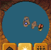
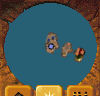
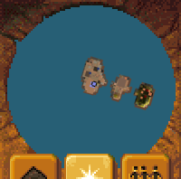
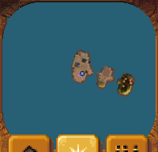
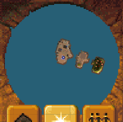
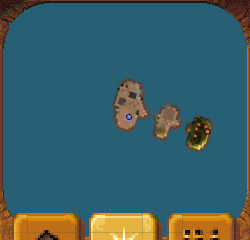

# Minimap frame comparison, 2026-10-04

These are actual browser crops from Mission 1, not original-game screenshots.

- Before: accepted main `7dcd89f9858600d9bd889d00a758fb78baa13f73`, old scaled 100×99 composite and CSS ellipse.
- After: local `0e602dcf14fd9a78e2a6ea0293966e3209dfd3a9`, exact code tree `03188eaeb62f0d0b69ea13f75abc0b5da9567513`, published as `394d465122d30dd260e9e7c66da141fe200be75c` in PR #176. It includes accepted main `155e591` plus the frame repair.
- Same Mission 1, viewport and automatic HUD preference. Camera is frozen for pixel capture; accepted intervening main fixes do not change minimap frame code. The screenshot dimensions differ because the old composite had an incorrect 99-pixel logical height; the corrected native control is 96 pixels.
- Browser: sandboxed Chrome Headless Shell 154.0.8037.92, WebGL2 ANGLE SwiftShader on Linux. Functional/pixel evidence only; no hardware performance or full-game native-frame claim.

## 640×480, 1× HUD

Before:

After:

## 1440×1000, 2× HUD

Before:

After:

## 3840×2160, 2.5× HUD

Before:

After:

Native proof: both 512/513 descriptors, twelve exact sprites, retained-size corners, tiled edges and absent center. The former ellipse CSS clip is removed. Full rectangular pointer reach is an explicit browser compatibility correction; native hit-region parity remains open.
