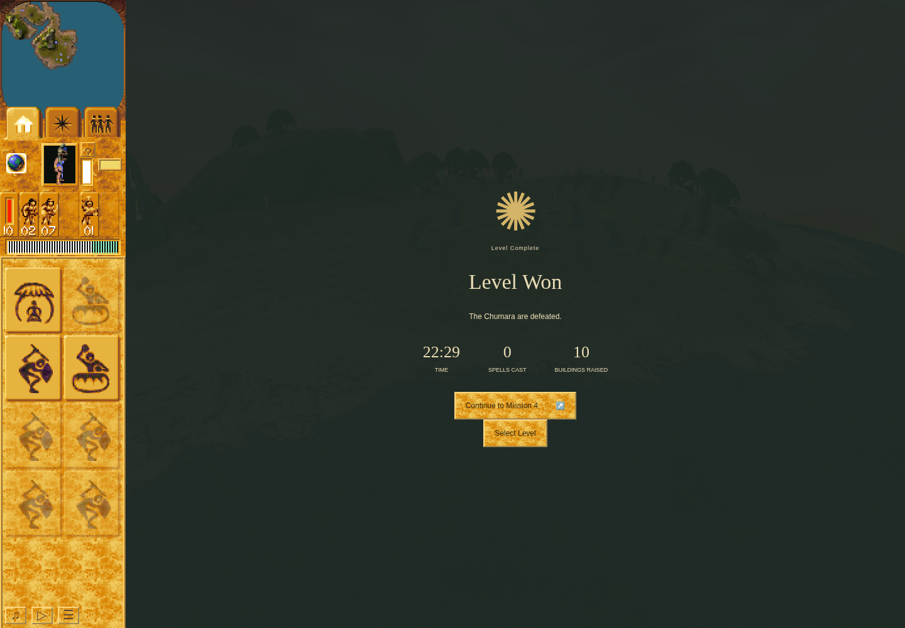

# Ordinary Mission3 victory with retained failed history

Actual run `a02e7d02-ae42-496d-a49e-00c75b069ede` on QA `5de3c5715f05cce509a6d7a86c2b17752aac8c2a` and pinned application `b3818511da0b420129b03092f397ad76bc6111a8` reached the real Mission3 victory through ordinary controls and normal RAF. [Accepted sermon/Erosion prefix](../erosion-evidence-a02e7d02-20261005/README.md) remains separately attributed.

[Independent terminal review](erosion-victory-a02e7d02-review.json) **ACCEPTS** the frozen packet,34 bound artifacts and90 assertions, including the visually inspected victory PNG and actual committed-profile journal line421. This proves the pinned historical application; later current-main changes have not been replayed by this run.

The final accepted seven-Warrior attack removed Yellow Shaman47 by16125. The actual world reports won, with no Yellow actors, at16159. The result displays “Level Won,” “The Chumara are defeated,” and “Continue to Mission4.” The existing proof waited for the result control and actual committed IndexedDB profile observation `{version:1, completed:[3]}`. [Victory screenshot](milestone-victory.png) and [matching paused snapshot](milestone-victory.json) are from16193; Mission4 was not started.

The cumulative active total is1936.25, including the original980.0833333333333 prefix, below the unchanged2252.8333333333335 ceiling. The world was paused for UI work and tactical decisions. The onscreen22:29 describes that world's game time, not cumulative replay time or wall duration.

All five command failures remain: three inherited, one rejected withdrawal ground probe, and one explicit builder target read after that actor was already absent. The two inherited control stops (preserve-latest and progress-stall) and this run's final preserve-latest stop also remain, for three stops total. The overall harness and outer receipt are **failed**, not a clean uninterrupted success. Ordinary gameplay victory, campaign persistence and normal cleanup are distinct observations.

An incomplete empty Yellow Hut1022 (hp170, progress2/3, occupants[]) remained at15825. Victory and terminal16193 lists contain no Yellow building. No separate accepted destruction order for that rebuilt Hut is claimed.

The sole authenticated preserve-stop completed normally at08:40:15.355Z. The original execution session95285 returned exit1; source/runtime stayed unchanged, cleanupVerified and continuationVerified are true, owner/Singleton markers are absent, and the owned4366 listener was released. The genuine latest checkpoint remains4813/full720e96e2. Dependency925605 was returned with the terminal-bound two-ended receipt; M3 holds no browser/package resource.

The frozen packet binds full journal, all20 consumed inputs, inner/outer receipts, journey, terminal and actual committed-profile evidence. No private browser profile or IndexedDB bytes are included. Original Run14 cleanup remains unknown. This is headless/software-rendered ordinary gameplay evidence, not complete original-game parity, native-pixel equivalence or hardware performance.
