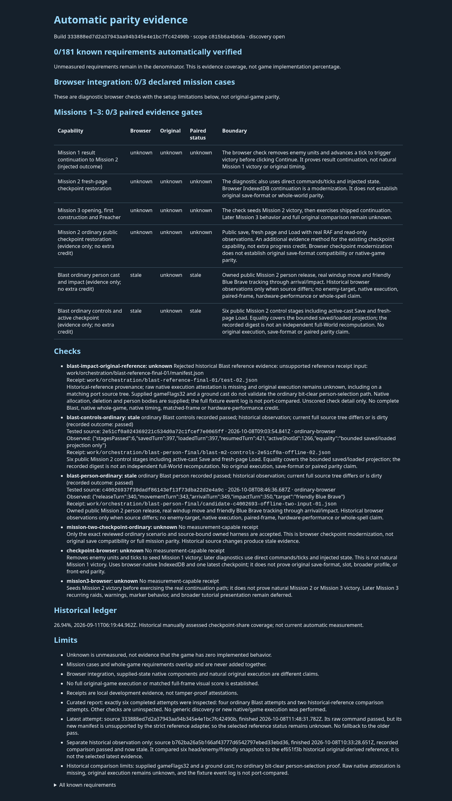
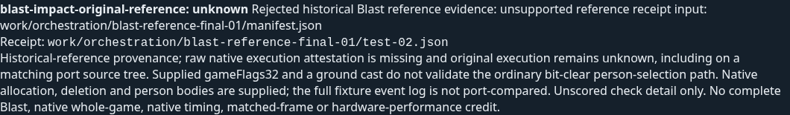

# Historical Blast reference: validation and report evidence

[PR273](https://github.com/JohnDeved/populous-new-dawn/pull/273) adds an unscored historical-reference comparison. The latest report correctly shows **unknown** for the current attempt's unsupported manifest and preserves the older passed comparison separately as **historical/stale**. Original execution remains **unknown**, with raw native attestation **missing**.

Current validated source: `333888ed7d2a37943aa94b345e4e1bc7fc42490b`  
Current tree: `e92f2bd801cfda3950372f67e031992f10f1dbbe`  
Reviewed carried source: `b762ba26a5b166af43777d6542797ebed33ebd36`  
Carried tree: `473a0c4d695dd5b12762421965d92c819a162f2b`

## Standard validation: eight fresh stages, four reviewed carries

The accepted aggregate covers **1,511 passing tests across 257 files**, with zero failed, cancelled, skipped or todo tests. It combines **eight fresh stages on 333888ed** with **four reviewed carried stages on b762ba26**. It is not a claim that all twelve stages were rerun on the current head.

Fresh stages: typecheck, test shards 01/02/03/08, parity checks, orchestration checks and build. They ran from `2026-10-08T11:47:18.475Z` to `2026-10-08T11:50:08.604Z`. Shards 04–07 retain their original source, dates, raw receipt hashes and inputs; their **641 tests/128 files** were carried after review. Fresh test shards cover **870 tests/129 files**.

Carry is bounded to unchanged dispatched tests, app/public inputs, dependency locks and runtime source. The old receipts also fingerprinted the changed but **non-dispatched** `tests/parity-owned-blast.test.mjs`; that overbroad input difference is disclosed. Their old wrappers did not execute the new report adapter imports, and their parityMeasurements arrays were empty. Changed adapter/registry/documentation/test paths are covered by fresh shards 01/02/03/08. This reviewed standard carry does not authorize the report adapter to weaken its own strict manifest or whole-tree rules. The aggregate is not a clean-lint attestation.

| Stage | Result | Execution source | Passed tests |
| --- | --- | --- | ---: |
| typecheck | PASS | fresh, 333888ed | — |
| test-01 | PASS | fresh, 333888ed | 206 |
| test-02 | PASS | fresh, 333888ed | 272 |
| test-03 | PASS | fresh, 333888ed | 160 |
| test-04 | PASS | reviewed carry, b762ba26 | 185 |
| test-05 | PASS | reviewed carry, b762ba26 | 129 |
| test-06 | PASS | reviewed carry, b762ba26 | 159 |
| test-07 | PASS | reviewed carry, b762ba26 | 168 |
| test-08 | PASS | fresh, 333888ed | 232 |
| parity | PASS | fresh, 333888ed | — |
| orchestration | PASS | fresh, 333888ed | — |
| build | PASS | fresh, 333888ed | — |

The [machine-readable summary](receipt-summary.json) keeps every stage's executed source, timestamps, stream/receipt hashes and carry limitations.

## Latest unknown; historical pass retained separately

The current `test-02` command passed on `333888ed`, finishing at **2026-10-08T11:48:31.782Z**. Its manifest hash is `0a298ac45bd357a7f1530afa4318964a9e0a8af10eefaaf1daa2f17a42f40008`. That manifest is outside the strict adapter's reviewed pins, so the selected comparison status is **unknown**. The report does not fall back to the older pass.

The earlier comparison ran on `b762ba26`, finished at **2026-10-08T10:33:28.651Z**, and passed against the reference originating in `ef651f3b592cf859fb738b9e36eb05495e55d9a5`. It remains separately labelled **historical/stale**, with missing raw native attestation and original execution unknown.

Only six head/enemy/friendly snapshots are compared: arrival keeps the head, relative visit 2 retires it, enemy impulse appears at visit 3 and friendly impulse at visit 5. The port test supplies **gameFlags32 and a ground cast**; it does not validate the ordinary bit-clear person-selection path. Native allocation/deletion, person bodies and unrelated consumers are supplied or intercepted. The fixture's allocation/audio event log is not port-compared.

The curated projection interprets exactly six approved attempts: four ordinary Blast attempts and these two historical-reference attempts. The ordinary person and controls rows remain stale. All Original statuses remain unknown. Counts remain **0/181 known requirements**, **0/3 browser cases** and **0/3 paired gates**. No capability or score binding is added; test totals are not parity percentages. The screenshot's dated 26.94% historical ledger is a separate manually assessed measure.

## Static report capture

The static HTML capture passed on Chromium `154.0.8037.92`, at viewport widths **1440 and 960**, finishing at `2026-10-08T11:56:30.194Z`. It recorded no browser errors, blocked requests or horizontal overflow; the browser disconnected afterward. The captured HTML/JSON match the curated outputs byte-for-byte. This capture loads the report, not a game scenario.

[Full report](report.png) · [Reference detail](reference-detail.png) · [Receipt summary](receipt-summary.json)

These results do not establish native whole-game play, full Blast parity, matched game frames, saves or hardware performance. No tests or game/browser/native run was repeated to publish this supplement. Only this summary and the unchanged relevant screenshots are published; raw archives, profiles and native binaries are excluded.
