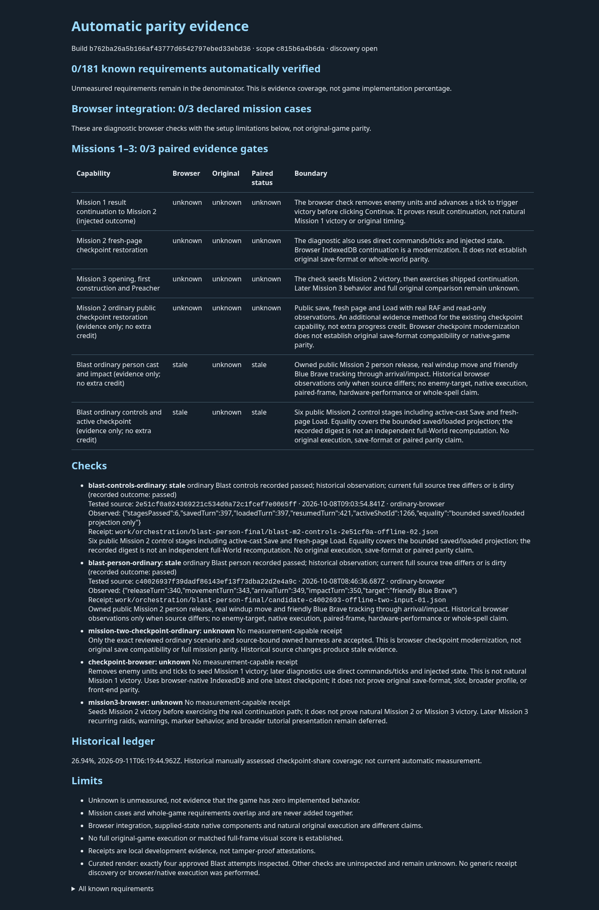
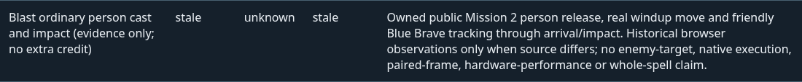
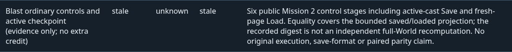

# Automatic parity report: Blast evidence supplement

This supplement records the combined tooling validation for [PR271](https://github.com/JohnDeved/populous-new-dawn/pull/271) and [PR272](https://github.com/JohnDeved/populous-new-dawn/pull/272). The report displays both accepted ordinary Blast observations as **historical/stale**, with **Original unknown** and **no additional parity credit**.

Tested source: `b762ba26a5b166af43777d6542797ebed33ebd36`  
Tested tree: `473a0c4d695dd5b12762421965d92c819a162f2b`

## Validation

The fresh standard profile passed all **12 stages**, including **1,505 tests across 257 files** with zero failed, skipped, cancelled or todo tests. Typecheck, eight test shards, parity checks, orchestration checks and build completed between `2026-10-08T10:31:27.224Z` and `2026-10-08T10:39:14.443Z`. Structural and context validation also passed.

**Strict lint preflight remains FAILED** (exit 1): three independently reviewed inherited `@typescript-eslint/no-unused-vars` findings in `scripts/orchestration/cli.mjs`: `_evidence` at 752:62, `_hash` at 842:44 and `_changeHash` at 842:63. The standard result does not claim clean lint or silently convert these findings into passes.

| Standard stage | Result | Passed tests |
| --- | --- | ---: |
| typecheck | PASS | — |
| test-01 | PASS | 200 |
| test-02 | PASS | 272 |
| test-03 | PASS | 160 |
| test-04 | PASS | 185 |
| test-05 | PASS | 129 |
| test-06 | PASS | 159 |
| test-07 | PASS | 168 |
| test-08 | PASS | 232 |
| parity | PASS | — |
| orchestration | PASS | — |
| build | PASS | — |

The independent static capture passed on Chromium `154.0.8037.92` at viewport widths **1440 and 960**. The captured document had no horizontal overflow, browser errors or blocked requests. The browser disconnected after capture. Capture finished at `2026-10-08T10:46:46.334Z`; it loaded the generated report HTML and did not execute a game scenario.

## Report and observations

- Known requirements automatically verified: **0/181**.
- Browser integration cases: **0/3**; paired evidence gates: **0/3**.
- The three evidence-only observation rows, including the existing ordinary Mission 2 row, add no numerator or denominator credit.
- Exactly four approved Blast attempts were interpreted. Other checks were uninspected and remain unknown. No generic receipt discovery was used for this curated report.
- The dated **26.94% historical ledger** in the screenshot is a separate manually assessed checkpoint-share measure, not newly earned automatic coverage.

[Full report screenshot](report.png) · [Person row](person-row.png) · [Controls row](controls-row.png) · [Machine-readable receipt summary](receipt-summary.json)

### Ordinary person cast and impact

Recorded source `c40026937f39dadf86143ef13f73dba22d2e4a9c`, finished `2026-10-08T08:46:36.687Z`: real release 340, public movement 343 during windup, arrival 349 and impact 350. The target was a friendly Blue Brave. Browser and paired status remain **stale**; Original remains **unknown**.

### Ordinary controls and active checkpoint

Recorded source `2e51cf0a024369221c534d0a72c1fcef7e0065ff`, finished `2026-10-08T09:03:54.841Z`: six stages passed, active shot 1266, saved and loaded turn 397, resumed turn 421. Equality covers the bounded saved/loaded projection. The recorded full digest is not an independent full-World recomputation. Browser and paired status remain **stale**; Original remains **unknown**.

## Provenance and limits

The [receipt summary](receipt-summary.json) retains the exact standard-stage, strict-preflight, structural/context, curated-generation, render and image SHA-256 identities. The render input JSON/HTML hashes match the original curated outputs byte-for-byte; source snapshots before and after generation/capture match the tested union. The screenshots are unchanged copies of the reviewed static captures.

These are tooling and report-presentation results, excluded from the product trial. They do not establish original-game execution, native paired parity, enemy-target coverage, matched game frames, or hardware performance. No game scenario or test was rerun to publish this supplement. Raw archives, profiles and unselected evidence are not published here.
