# PR314 rendered and standard-gate evidence

Product: `e989fbb71849f2530692f896ea3d045afd6432bf`. Reference application/assets: `219384134d21200f80df0496a4866fb02fb200db`. QA helpers are maintained separately in PR317; no product source was changed by the browser checks.

## Completed world-theme pair

Both finite routes passed: M1 → M3 → Save → M1 → M2 → Load M3 → Restart → page reload → startup Load. Each retained ten actual rendered world/minimap views and eight synchronous shipped action boundaries. Candidate mode strictly verified selected c/s/p terrain bytes, full atlas response bytes, selected tree geometry and warm-cache replacement. Reference mode admitted exact baseline app/public equality and made no corrected-selection claim.

Each run used a new game-only profile, sandboxed Chrome Headless Shell154.0.8037.92 and ANGLE/SwiftShader, viewport1440×1000 at DPR1, ordinary real RAF and shipped inputs. Terminal source/input hashes were stable and browser/profile cleanup verified. No browser errors were recorded.

Before/after images use the same mission, shipped camera sequence and viewport. Natural turn/actor poses differ; these are comparable scenarios, not pixel-aligned or native-game reference images. Actual capture poses and source fingerprints are in the reports.

### M1 ground, c control

Before: application `219384134d21200f80df0496a4866fb02fb200db`, natural world sample turn425, preset2. The viewport screenshot has its separate before/after pose brackets in the report.
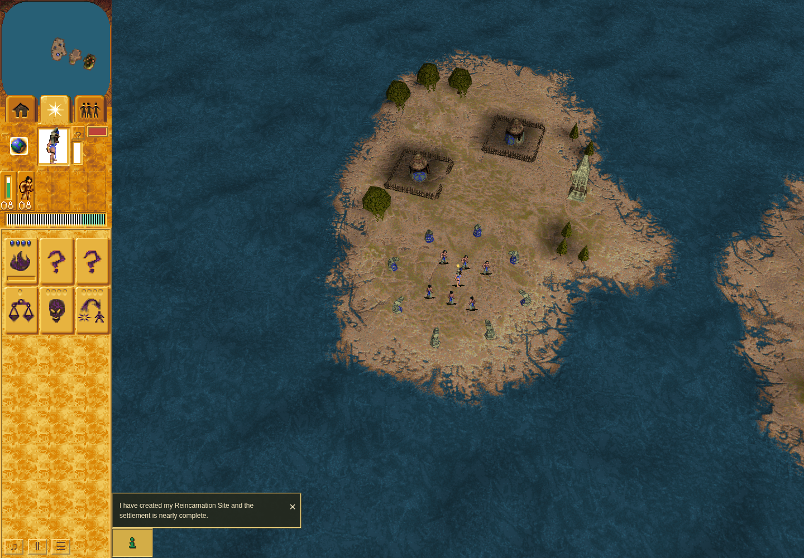

After: application `e989fbb71849f2530692f896ea3d045afd6432bf`, natural world sample turn417, preset2. The viewport screenshot has its separate before/after pose brackets in the report.
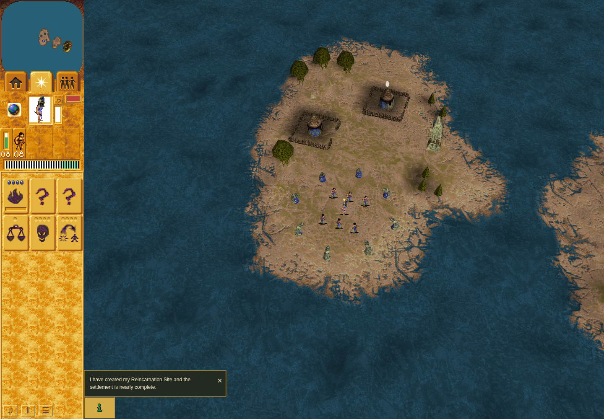

### M2 ground, authored s terrain

Before: application `219384134d21200f80df0496a4866fb02fb200db`, natural world sample turn154, preset2. The viewport screenshot has its separate before/after pose brackets in the report.
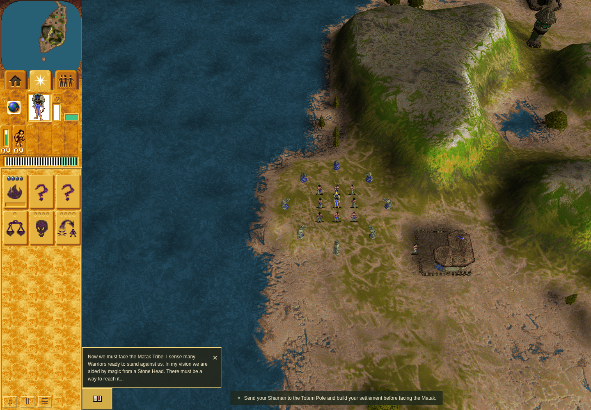

After: application `e989fbb71849f2530692f896ea3d045afd6432bf`, natural world sample turn156, preset2. The viewport screenshot has its separate before/after pose brackets in the report.
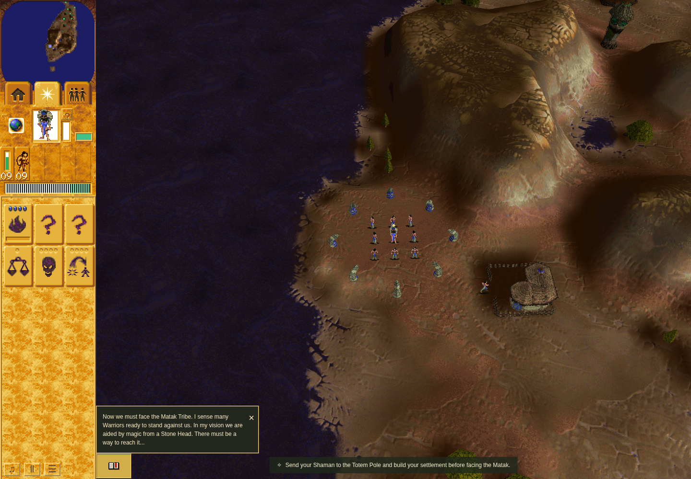

### M3 ground, authored p terrain and bank6 trees

Before: application `219384134d21200f80df0496a4866fb02fb200db`, natural world sample turn127, preset2. The viewport screenshot has its separate before/after pose brackets in the report.
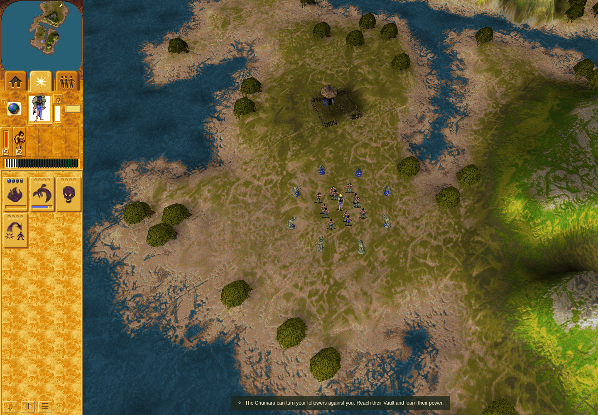

After: application `e989fbb71849f2530692f896ea3d045afd6432bf`, natural world sample turn114, preset2. The viewport screenshot has its separate before/after pose brackets in the report.
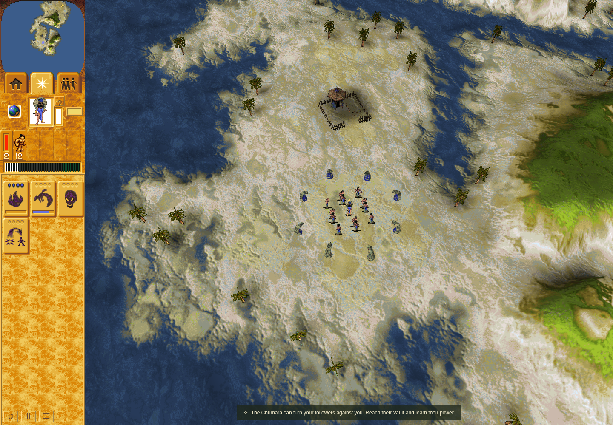

### M1 overview

Before: application `219384134d21200f80df0496a4866fb02fb200db`, natural world sample turn460, preset4. The viewport screenshot has its separate before/after pose brackets in the report.

After: application `e989fbb71849f2530692f896ea3d045afd6432bf`, natural world sample turn450, preset4. The viewport screenshot has its separate before/after pose brackets in the report.
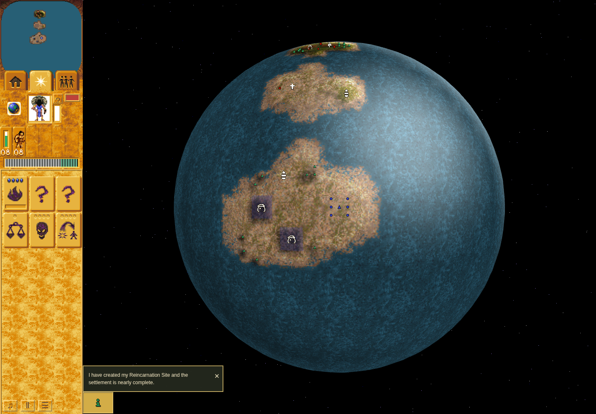

### M2 overview

Before: application `219384134d21200f80df0496a4866fb02fb200db`, natural world sample turn196, preset4. The viewport screenshot has its separate before/after pose brackets in the report.
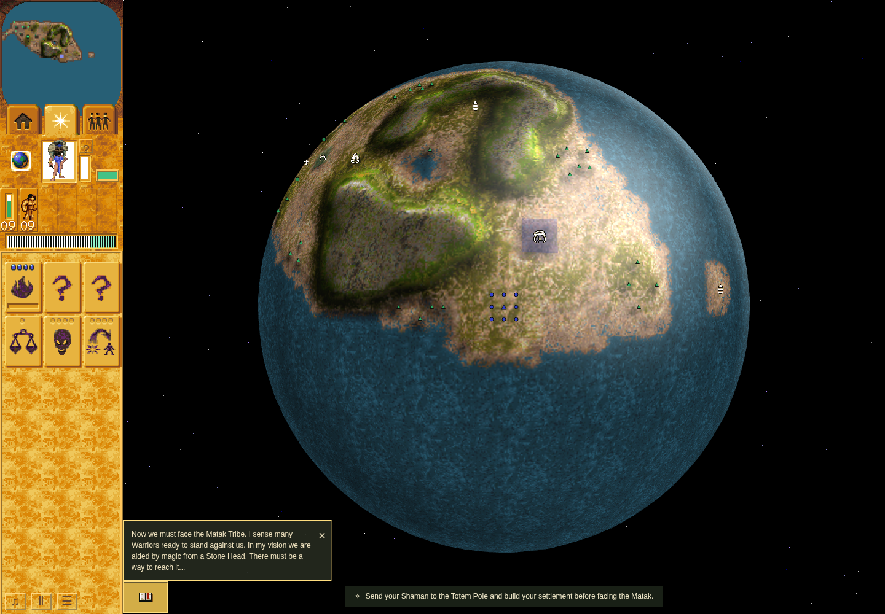

After: application `e989fbb71849f2530692f896ea3d045afd6432bf`, natural world sample turn195, preset4. The viewport screenshot has its separate before/after pose brackets in the report.
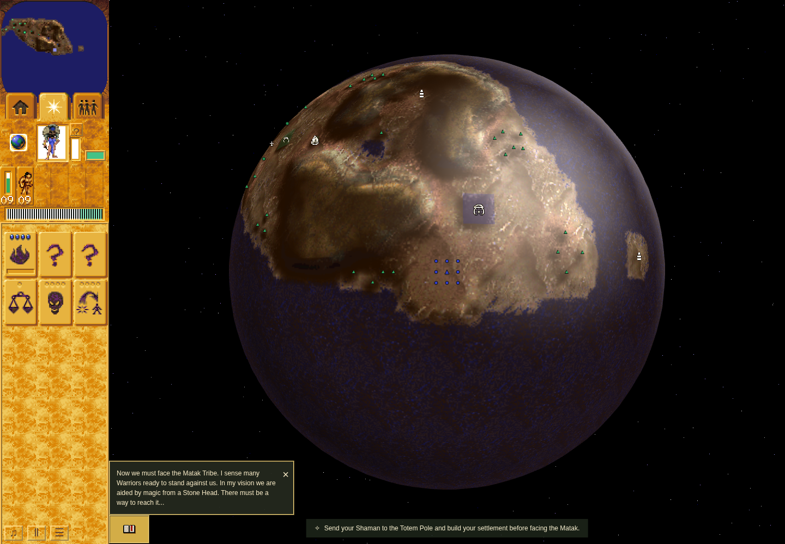

### M3 overview

Before: application `219384134d21200f80df0496a4866fb02fb200db`, natural world sample turn165, preset4. The viewport screenshot has its separate before/after pose brackets in the report.
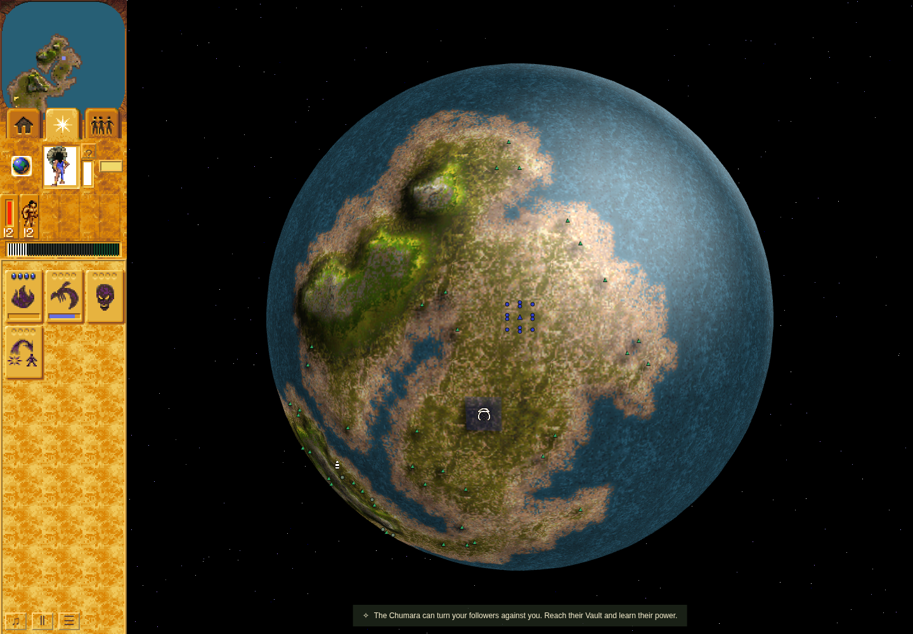

After: application `e989fbb71849f2530692f896ea3d045afd6432bf`, natural world sample turn151, preset4. The viewport screenshot has its separate before/after pose brackets in the report.
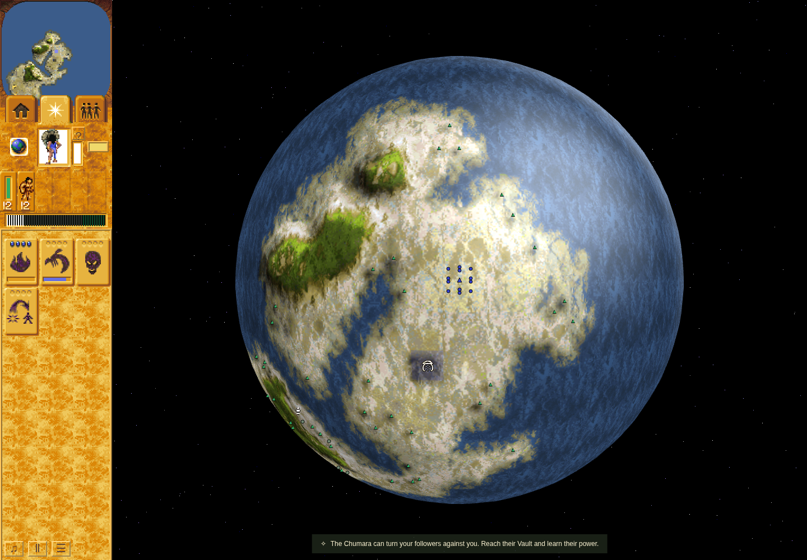

## Ordinary M3 construction retained from a failed QA episode

The unchanged public route earned Temple knowledge from its authored Vault, returned the Shaman, selected five Braves, placed and completed Blue Temple1021 and genuinely saved at turn2877. Its final observer assertion originally omitted the normal RenderView shader-key prefix, so that whole episode remains FAILED. There were no product/browser errors and cleanup was verified.

A separate source-bound revalidation passed against the unchanged retained geometry, pixels and PNG hashes after an independently reviewed exact shader-key correction and signed-zero JSON normalization. It verifies stages0–3 and two completed shared tiles. It does not retrospectively make the failed episode pass or claim its unexecuted Load/Restart tail.

Blue Temple1021 is visually clear in these frames. Incidental submitted Red meshes are not used as unobstructed non-Blue visual evidence.

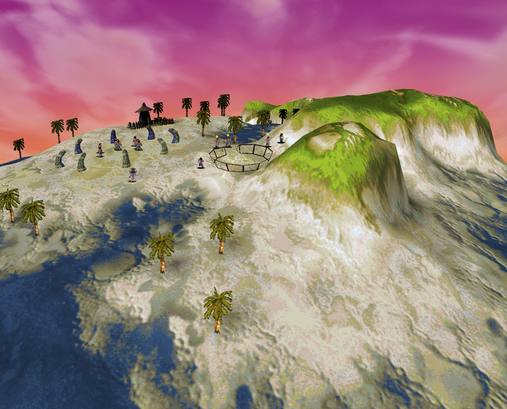

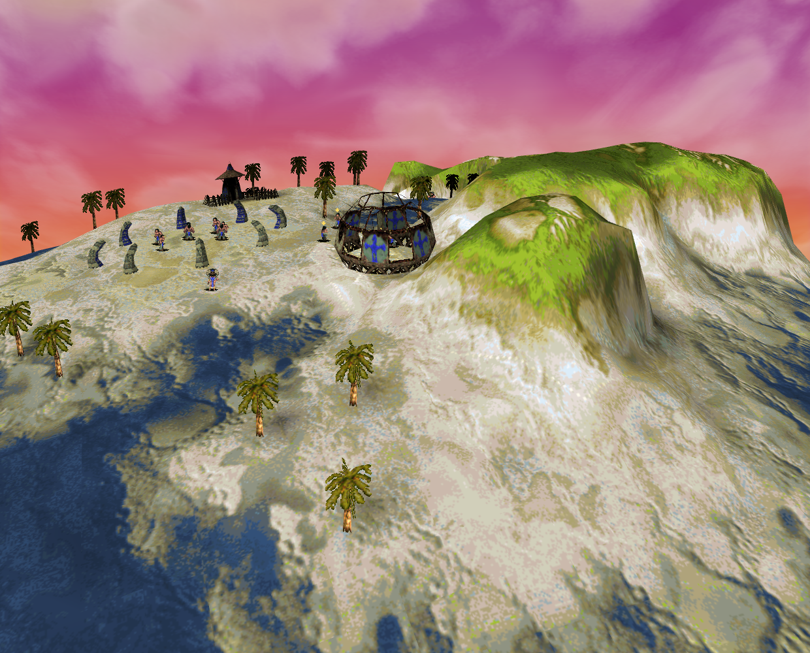

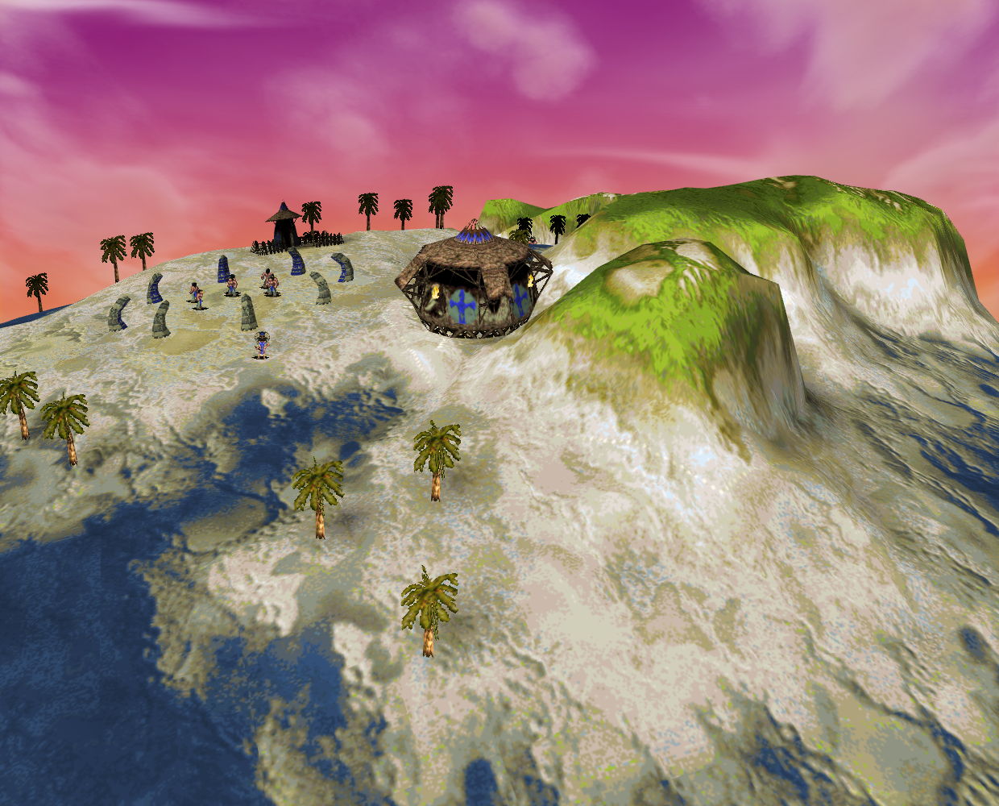

## Portable receipts and remaining evidence

- `standard-gates/` is the independently verified full product diff plus19 bounded receipts for the exact product head. All17 standard stages passed, including304 test files, typecheck, parity, orchestration and production build.
- `before/`, `after/` and `temple-construction/` contain profile-free copies of exact raw reports/receipts. `manifest.json` records both unchanged raw-source hashes and published-copy hashes, plus every unchanged exported PNG hash. Profile/session metadata and executor-specific paths are redacted in JSON copies.
- Only named representative PNGs are exported. Complete source-bound run artifacts remain retained in the isolated QA outputs. Missing exported images are not substituted or fabricated.
- Failed locator and pre-click minimap attempts remain failed in `failed-attempts/`; their raw reports remain retained with hashes.
- Headless functional evidence does not certify original raster equality, original animation cadence, ordinary campaign victories, or hardware frame performance.

## Authored non-M3 and non-Blue Temple views

The bounded public M10 → M17 route PASSED, including source stability, no browser errors and verified cleanup. Actual camera travel used strictly owned minimap clicks and short waypoints. The retained natural frame records verify the exact imported mesh/mode data, encoded full-atlas response bytes, completed shader variant and shared resource tile/epoch. The following targets are clearly visible in both retained phase images:

- M10 p/2: Blue Temple74 (tiles92,103) and Green Temple33 (tiles92,108)
- M17 c/2: Blue Temple400 (tiles103,100), Red Temple450 (tiles93,103) and Yellow Temple463 (tiles92,95)

These give visible models95–98 and naturally reached non-Blue/non-M3 Temples, with multiple visible tribes per selected resource. Different camera samples are not claimed to be simultaneous. M17 Green404's early two mesh-submission records were behind terrain and are explicitly EXCLUDED from visual coverage; a renderer callback is not proof of unobstructed pixels. The full report retains those records honestly.

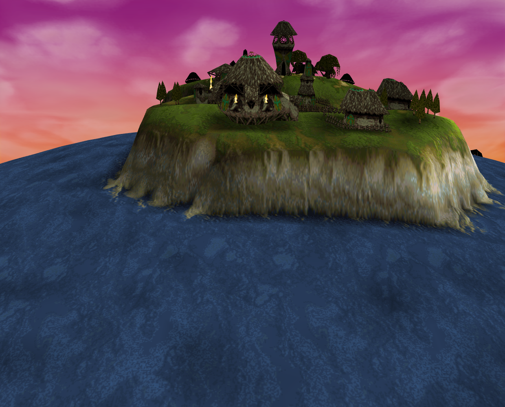

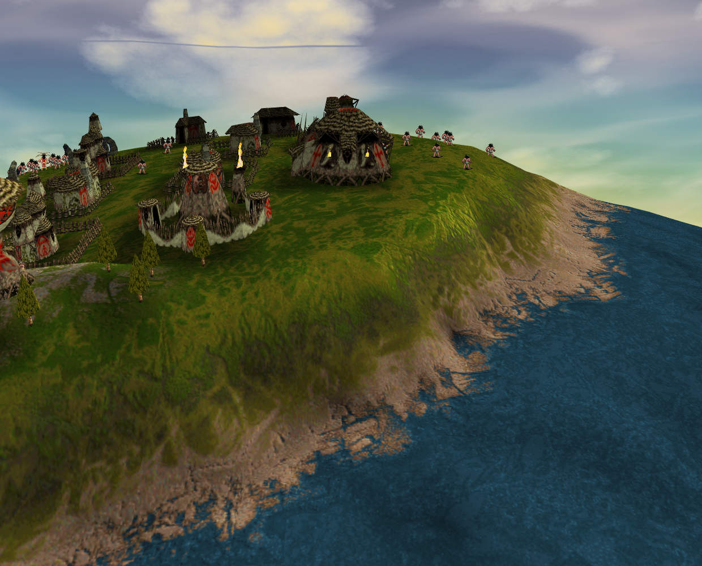

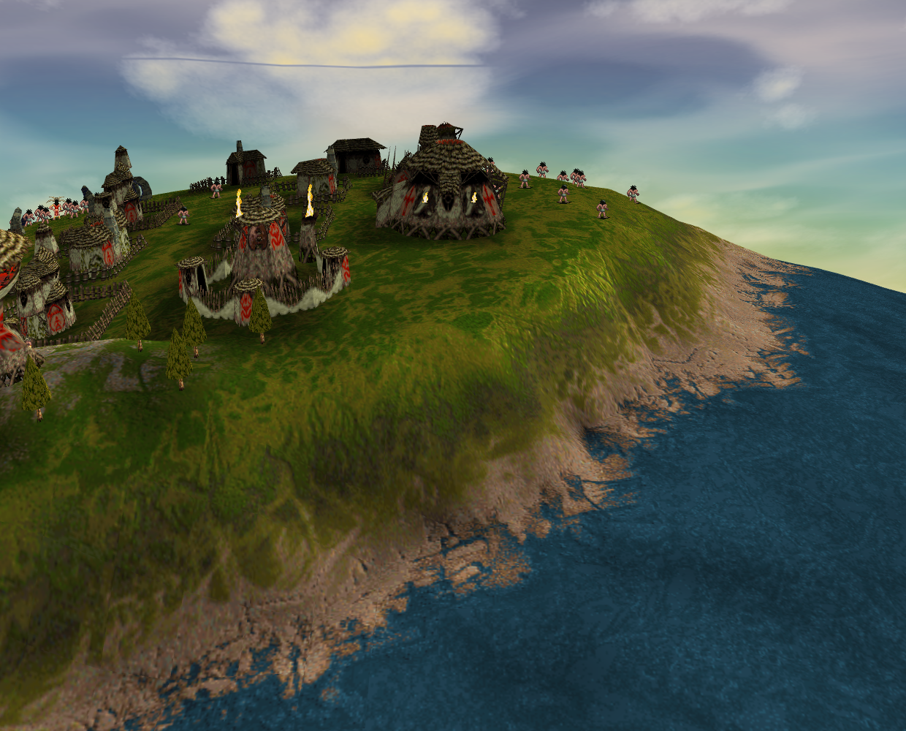

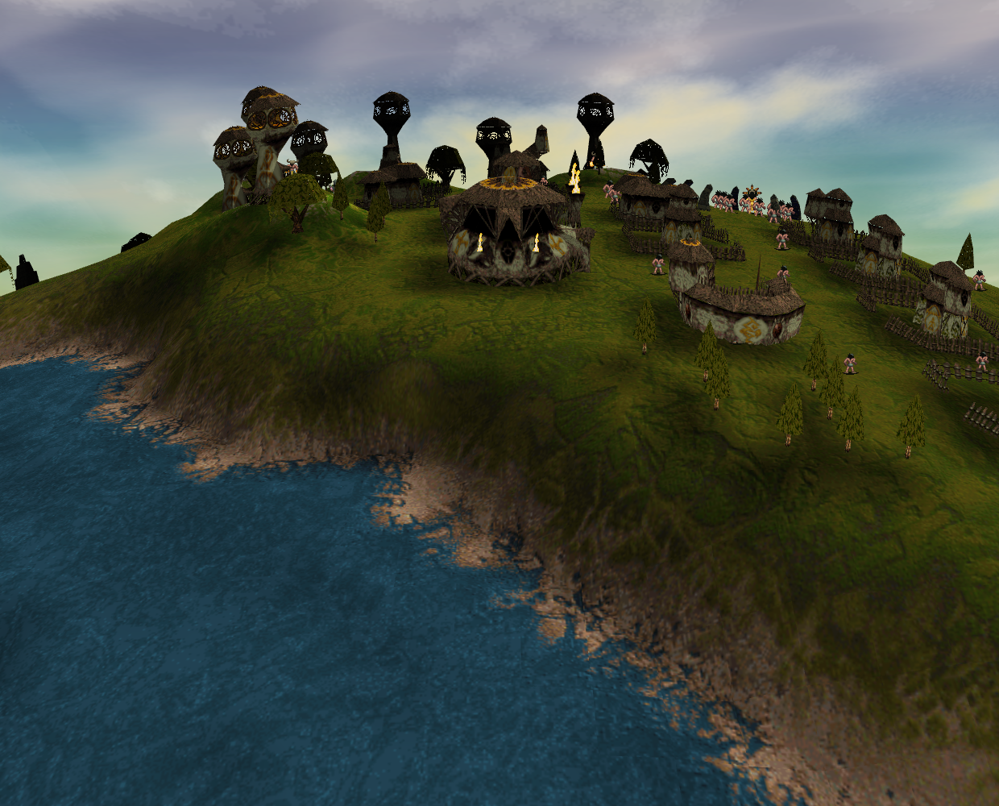

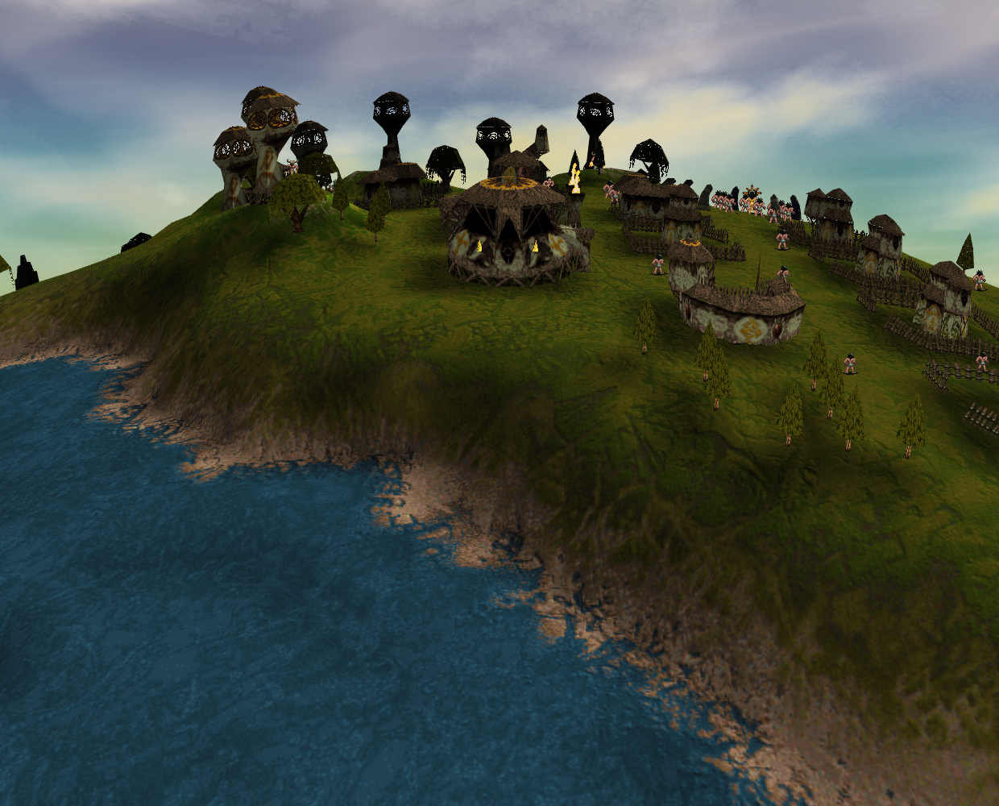

## Genuine completed-Temple Save lifecycle

The separately reviewed continuation PASSED using the exact normally closed original game-only profile and genuine turn2877 Save. The harness rechecked source/application/runtime/origin/checkpoint equality before reuse; no World, clock or storage was reconstructed. The preceding failed episode is still failed, and only its explicitly revalidated construction records are carried.

New trusted shipped actions established:

- Startup Load Game: initial c/atlas epoch1 → p/atlas-p epoch2, counter0/tile92
- Restart world: exact p/atlas-p epoch2, counter7/tile103 retained; new world turn0, no constructed Temples
- Load checkpoint: p/atlas-p epoch3, counter0/tile92; two new visible completed Blue Temple samples

The complete persisted Save checksum remained `fbc75d078d344cca75a75e982606a5a8776305802f8558f6030d5430debe39aa`. Synchronous live Load continuity is explicitly limited to level/turn/time plus typed actor/terrain/stock digests; it is not a claim that migration preserves every byte of the live World. Temple1021's loaded geometry/material is separately checked and visibly retained.

Both loaded epochs produced two naturally rendered shared tiles. There were no browser errors; final source/input hashes and owned cleanup/provenance passed.

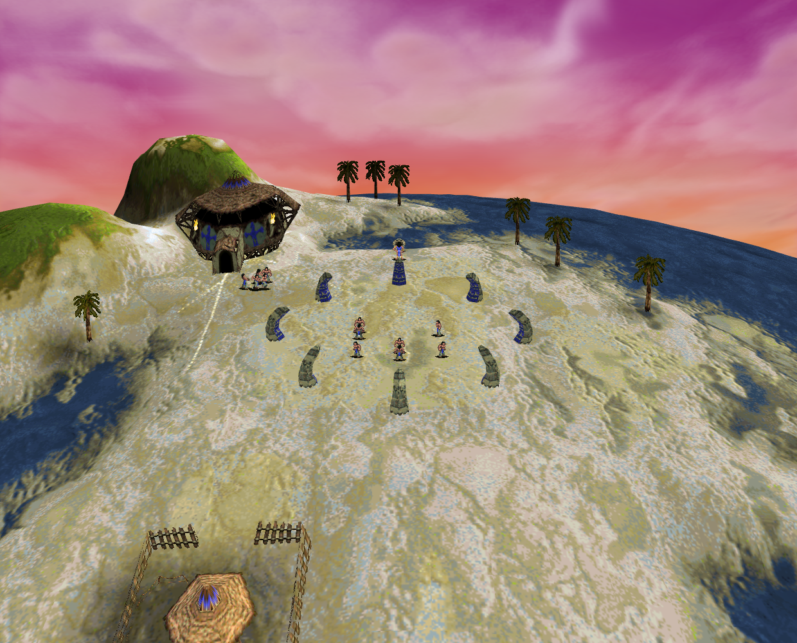

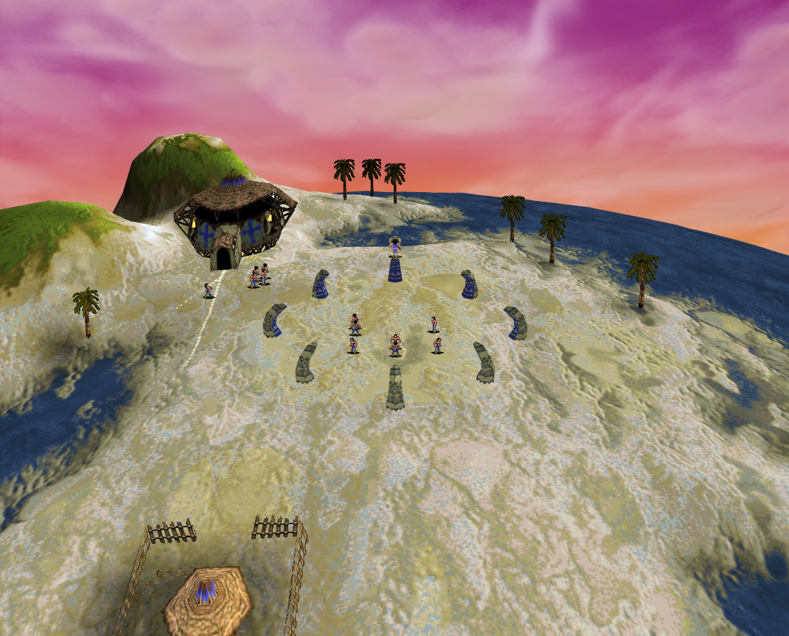

## Exact helper provenance

- World-theme pair: accepted focus-control repair `793d0638c2d2e5e5ddf17976b1da5cc1aaa77051`; reference QA head `288207c72e8cabbfb7e4b4a5d13da5e7284907ab` has identical theme executable bytes. Reference app/public equals baseline21938413. Candidate is exact producte989fbb7 plus only hash-recorded external QA files.
- Original ordinary M3 construction capture: independently accepted helper bytes at `8b1a0e9401ac7adc98cf52fb4ebc03b3df9b0cc9`; independently reviewed strict revalidation and continuation at `f758a2d443e7c1b815914e1ee58988dc065b9415`.
- Authored M10/M17 route: accepted minimap waypoint repair, exact RenderView shader-key check and signed-zero-safe strict numeric comparison at `f758a2d443e7c1b815914e1ee58988dc065b9415`.
- `helper-validation/` contains source-bound34/34 tests, ESLint and formatting receipts for that exact helper head. Subsequent publication changes are evidence/docs only.

No product source, imported assets, parity completion flags, deployment or native executables were changed during this QA work.
