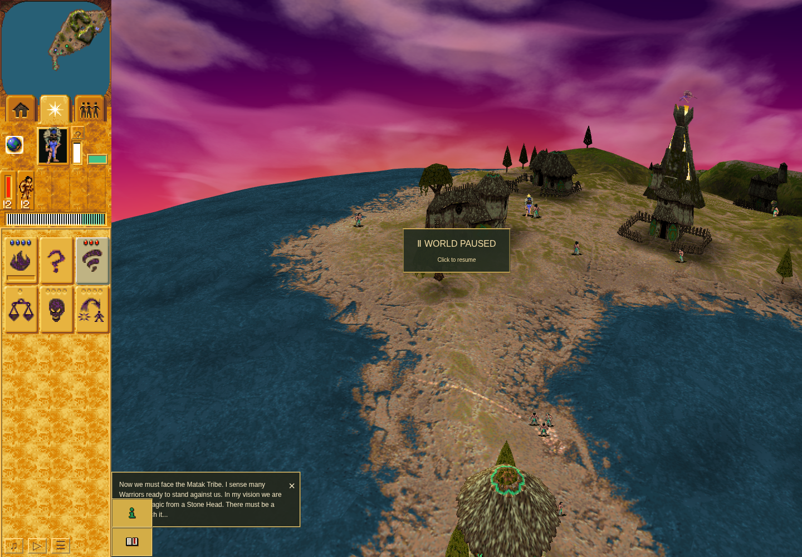
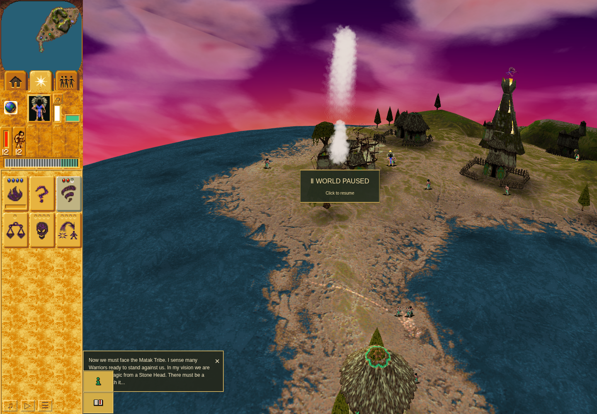

# Tornado building timber evidence

This packet preserves the source, focused regressions, standard gates and accepted
ordinary Mission 2 witness for PR #305. One fresh earned Tornado cast reached the
actual building callback and released its matching log.

## Source and application identity

- Product: `92907866646e418747dd2bda44236d9949835bc5`, tree
  `c35d4fda6617bf905942cc783b0c5d82d32c73a1`.
- Actual merged main adopted: `e17e8e06cf3ecde6adc503153e527d7a5674e7fc`, the
  reviewed selection-radius application. Every tracked product entry was checked
  against this main plus the unchanged four-file Tornado delta.
- Ordinary checker: `d37f8899a583b10e58d2e0c257709fcd80ec4768`, tree
  `3594b2b9e7415fd2cde66a48a05671ea5c0d5194`. Its application, public assets and
  package inputs match the product; the six QA files retain the accepted method.
- [Accepted original source](https://github.com/JohnDeved/populous-new-dawn/blob/9694f1f2156c4c06a6128278f16c6eac1dd35ba2/decomp/research/selection-radius-source-20261010/tornado-retirement/findings.json)
  establishes stage decrement before one class-5/model-11 timber allocation, work
  loss only on allocation success, and the exhausted-work retirement route.

The port uses the existing non-jittering, unbounded loose-wood adapter. An injected
allocator failure proves ordering and conditional work loss only. It does not
establish a production pool-exhaustion path, native physical allocation, allocator
initialization/RNG parity, or full native retirement equivalence. Earthquake's
existing damage helper is unchanged.

## Completed gates

- Two new real-caller regressions first failed because the unchanged Tornado
  callback produced no timber. The focused repaired suite passed all 13 cases.
- Fresh combined standard profile: **1,829 passes across 295 test files, all 17
  stages passed**, including typecheck first and the final build. Exact stage
  assignments cover each product test file once.
- Fresh combined QA contracts: 10 passes, including the composed actual game
  clock, projectile, live Tornado and timber callback. These are supplied Node
  fixtures, separate from ordinary gameplay.
- Fresh no-listener Vite transform: 321 modules, 10,328,703 bytes, 21.721 seconds,
  exit zero and normal server close. Native config loading and private
  `node_modules/.vite` and registry paths are bound in the receipts.
- Scoped product formatting and ESLint pass. Oxlint remains failed with the same
  15 inherited diagnostics and no introduced finding. The six unchanged QA files
  passed scoped ESLint.

`combined-standard/` contains the actual profile, aggregate, all 17 raw command
receipts and their stdout/stderr files. `prior-standard/` preserves the earlier
4c65 application results with their original identity. `reviews/` contains the
independent source, result and exact ordinary launch binding verdicts.

## Ordinary Mission 2 result

Fresh public play earned shrine 55's bridge, completed it at turn 615, brought the
original Blue Shaman to head 56, and earned three Tornado gifts at turn 2144 using
actual Brave worshippers. The public HUD cast at turn 3050 spent one gift and
produced projectile 3602, followed by owned Tornado effect 3626.

At turn **3072**, the current Green Camp 1 changed **stage 4 to 3** and **plan work
800 to 700**. Exactly one matching new log, **3627 / model 11 / one log**, appeared
at its current position `(68.921875, 100.703125)`. The Camp survived. The passive
observer recorded 85 consecutive real turn visits, found no competing writer,
detached at that first accepted impact and restored both callbacks without error.

The inner harness finished at `05:04:35.948Z`; the outer command receipt finished
at `05:04:38.581Z`, with exit zero. Its profile cleanup and continuation checks
passed, the lease was released, and no checkpoint was created. The complete raw
scenario, delivered pointer receipt, turn records and cleanup are in `ordinary/`.
Independent result review is
`reviews/tornado-ordinary-result-review-d37f8899-20261010.json`.

Before the earned cast, paused through the public UI:

After the accepted impact, showing the live Tornado and damaged Camp:

The pause card partly covers the ground. Exact work and log identity are proved
by the synchronous scalar records, not by counting pixels in these natural frames.

## Preserved failures and limits

`product-focused/` retains the expected red tests, the initial formatting failure
and the intermediate Oxlint warning as executed. Their repaired successors are
separate receipts.

`qa-checks/tornado-transform-1675b5c2.json` remains a failed exit-124 attempt:
`createServer` failed on the default Miniflare registry directory before returning
a server. Worker cleanup is **UNKNOWN**. Its task paths remain quarantined. The
successful fresh attempts do not retroactively prove cleanup of that first attempt.

The ordinary route proves one eligible current Green Camp hit. The observer stops
at its first accepted impact, error or 320-turn bound and preserves cleanup
failures. Exhausted-work removal and supplied allocation failure remain component
coverage. No victory, Save/Load,
native execution, original save interoperability, pixel parity or hardware
performance claim follows from this packet.

`artifact-manifest.json` records exact copied bytes and hashes. Private browser
profiles and storage, held archives and original executable files are excluded.
