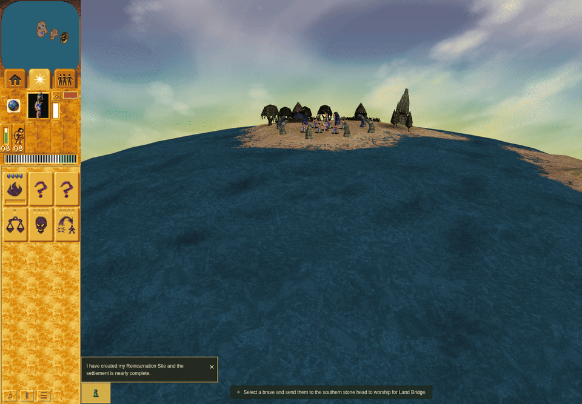
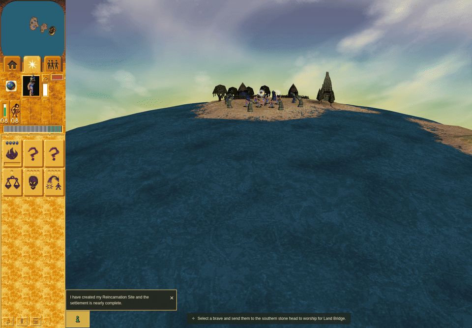
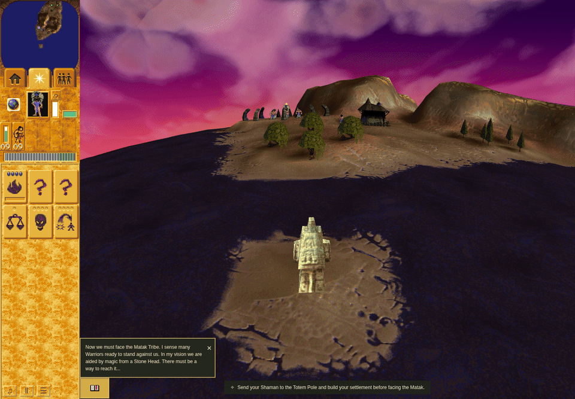
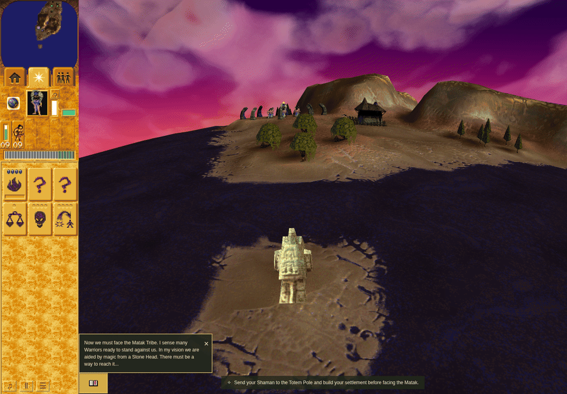
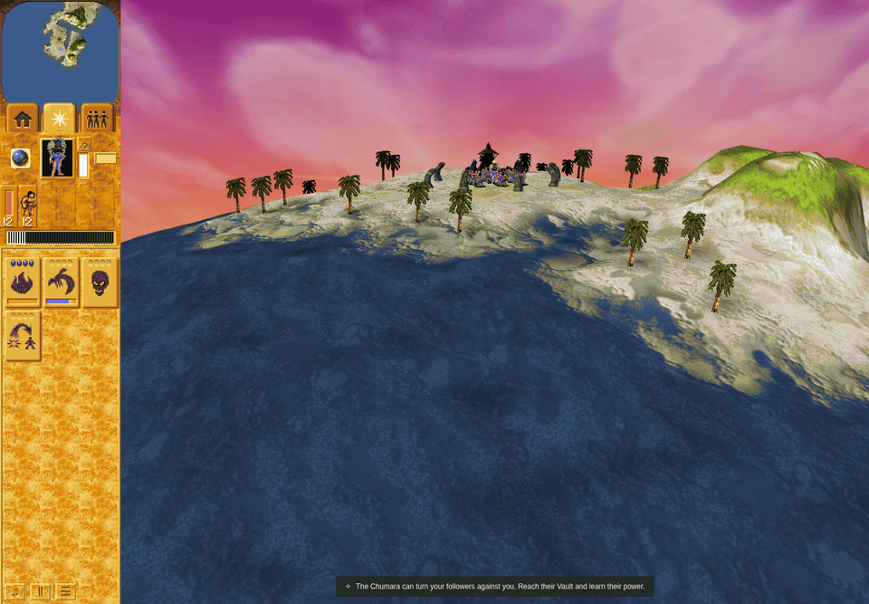
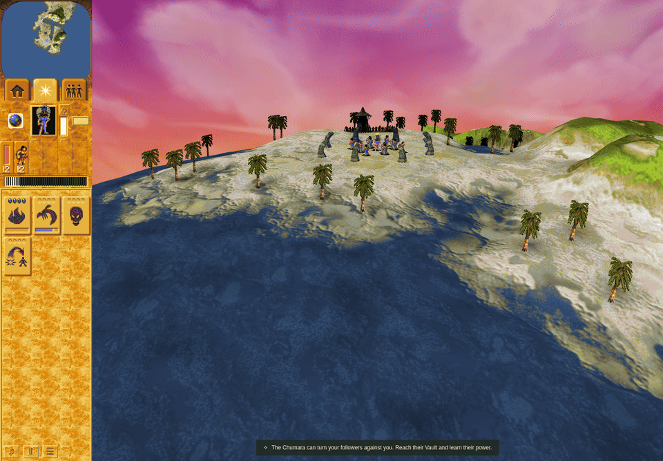

# Issue 315: open-water / shore animation

These are real browser captures of ordinary shipped controls, not original-game
screenshots or injected simulation turns. The user-visible correction removes
an extra sea-only UV offset. Shared WATDISP height and diffuse-light animation
continue. No complete native texture-regeneration schedule is claimed.

## Paired moving views

Before: `4fdf367db4eb6d15d9a05d84f85758a2893c0526` (unchanged product plus the
recorded local-render checker). After: `8c4c45f32e49765afc6972d76b9c3dd8f1ce520e`.
The runtime change is in `5dd28fc8`; later candidate commits strengthen the checker.

Each GIF contains the four actual `speed1` frames in capture order, with durations
from their recorded observation timestamps (the final frame is held for two seconds
before looping), downscaled to 960 pixels wide with
256-color GIF quantization and no interpolated frames. Raw PNG SHA-256 values are
in `manifest.json`; all 120 full-resolution PNGs remain in the reviewed local run
artifacts. Use the JSON phase records for all control/lifecycle observations.

M1 is the closest matched view. M2/M3 use the same public opening and keyboard pan,
but ordinary timing yields slight camera/actor differences. These are comparable
natural-play sequences, not pixel-aligned image-difference oracles.

| Mission | Before | After |
| --- | --- | --- |
| M1 / landscape c |  |  |
| M2 / landscape s |  |  |
| M3 / landscape p |  |  |

## Ordinary-flow results

Both complete runs passed all 15 phases / 60 screenshots each: for each of M1–3,
1× running, pause, 2× running, Save/Load and Restart; mission changes use the public
selector. Actual turn, speed, texture/wave observations and per-frame filenames are
recorded. The strengthened candidate checker explicitly requires running wave
heights/light to change and paused heights/light to hold. All candidate frames use
spatial water coordinates; acquired water/wave fingerprints and selected landscape
identity match the corresponding baseline phases. CPU caller tests additionally
check byte equality, shared shore heights, static UV buffers and 256-turn wrap.

Neither run recorded page/console errors. Chrome emitted its existing texture
readiness warnings and automatic software-WebGL fallback warnings. Chrome Headless
Shell version is 154.0.8037.92; normal sandbox; only remote-debugging-pipe launch flag;
1440×1000 viewport / DPR1. An unmasked renderer string was not collected. These
software-rendered captures establish functional visual behavior, not hardware FPS
or original raster equivalence. Frame observations occur immediately before each
screenshot; natural scheduling differs between runs.

The first baseline attempt remains FAILED due to its 240-second timeout. It is
retained as `checks/initial-baseline-timeout.json`, never relabeled as passing. The
complete isolated retry and candidate run each have unchanged before/after source
fingerprints and PASS receipts. The harness owns cleanup before returning success.

## Receipts and native evidence

`checks/` retains raw source-bound command receipts and stdout/stderr. Original
receipt paths still point to their local `work/` artifacts; copied logs retain their
original hashes. `red-callers-original.test.mjs.txt` is the exact RED test body;
its SHA matches the RED receipt. Copy it to `tests/water-animation-callers.test.mjs`
on the stated base to replay the failure. Later test assertions only strengthen
checks after that same failing offset assertion.

Focused changed TypeScript formatting and ESLint pass. Oxlint reports the same 14
normalized diagnostics as base; this is not a clean Oxlint claim. Full standard
check/build results are in their named receipts. Fallow health is still running at publication; its receipt is nonterminal, and
duplication/unused checks are queued behind it. No Fallow pass is claimed. These
advisories do not establish unused native probe consumers. The completed standard
check/build and independent product review are separate results.

See [the source contract](../../engineering/water-shore-animation.md) and
`native-inputs.sha256` for retained decompilation and exact landscape/wave inputs.
Original executable execution, unavailable historical packets and complete native
texture scheduling are outside this correction. No parity credit was added.
