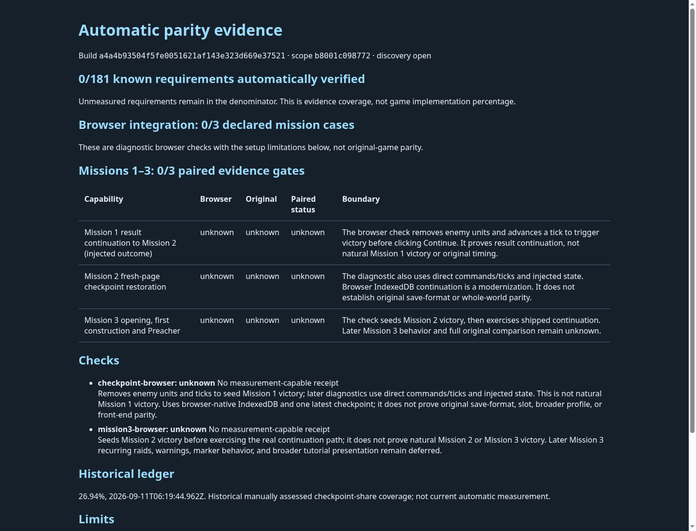

# Automatic parity report snapshot

Generated and rendered on 2026-10-07 from reviewed PR #266 candidate `a4a4b93504f5fe0051621af143e323d669e37521`.

This first report keeps all 181 known requirements unknown until complete automatic evidence bindings exist. Its three Mission 1–3 diagnostic cases are also unknown: older receipts are not promoted to current measurements. The initial zero is automatic evidence coverage, not an estimate of game implementation or full original-game parity. The dated 26.94% historical ledger is displayed separately.

The diagnostic cases explicitly disclose injected victory and direct command/tick setup. No original-game credit is claimed. Download `snapshot.html` to inspect this static snapshot locally; the screenshot shows the same generated bytes. Current reports are regenerated locally by `npm run parity:measure` and completed registered receipt workflows. There is no background watcher or manually editable score. Exit 2 denotes incomplete evidence.

Validation: all 251 standard test files and 1,457 tests passed on this candidate, plus TypeScript, parity, orchestration and production build. The generated HTML rendered in official Chrome Headless Shell 154.0.8037.92 with sandbox enabled, no external requests/page errors, no horizontal overflow and normal verified browser closure. This validates the report tooling, not gameplay parity.

The snapshot contains only generated report HTML and its screenshot. No original game files, browser profile, authentication data or raw evidence archive is included.
