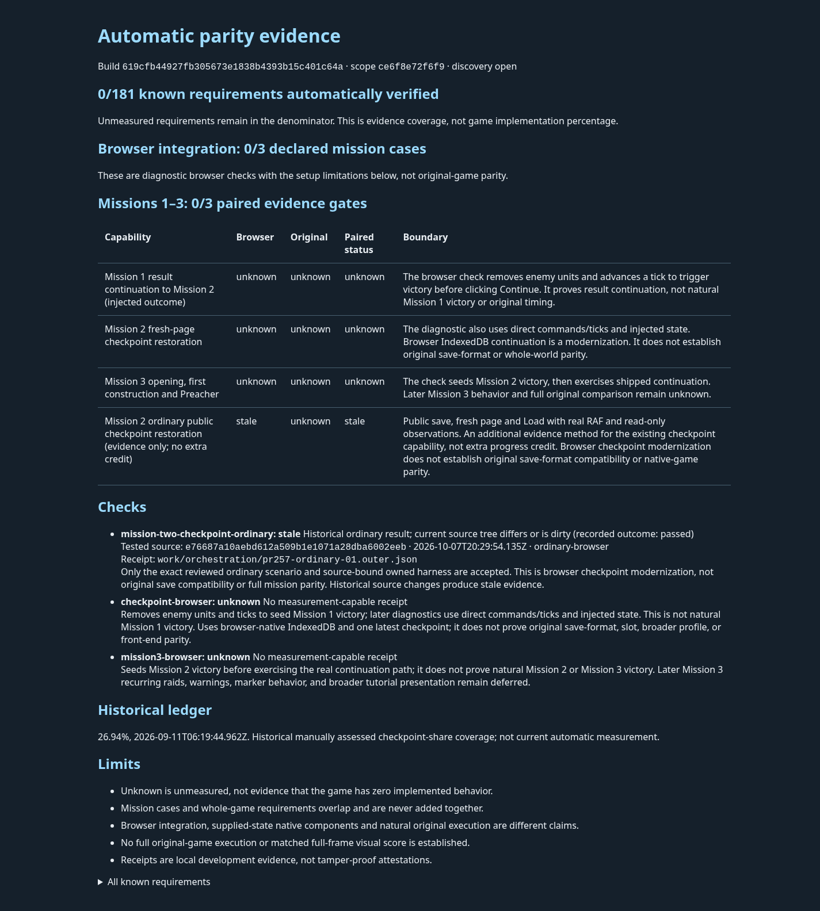

# Ordinary Mission 2 evidence in the automatic report

This snapshot accompanies [PR268](https://github.com/JohnDeved/populous-new-dawn/pull/268), candidate `619cfb44927fb305673e1838b4393b15c401c64a`.

The new row is derived from an existing genuine public-control Mission2 Save, fresh-page reload and Load witness. It reports the observed pass, original tested source `e76687a10aebd612a509b1e1071a28dba6002eeb` and date `2026-10-07T20:29:54.135Z`. Saved and synchronously loaded turn217 agree; normal clock advancement subsequently reached251.

The evidence is **stale for the new source**. It is an additional observation of an existing capability and earns no extra denominator or numerator credit. The seeded diagnostic stays separate. Original save-format compatibility and native-game parity remain unknown. The report still shows0/181 known requirements automatically verified and0/3 paired mission gates; this is not a claim that the game is unimplemented. The historical26.94% is visibly dated and separately described.

The adapter validates the actual outer/inner/journey identities and raw hashes, distinguishes attempted owned-harness runs from unrelated syntax checks, and handles real failed envelopes without inventing a Mission2 pass. Interrupted or malformed evidence stays unproved. Later failures and source freshness are preserved.

Required code coverage passed254 test files/1481 tests plus typecheck, parity, orchestration and build. Seven current stages ran on619cfb; five unchanged groups retain their reviewed original25c9 receipts and measurement-hook identity. Inherited CLI lint errors remain failed with accepted baseline attribution. This is an explicitly reviewed aggregate, not a fresh single-head full test execution.

The screenshot uses an exact static generated HTML copy in sandboxed Chrome154; no game was launched for the render. HTML SHA256 `a8ac9810fd5d1cb35b82307f09cd58ec98eebd28ee8255babe78e8dcfbe85fb3`; report JSON SHA256 `3df4b916e9d8522b7c24e5cb7cd0abe46e6dc0e455d4d79d656b9e01fd89e792`. [HTML snapshot](snapshot.html).

Only this compact report, generated HTML and rendered image are published here. Raw receipts, original game data and private profiles are excluded.
