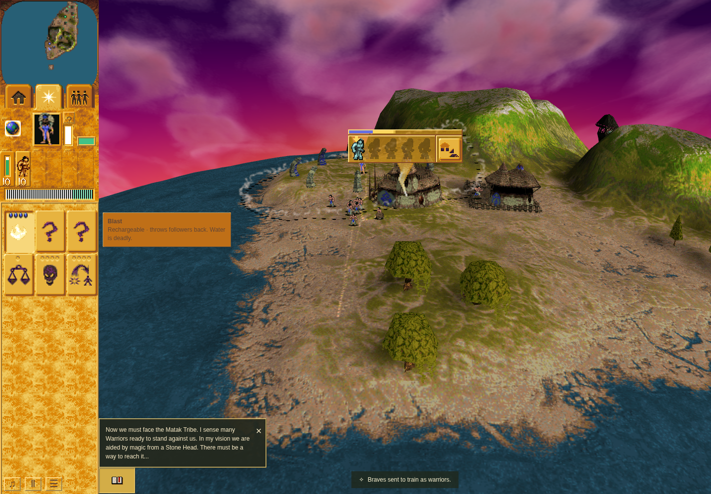
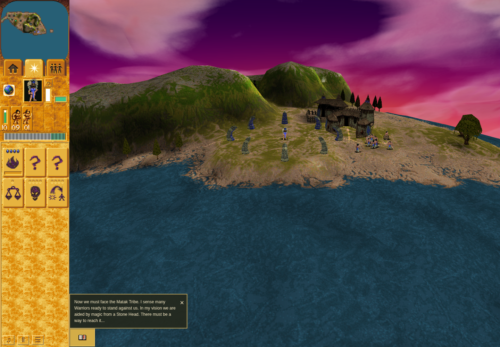

# Ordinary Mission 2 automatic-training panel result

**ACCEPTED:** one ordinary Mission 2 episode built a Warrior Training Hut with
nine Braves, selected one real Brave, trained him naturally, saved while active,
loaded that committed checkpoint in the same page, and retired the automatic
panel after conversion. The [independent result review](result-review.md) checks
all raw events, typed checkpoint boundaries, four original PNGs and cleanup.
Refs #25; this does not close the complete issue.

Runtime `99f8a8907380fd2f3c8a3fe0e3f31fb13335a840` is unchanged from the accepted
[source and 1,686-test standard checkpoint](../README.md). QA
`df0f42b02fa44a1cc89b24893239af6a4a62148d` is **local only** at collection; PR292
still contains `91a5ea6d7bb9c37d40fbc26e4be8376dc0328aa8`. The bounded repair
filters live observer reads before cloning and retains one full terminal export.
Its [43 contracts and scoped ESLint](qa-checks.json) pass. It changes no gameplay,
clock, required proof, assertion or run budget.

The outer receipt passed from **21:03:30.922 to 21:07:09.453 UTC on 2026-10-09**
(218.531 seconds); the inner receipt ended at 21:07:05.905. The attempt used
sandboxed Chrome Headless Shell 154.0.8037.92, CPUs 5–7, a private ephemeral
game-only context, and the reviewed 480-second harness/520-second outer bounds.
Eight software WebGL/texture/performance warnings remain in the inner receipt.

## Actual route and checkpoint ownership

Camp 1022 completed at turn 1115. At readiness, a natural birth had produced ten
living Braves; only Brave 281 was selected. His real `entry.person` and shared
model-8 order 59 targeted the camp. The callback synchronously created phase
-1/remaining 0/hold 16 ownership before conversion, with one reservation and no
immediate DOM paint. Pointer-independent phase 1 hold was observed for 95 visits
before Save and 138 after Load.

Public Save at turn 1331/time 110.91666666666667 exactly matches the complete typed
committed IndexedDB checkpoint; the final committed read matches it again. Load
has a different whole-checkpoint digest after normal migration. Its required
training, actors, terrain and stock digests, plus level/turn/time, match Save and
storage exactly. Transient reservations are visibly cleared at Load, but this
packet does not claim they are the sole whole-record difference. The old Scene
is disposed, the new owner starts empty, and the page controller session persists.
A new genuine training callback recreates automatic ownership.

The selected Brave is retired and exactly one new living Blue Warrior 1266
appears, with trained count increasing by one. The trace checks the full 3/16/3
progression: activity clears at turn 1404, exit visits count down 2→1→0, and record,
latch, reservation and DOM ownership retire by turn 1405. Camp occupancy and queue
are empty. IDs are linked through the actual conversion evidence, with no assumed
numeric relationship between old and replacement IDs.

## Original screenshots

All images show exact runtime `99f8a890` with local QA `df0f42b0`, sandboxed
headless Chrome 154 and software rendering. They establish this browser's visible
behavior, not original-game raster or hardware frame-performance equivalence.

The panel remains visible while the pointer is away and the Blast description is
visible. This composite is later than the synchronous panel/world capture pair.

The exact panel frame is ordinal 2709/turn 1295, with one occupant and 8% charge.
The [matching world-only canvas](automatic-active-world.png) excludes the separate
DOM panel canvas by design.

The post-Load camera differs, so these images are not a stationary pixel-difference
comparison. The trace supplies trainee, camp and replacement identity evidence.

## Retained failure, cleanup and report limit

[Ordinary01 remains FAILED](ordinary01-failure-review.md): a twelve-second held
wait timed out, raw callback history was lost, Save/Load was not reached and
observer restoration reported `Target crashed`. The renderer-crash cause is not
proved. Its maintained harness control flow supports browser disconnect/server
stop completion; it does not prove a process census.

In ordinary02 the complete 3,167-row export is retained. Both observer epochs
closed without error, input observers were restored and held pointers cleared.
The passed final receipt and maintained harness control flow support successful
browser close/disconnection and owned server-stop completion, without claiming
independent reaping of every descendant.

Automatic report discovery separately **FAILED** with the exact retained
[diagnostic](discovery-diagnostic.txt): `Receipt JSON byte limit reached; no partial
report written`. No guard was raised and no old or new evidence was removed.
The accepted gameplay result does not make the automatic report complete.

The [compact result](result.json), [artifact hashes](artifact-index.json) and
[manifest](manifest.json) bind the retained large local reports without copying
them into this packet. Only bounded text/JSON and four original PNGs are included.
Native wall-time cadence, physical secondary allocation, full frontend histories,
audio, fresh-page recovery and hardware performance remain outside this result.
Strict product Oxlint still has 11 inherited errors and 52 inherited warnings,
with zero added diagnostics. Publication and merge are separate pending actions.
