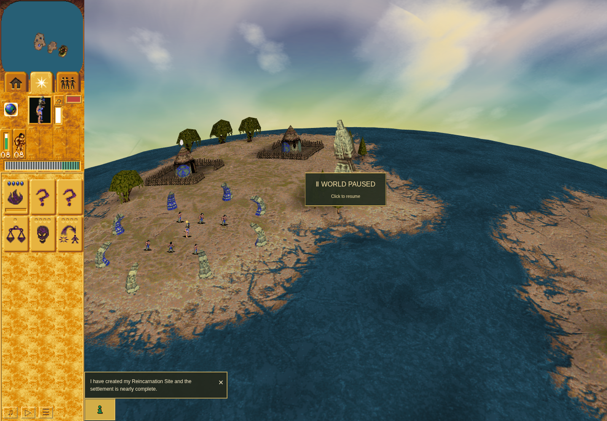

# Current campaign: accepted source and first Mission 1 attempt

The fresh Mission 1 run reached ordinary Shaman readiness, then stopped after its first shrine click produced no accepted command. Bridge stock, victory, Continue, and Save/Load were not earned. The failed input and authenticated preserving stop remain in the raw journey.

Source `901a4e15e676a2e08c986066aedde9f8a243ba0a` pins accepted application main `3cc9e830d2e7d2aa9844e8104fa51017d65dd171`. [Independent source review](review-901a4e1/review.json) accepts the enabled finite policy, fresh 81 QA tests, structure/whitespace checks and combined build. Standard 1,126 tests/parity are explicitly carried from `3123edf` through the accepted `d8897cf` formatting delta, with typecheck from `d8897cf`; a combined `npm run check` was not run. Exact origins and scope are in [gate correspondence](901a4e1-gate-correspondence.json).

[Independent terminal evidence review](mission-one-segment-01-independent-review.json) accepts these bounded observations and publication claims. The campaign attempt remains failed.

## Actual run

Run `5c92fac0-f9d6-4e8a-ac5f-57a8b98dd528` used a new game-only profile and owned strict origin `http://127.0.0.1:4375`, normal 1× real-clock controls, and the unchanged reviewed first batch. Readiness was observed at turn 411 and the opening paused at turn 435. The shrine 29 hit probe was recorded at turn 664. The click at turn 684 produced no fresh order or pointer acknowledgement through turn 702. The terminal world was paused at turn 723, with 60.25 active seconds, one retained failure and one preserving stop.

[Raw terminal packet](mission-one-segment-01-terminal-packet.json) binds the journal, snapshots, original command receipts and normal cleanup. The latest checkpoint remained null before and after the preserving stop. The original execution exited 1 without a signal; browser cleanup and continuation checks passed, the owner lock was absent and both same-scope port probes confirmed closure. Dependency inode 925605 was [returned to its donor](dependency-return.json), restoring this worktree's original dependency absence.

The screenshot shows the paused failure boundary, not worship completion. No dispatch-time browser event/hit/context witness was captured, so the cause is unresolved. An edge hit is a hypothesis, not a demonstrated application or animation regression. The earlier historical Mission 3 victory remains separate and supplies no fresh campaign credit. Original visual/native parity and hardware performance remain outside this evidence.

The source's `launchEnabled` policy remains true, but this attempt is closed. Its failed profile has no committed mission boundary and is not a valid continuation predecessor. Another runtime attempt requires a reviewed repair and exact operational grant; nothing is running or queued.

Prelaunch files are retained verbatim as historical inputs, including their then-pending grant and absent-profile fields. The actual launcher/terminal receipts record the subsequent execution; those earlier files were not retroactively rewritten.
