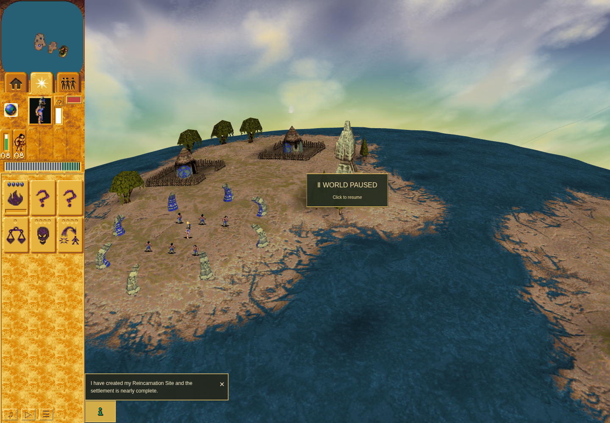

# Mission 1 attempt 02: failed first shrine order

**Failed; cause unknown.** The first shrine order earned no dispatch,
acknowledgement, or Land Bridge stock. The ordinary preserving stop retained the
empty checkpoint. This run earns no victory, Continue, Save/Load, or campaign
completion credit.

Run `625b85ed-d3cf-433a-9bec-1f409cdcc141` used source
`c56e98af1b7cbeaa4fdc1898a31759f30960966f` with accepted application main
`3cc9e830d2e7d2aa9844e8104fa51017d65dd171`. The exact source received a
[fresh successful build](campaign-continuity/c56e98a-build.json) and
[independent launch-binding acceptance](campaign-continuity/review-c56e98a/final-launch-review.json).
The [binding](campaign-continuity/c56e98a-final-launch-binding.json) retains the
explicit accepted PR217 component carry and 89 focused QA tests; it does not claim
a fresh combined `npm run check`, adopt PR218, or reuse PR218's test results.
The [runtime receipt](campaign-continuity/mission-one-segment-02/receipt.json)
records matching before/after source and runtime fingerprints.

## Observed input and outcome

Readiness was observed at turn 413 and the opening paused at turn 440. The first
batch was queued 0.189591 seconds after the awaiting-input boundary. At turn 698,
the detached diagnostic found enabled shrine 29, context model 27, and selected
Shaman 30. The integer point `(806, 289)` passed final revalidation at turn 714.
The trusted primary pointerdown/up pair reached the canvas at that same point at
turn 715, but the actual pointerup `pickWorldObject` result was null. Picker
wrappers restored their original methods without diagnostic errors; the order and
acknowledgement fields did not advance.

The [independent input review](mission-one-segment-02-input-review.json) establishes
this probe-to-delivered-hit discrepancy. It finds no demonstrated plain-point
versus PointerEvent semantic mismatch. Event-time geometry, projection, mixed-hit
identity, painter ordering, and cache state were not retained sufficiently to
establish a cause. Morph motion, animation, or a cache defect remains unproved.
These observations do not retroactively explain attempt 01 or establish a PR218
causal claim.

The terminal world paused at turn 766, after 63.833333333333336 active seconds,
with one retained failure and one preserving stop. The checkpoint stayed null.
The [outer receipt](campaign-continuity/mission-one-segment-02.outer.json) records
exit 1 without a signal; the terminal packet identifies original execution session
97599. Browser cleanup and continuation checks passed. The
[launcher receipt](campaign-continuity/mission-one-segment-02.launcher.json) records
both same-scope loopback port probes closed. The terminal packet records the owner
lock absent. Dependency inode 925605 was
[returned to stone-head-logical-visit-fix](dependency-transfers/campaign-to-stone-20261005T1838/receipt.json).
No third run is included or authorized by this packet.

This screenshot shows the failed, paused boundary on source `c56e98a`. Capture used
sandboxed headless Chrome 154.0.8037.92 at 1440 × 1000, with the receipt explicitly
limited to software-rendered performance. It proves no worship completion, native
pixel parity, calibrated animation timing, or hardware/GPU performance.

## Packet and publication checks

The [terminal packet](mission-one-segment-02-terminal-packet.json) binds exactly
24 source files. [manifest.json](manifest.json) maps all 24 unchanged files plus
the terminal packet and independent input review to their published paths, with
SHA256 hashes and byte counts. [SHA256SUMS](SHA256SUMS) covers every other file in
this folder; [publication-verification.json](publication-verification.json)
records the focused publication checks and their limits.
The full whitespace check flags original build-log trailing whitespace and a
blank line at EOF; those exact receipt bytes are preserved. Authored files pass.

Only allowlisted game snapshots, the screenshot, source/gate/runtime receipts,
logs, and launcher source are included. Profile identifiers and path strings are
metadata; private profile, IndexedDB, browser storage, and private TMP contents
were not copied. Prelaunch absent-profile and pending-grant statements remain
unchanged historical inputs; subsequent launcher and terminal receipts establish
the actual failed execution. The source tree, profiles, and PR216 were not modified
for publication. This evidence-only addition requires hash, scope, structural,
link, and authored-file whitespace checks; no new build, browser run, dependency
acquisition, or gameplay acceptance is claimed.
