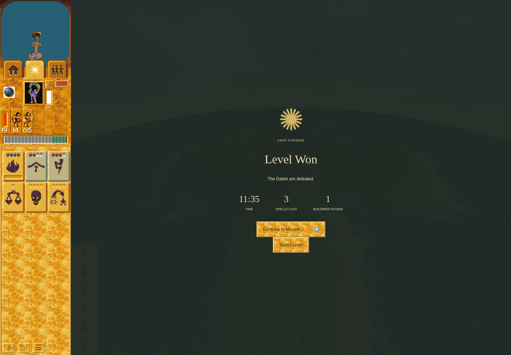

# Fresh Mission 1 victory and Mission 2 checkpoint

**Mission 1 passed.** The same fresh campaign earned ordinary victory, committed
completion `[1]`, clicked **Continue to Mission 2**, and committed a real Mission 2
Save before normal cleanup. Mission 2 and Mission 3 completion remain pending.

This genuine result is paused at turn 8342: **11:35**, three spells cast and one
building raised. All Red followers are gone; empty Red Camp 31 remains at 65 HP.
There is no all-buildings-destroyed claim. The screenshot used sandboxed headless
Chrome 154.0.8037.92, 1440 × 1000. It is browser evidence, not original-game pixel
parity, calibrated animation timing or hardware/GPU performance.

## Actual campaign boundary

Run `329b5c19-0e73-4209-b2b0-bba3e1094a0f` used frozen QA source
`ddef3caa522d45168b16f290cc5b5a4d1541fce2` on accepted application main
`3b899125cc8cedef938823718ad5d44f49957b66`. The [raw journal](campaign-continuity/mission-one-segment-03/actions.jsonl)
and [terminal packet](mission-one-segment-03-terminal-packet.json) retain every
ordinary command, exact identity transition, persistence observation and cap.

- Four Bridge shots, central bridge, Warrior knowledge, constructed Camp, exactly
  five trained Warriors, four Lightning shots, and northern bridge were observed.
- Mission 1 Save at turn 5692 was loaded through an actual page reload and Load
  control. The full committed digest matched before and after Load; replacement
  actor, terrain and stock projections matched. Pause preceded diagnostic work.
- Victory committed profile `[1]`. Continue kept the store, replaced World and
  scene, and verified `scene.world === store.getWorld()` for Mission 2.
- Mission 2 Save committed at turn 396/time 33 with full digest
  `3c33b5f3e144282405b5611810f860925ed6b3e8a104f0a12edd168e5610d33e`.
  Its [opening screenshot](campaign-continuity/mission-one-segment-03/m2-continued-segment.png)
  precedes the Save; the later transaction readback proves commitment.

The [inner receipt](campaign-continuity/mission-one-segment-03/receipt.json),
[outer receipt](campaign-continuity/mission-one-segment-03.outer.json) and
[launcher](campaign-continuity/mission-one-segment-03.launcher.json) passed with no
failures, stops or browser errors. Original session 1455 exited 0 normally;
cleanup/continuation checks passed, the owned lock was released and same-scope
port 4375 closed. The [dependency return](dependency-transfers/campaign-to-stone-20261005T1937/receipt.json)
records release at 19:37; later owners may move that closure independently.

Mission 1 consumed 697.5833/900 active seconds and 26:29.523/30:00 owned wall time.
The [forward boundary](campaign-continuity/mission-one-segment-03/segment-boundary.json)
retains cumulative 733.5833 active seconds, including Mission 2's 36 seconds and
46.424 seconds of owned wall time. The [maintained predecessor check](campaign-continuity/mission-one-segment-03-predecessor-validation.json)
accepts this actual closed boundary. Any next segment must verify the saved digest
again, use ordinary Load and retain these budgets; it has not yet launched.

## Source checks and limits

The [source acceptance](campaign-continuity/review-ddef3ca/review.json) and
[final launch acceptance](campaign-continuity/review-ddef3ca/final-launch-review.json)
bind 92 fresh QA tests, fresh structural/whitespace checks and the
[fresh combined build](campaign-continuity/ddef3ca-build.json). The 1,134 standard
tests, typecheck and parity components are explicitly carried from accepted PR218
through exact source correspondence. No combined aggregate check is claimed.

The earlier independent fresh attempts remain failed with unknown input-miss
causes. This successful run neither rewrites those outcomes nor proves which
intervening change altered input behavior. The older saved-checkpoint Mission 3
victory remains historical and satisfies no new Mission 3 milestone. Full current
campaign acceptance, native parity and issue #214's other timing families remain
open.

[manifest.json](manifest.json) maps the 57 terminal packet files and the packet
itself to byte-identical copies. Public files are allowlisted game snapshots,
screenshots, journals and source/runtime/check receipts. Browser profile,
IndexedDB, other private storage and private TMP bytes remain local. Historical
prelaunch statements are preserved unchanged; actual execution is established by
the later terminal receipts. This publication changes no QA source or profile.
