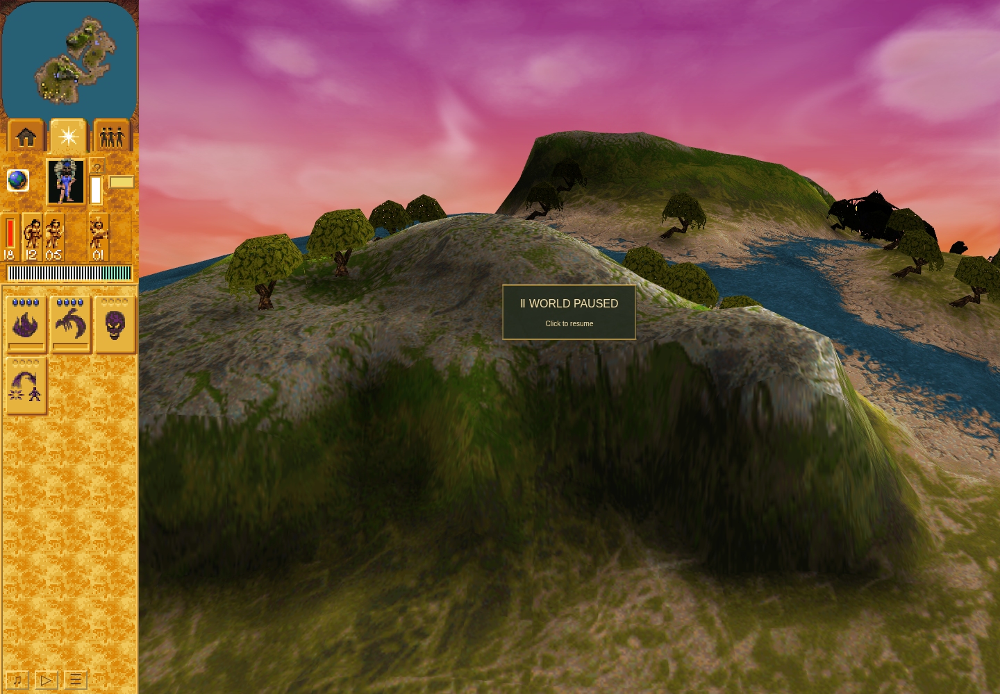

# Fresh converted-Brave Erosion prefix

The actual `ce37f851` continuation loaded the genuine Save 7424 and earned a new
singleton conversion of Yellow Brave 2631 to Blue Brave 3298 in epoch
`reload-3-8`. It then used that freshly observed Brave for head 101 while the
Preacher's order 17 remained unchanged. This is an in-progress prefix through
paused turn 9047; it is not a terminal or Mission 3 victory result.

The [53-line journal](actions-through-0002.jsonl) records accepted ordinary order
27/a101 to healthy Brave 3298. The prospective per-turn observer recorded head
use and Erosion effect 3322 at turn 8824, all 64 present samples from remaining
64 through 1, and actual zero/removal at turns 8887 → 8888. Native center and
controller identity remained bound. The [full snapshot](batch-0002.json) retains
the observed initial/final local terrain inputs and 99 correlated changed cells.
That correlation alone does not exclude other terrain producers. Independent
lifecycle/native correspondence review is pending; no historical replay is
credited as this run and missing native inputs will not be invented.

This actual rendered view is at turn 9047 after retirement, not an onset or live
effect frame, and not a before/after comparison. The logical samples establish
the lifecycle. Brave 3298 and Preacher 3181 remain healthy at the cutoff.

[Prefix and hashes](prefix.json) bind QA `b45073e` and application `3b89912`.
The original declaration/cancellation and first conversion remain inherited
proof; the new replacement ID was observed again despite matching its earlier
number. Campaign active time is 2827.9167 seconds; Mission 3 has used
988.9167/2400, leaving 1411.0833. The original conversion budget anchor is
unchanged. Three inherited failure records and one prior automatic stop remain;
no new failure/stop occurred through this prefix. The failed earlier envelope,
unknown fatal attribution, native/full-parity limits and private-profile exclusion
remain explicit. The ordinary live run continues separately from this frozen cut.
