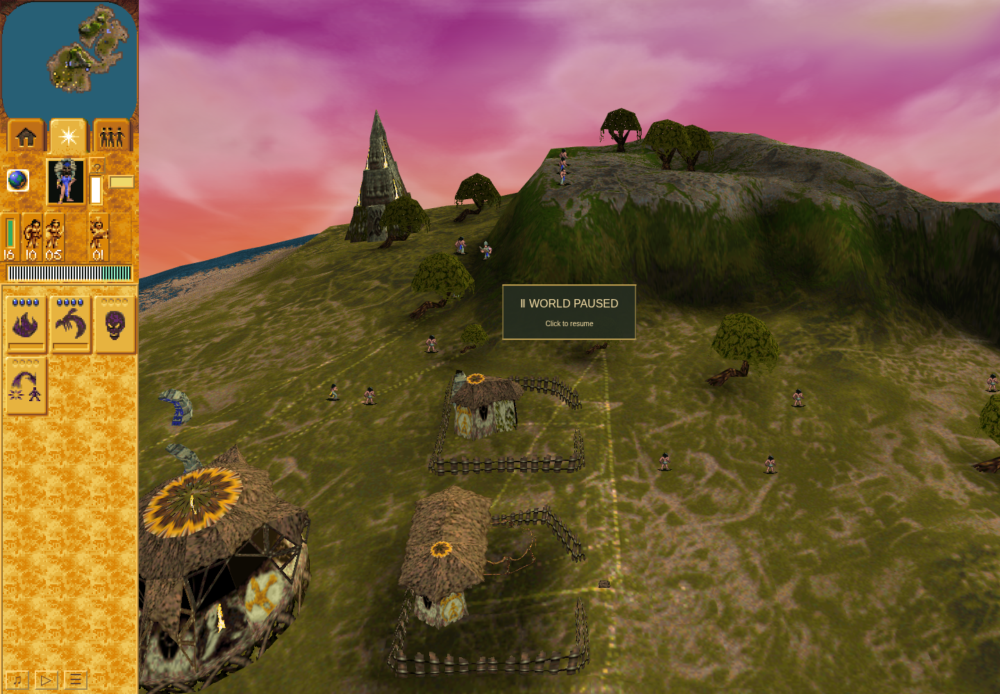

# Fresh Mission 3 saved-sermon sequence; Erosion attempt failed

This continuation of the fresh Mission 1 → Mission 2 campaign earned a genuine
saved-sermon cancellation, ordinary Load, and conversion of the same declared
Yellow Brave into one Blue Brave. The later Erosion attempt failed without any
shrine work or use. Mission 3 victory remains unproved, and the total harness
result remains **failed**.

Run `bcf8ac55-e418-49e4-a3d6-b7e804ee31d3` used frozen QA
`ddef3caa522d45168b16f290cc5b5a4d1541fce2` and application
`3b899125cc8cedef938823718ad5d44f49957b66`, including accepted PR218 and excluding
later Guard changes. The [terminal packet](campaign-continuity/mission-three-segment-01-terminal-packet.json)
binds the actual command journal, snapshots, source/runtime inputs and receipts.

The actual rendered screenshot shows the later paused village view after the
sequence. It is not an onset, cancellation or exact conversion frame. Adjacent
logical-turn observations and committed-storage readbacks establish those events;
the image alone does not identify the actors or prove the sequence.

## Earned sequence

- Ordinary Load verified the genuine Mission 3 checkpoint at turn 179, including
  full, actor, terrain and stock digests. Vault worship, the Temple, five Warriors
  and one healthy Preacher were then earned through ordinary controls. The
  Shaman removed the forward Yellow Preacher while the Blue Preacher and Warriors
  stayed home.
- Before the Blue Preacher's departure, turn 6593 declared the eligible Yellow
  Braves and the first-owned-listener rule. The observer captured Brave 2631 at
  turns 7367 → 7368 entering state 23 with owner 3181 and timer 101. Its automatic
  capture preempted the queued approach action; there was no later victim choice.
- The actual [Save](campaign-continuity/mission-three-segment-01/sermon-saved.json)
  committed at turn 7424, full digest
  `2771e990a00b005fd23a86e7909f7f679c746aab1d977f589162df116934e5fa`.
  Stored Preacher 3181 had 55 HP; Yellow Brave 2631 had 50 HP, state 23, owner
  3181 and timer 45. All thirteen saved Blue actor identities were retained.
- The [cancellation observation](campaign-continuity/mission-three-segment-01/m3-milestone-sermon-cancelled.json)
  at turn 7552 proves listener ownership was released. The victim was then in
  combat. `clearedBitObserved` is false: there is no intermediate clear-bit
  witness, and combat reused the numerical flag. The ownership-aware assertion
  and actual combat state remain explicit.
- Ordinary [Load](campaign-continuity/mission-three-segment-01/m3-milestone-sermon-reloaded.json)
  restored that exact Save. Immediate ordinary Pause preceded diagnostics;
  committed full/actor/terrain/stock checks passed and the paused World was
  observed at turn 7443.
- The passive observer captured the exact singleton conversion at turns
  **8086 → 8087: Yellow Brave 2631 → Blue Brave 3298**. The
  [conversion milestone](campaign-continuity/mission-three-segment-01/m3-milestone-conversion.json)
  was recorded at turn 8282. Other observed conversions are separate events and
  supply no substitute identity credit.

## Failed Erosion and preserved checkpoint

After the sequence, Yellow Brave 52 was still an owned listener at turn 8375.
The Erosion observer was prospectively armed at turn 8465. The actual ordinary
order to head 101 was delivered to Preacher 3181 and acknowledged. The subsequent
turn 8598 observation shows the same Preacher in melee with 52, at 52 HP, while
still retaining order 27 targeting 101. At terminal turn 10077 the Preacher was
absent. No sampled fatal boundary establishes an exclusive cause of its loss.

The head remained active with zero work, followers and uses. The passive observer
recorded no Erosion onset or retirement. The normal 120-active-second worship
no-progress guard raised `IncompleteRun`; the two remaining batch actions never
ran. There was no manually queued preserving-stop command.

The [journey](campaign-continuity/mission-three-segment-01/journey.json) retains
two inherited M2 helper failures, the separately labelled prior M2 failed
envelope, and this new automatic control stop. No new M3 helper-failure array
entry was added. The [inner receipt](campaign-continuity/mission-three-segment-01/receipt.json),
[outer receipt](campaign-continuity/mission-three-segment-01.outer.json) and
[launcher](campaign-continuity/mission-three-segment-01.launcher.json) retain
normal exit 1 from original session 98147, verified browser/profile cleanup,
released owner lock and closed same-scope port 4375. Latest Save 7424 remained
byte-logically unchanged. Dependency ownership subsequently transferred through
the bound receipt; the campaign tree retained only its installed-lock stub.

Mission 3 used 853.6667 of 2400 active seconds and 36:12.699 of 90 minutes owned
wall time. The 64.187837-second paused opening admission delay remains charged.
The maintained helper totals 2692.666666666667 campaign active seconds, including
the terminal open epoch exactly once. Reload never refunded active or wall time.

Cleanup/storage validity does not admit another scenario entry: this stop has no
completed mission-boundary record. Any continuation from Save 7424 needs a
reviewed admission and preserved failed-prefix budgets before a new Load.
The historical saved-state Mission 3 victory supplies no fresh campaign credit.
Full campaign acceptance, original/native parity, remaining timing families and
hardware performance remain open. The [manifest](manifest.json) contains only
allowlisted game evidence and receipts; private profiles, IndexedDB, browser
storage and private temporary files are excluded.
