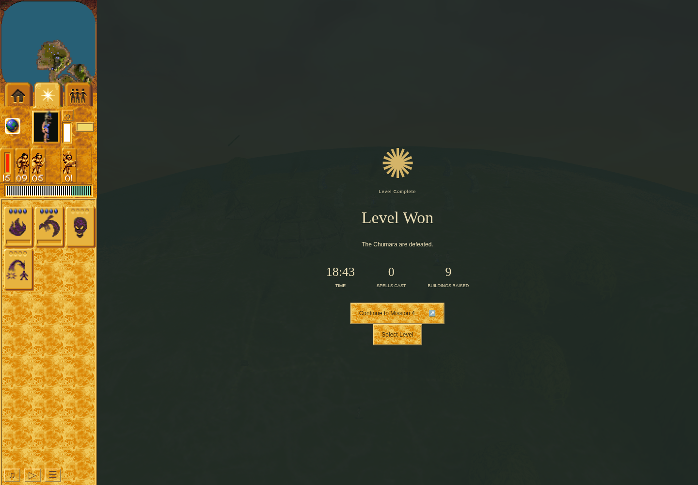

# Fresh campaign reaches Mission 3 victory

The same fresh game-only campaign has now won Missions 1, 2 and 3 through ordinary
browser controls and read back committed completion `[1,2,3]`. This Mission 3
continuation earned a genuine saved-state Load, a new exact conversion and a
prospectively observed Erosion lifecycle before ordinary combat reached victory.
The harness envelope remains **failed**, retaining earlier failures and control
stops. Mission 4 was offered and was not started.

This genuine paused result is turn 13480 on application
`3b899125cc8cedef938823718ad5d44f49957b66`, QA
`b45073eb75f8e2c8aa66ef809e76eaf621a68fc0`, run
`ce37f851-390c-473a-a68e-bbfc05f900e2`. It visibly shows Level Won, Continue to
Mission 4 and displayed statistics 18:43 / 0 spells / 9 buildings raised. Those
displayed building statistics are not a claim that the player built nine buildings.
The [matching snapshot](campaign-continuity/mission-three-segment-02/m3-genuine-campaign-victory-result.json)
and [independent review](independent-review/review.json) bind the outcome.

## Actual continuity and final state

- [Mission 1](../mission-one-victory-ddef3ca/README.md) earned a clean victory,
  genuine Save/Load, committed completion and ordinary Continue into Mission 2.
  [Mission 2](../mission-two-victory-ddef3ca/README.md) earned the next victory,
  committed `[1,2]`, ordinary Continue 3 and a real Mission 3 opening Save, while
  retaining two pre-input helper failures and its failed envelope.
- The [first M3 segment](../mission-three-sermon-bcf8ac55/README.md) earned the
  prospectively declared listener, Save 7424, ownership-aware cancellation,
  ordinary Load and exact same-victim conversion. Its later Preacher worship
  attempt stalled; its failed history and unknown fatal attribution remain.
- This reviewed continuation loaded that actual Save, checking the full record
  and actor/terrain/stock projections before dependent input. Immediate ordinary
  Pause preceded diagnostics. A new epoch observed Yellow Brave 2631 → Blue Brave
  3298 at turns 8086 → 8087; matching the earlier numerical ID was not assumed.
  The earlier cancellation remains inherited proof, not a new cancellation claim.
- The actual converted Brave received ordinary order 27 to head 101 while the
  Preacher's order 17 stayed unchanged. Head use and effect 3322 began at 8824;
  all 64 present samples and actual zero/removal at 8887 → 8888 were recorded.
  [Accepted lifecycle evidence](../mission-three-erosion-ce37f851/README.md) retains
  99 correlated changed cells. Exact native replay is unavailable because RNG and
  full terrain inputs were not retained; no missing input is reconstructed.
- One finite three-Brave Camp order reinforced the five existing Warriors. The
  first-new wait was followed by a paused count/empty-queue observation of eight
  Warriors. Accepted finite orders cleared occupied Huts 1016, 1015, 1020 and 1019,
  then targeted Shaman 47. Five Warriors survive; three were lost. No Yellow
  actors remain. Empty Yellow Tower 1023 retains 52 HP and Temple 1022 retains
  65 HP. Earlier empty Hut 1017 is absent at victory without a separate explicit
  destruction-order claim. Not all Yellow buildings were destroyed.

The committed profile record `[1,2,3]` was **read back** at 22:51:34.515 UTC in
[journal line 243](campaign-continuity/mission-three-segment-02/actions.jsonl).
This is the readback time, not a measured instant of the underlying write.
The latest genuine Save is still post-Erosion **turn 9047**, full digest
`ea74a69178c1aef6658c920058f97a1a71a0e32deeee681c7c347f399eb092ab`.
It contains playing state before victory; the committed completion profile is a
separate record. `terrainSha256` hashes `w.terrain`, while the full checkpoint
hash includes `World.land`; that projection is not a native-land change digest.

## Failed envelope, budgets and cleanup

The [terminal packet](campaign-continuity/mission-three-segment-02-terminal-packet.json)
binds 254 journal lines, 46 issued ordinary actions and the sole authenticated
preserving command. All three inherited failure records remain: the two M2 helper
failures and its separately labelled failed envelope. The prior M3 automatic
progress-stall and this run's requested preserving stop are both retained. There
was no new helper failure or browser error, no deliberately failed finish command,
no fallback Save and no abrupt signal.

Mission 3 used 1358.3333/2400 active seconds and 63:54.891/90:00 owned wall.
Campaign active time is 3197.3333333333335 seconds. The original conversion budget
anchor and every spent epoch remain; Load refunded no time. The real terminal
open observation is counted once.

Original session 74059 exited 1 normally. The
[inner receipt](campaign-continuity/mission-three-segment-02/receipt.json),
[outer receipt](campaign-continuity/mission-three-segment-02.outer.json) and
[launcher](campaign-continuity/mission-three-segment-02.launcher.json) verify
preserved Save 9047, normal browser/profile cleanup, released owner lock and
closed same-scope port 4375. Dependency 925605 was returned with a two-ended
receipt before publication; the campaign's exact lock-only stub was restored.

The frozen source passed 103 direct QA tests, 32 independently rerun affected
tests, structural/diff checks and its fresh combined build. The 1,134 standard
tests/typecheck/parity components have explicit reviewed source correspondence;
no combined aggregate command is claimed. This is observed browser campaign
continuity, not full original/native parity, calibrated animation timing,
original pixels or hardware performance. The historical b381 victory supplies
no fresh milestone. The [manifest](manifest.json) includes only allowlisted game
evidence and receipts; private profiles, IndexedDB and storage bytes stay local.
