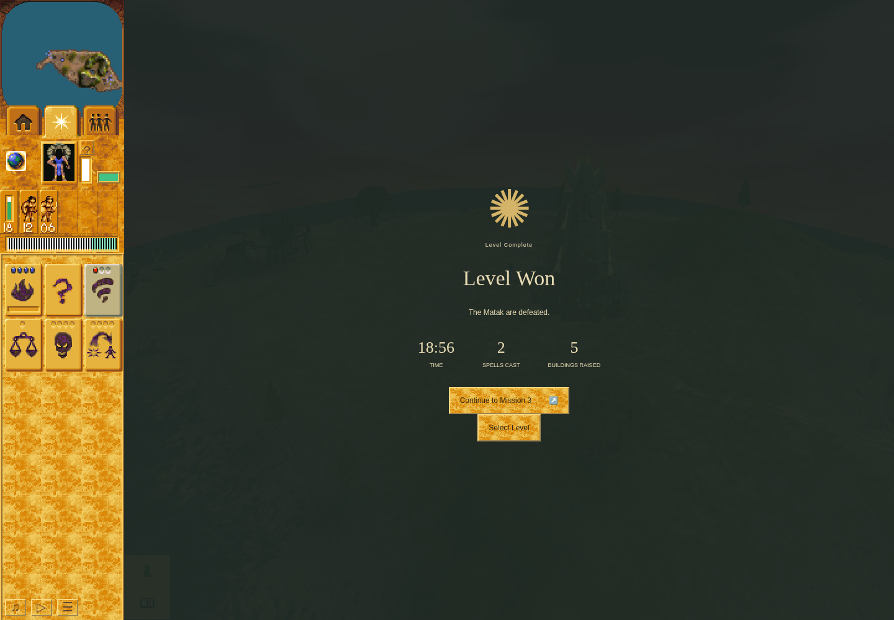

# Fresh Mission 2 victory and Mission 3 checkpoint

**Mission 2 reached victory in the same fresh campaign.** Actual Save/reload/Load,
committed profile `[1,2]`, ordinary Continue to Mission 3 and a genuine Mission 3
Save are retained. **The harness is FAILED:** two pre-input helper failures remain.
Normal cleanup and checkpoint-continuation verification passed. Mission 3 gameplay
and full campaign acceptance remain pending.

This genuine paused result at turn 13632 shows **18:56**, two spells cast and five
buildings raised. Six Blue Warriors and the 100-HP Shaman survive; no Green
followers remain. Empty Green Camp 1 remains at 97.5 HP, so no claim is made that
all buildings were destroyed. Displayed construction statistics include enemy
construction. Capture used sandboxed headless Chrome 154.0.8037.92 at 1440 × 1000.
It does not prove native pixels, calibrated animation timing or hardware/GPU
performance.

## Actual continuity and persistence

Run `1a4080a7-e027-4de2-8ff1-4b6f5ff26368` used unchanged QA source
`ddef3caa522d45168b16f290cc5b5a4d1541fce2` and application main
`3b899125cc8cedef938823718ad5d44f49957b66`. Its real predecessor is the
[accepted fresh Mission 1 victory](https://github.com/JohnDeved/populous-new-dawn/blob/aee2ac42fa3ac979a63c96f43b1509a9b3777145/references/verification/current-campaign-continuity-source-2026-10-05/mission-one-victory-ddef3ca/README.md).
The [raw journal](campaign-continuity/mission-two-segment-01/actions.jsonl), fifteen
immutable consumed batches and [terminal packet](mission-two-segment-01-terminal-packet.json)
retain the actual route and failed inputs.

- Opening ordinary Load matched the full Mission 2 Save at turn 396, actor,
  terrain and stock digests. The first finite batch was queued 17 milliseconds
  after the actual paused opening/awaiting-input boundary.
- Actual Bridge shrine use/effect completion, Camp construction and five living
  trained Warriors were recorded. Two named Braves worshipped the Tornado shrine;
  an active [first-delivery snapshot](campaign-continuity/mission-two-segment-01/m2-first-tornado-delivery.json)
  shows both working, two followers, one use and one delivered shot. All three
  shots were then delivered.
- Mission 2's own committed Save at turn 5185, full digest
  `5afba71ef6deb2b0bad8afa79e666c4c9a4763eae8f9753be522afb04b6bf457`,
  survived an actual page reload and ordinary Load. Replacement and storage
  actor/terrain/stock checks passed; immediate ordinary Pause preceded diagnostics.
- Two added Huts and two further finite five-Brave training groups produced
  fifteen total trained Warriors. Actual paused counts/queues preceded decisions;
  nine losses during ordinary combat leave six survivors. Two acquired Tornados
  were cast. The planned later Blast was never cast.
- Victory committed profile `[1,2]`. Continue retained the store and replaced
  World and scene with current correspondence. Mission 3 Save committed at turn
  179/time 14.9166667, full digest
  `5cb9a33a119f9c70dbf22455766e5c7add5ffa99a45b704d90ba5c434ac3b713`.
  Its [opening screenshot](campaign-continuity/mission-two-segment-01/m3-continued-segment.png)
  precedes the Save; later transaction readback establishes commitment.

## Failed envelope and normal closure

Batch 11 rejected Warrior 6's previously sampled integer interior point when its
immediate pre-input revalidation failed. The recorded delivered observation is
null: that click was never sent. A later ordinary order to the observed static
western Tower was accepted; the rejected input was not retried or relabelled.

Batch 14 accepted the static Hut 1019 army order, then its later Shaman ground
probe returned null at turn 13602. No move or Blast followed. The retained paused
snapshot at turn 13632 already shows `won` and zero Green followers. The later
snapshot alone does not establish the exact cause of that earlier null probe.
Both raw failures remain in [journey.json](campaign-continuity/mission-two-segment-01/journey.json).
No assertion or running source was changed.

The [inner receipt](campaign-continuity/mission-two-segment-01/receipt.json),
[outer receipt](campaign-continuity/mission-two-segment-01.outer.json) and
[launcher](campaign-continuity/mission-two-segment-01.launcher.json) record normal
exit 1 from original session 34673. The exact deliberately thrown boundary error
is hash-bound in [segment-boundary.json](campaign-continuity/mission-two-segment-01/segment-boundary.json).
There is no terminal override or browser error; cleanup and continuation checks
passed, the owned lock was released and both same-scope port 4375 probes closed.
There were no preserving-stop commands in this segment.

Mission 2 used 1141.4167/1500 active seconds and 33:59.727/90:00 owned wall time.
The real closed prefix retains 1857.1667 total active seconds, including Mission
3's 18.1667 active seconds and 30.211 seconds owned wall. The
[maintained predecessor validation](campaign-continuity/mission-two-segment-01-predecessor-validation.json)
accepts the failed but genuine completed boundary. It forwards both helper
failures and a separate prior-harness-failure record for the envelope; that record
is not a third gameplay input failure. Future M3 entry still requires its own
reviewed inputs, real lease, full saved digest match and ordinary Load.

## Verification and limits

The [exact M2 launch review](campaign-continuity/review-mission-two-launch-ddef3ca/review.json)
retains the accepted unchanged-source gates: 92 fresh QA tests and an exact fresh
combined build from the published M1 packet, with explicitly reviewed 1,134-test,
typecheck and parity component correspondence. No repeated or combined aggregate
check is claimed. Later Guard changes are excluded from this pinned run.

The earlier independent failed fresh profiles and historical saved-state M3
victory remain separate evidence. They supply no new campaign milestone. Native
parity, issue #214's remaining timing families and full current campaign acceptance
remain open. Private profile, IndexedDB, browser storage and private TMP bytes are
excluded; [manifest.json](manifest.json) maps only allowlisted game evidence and
receipts to exact byte-identical copies. Historical prelaunch records remain
unchanged, with actual later receipts establishing execution and closure.
