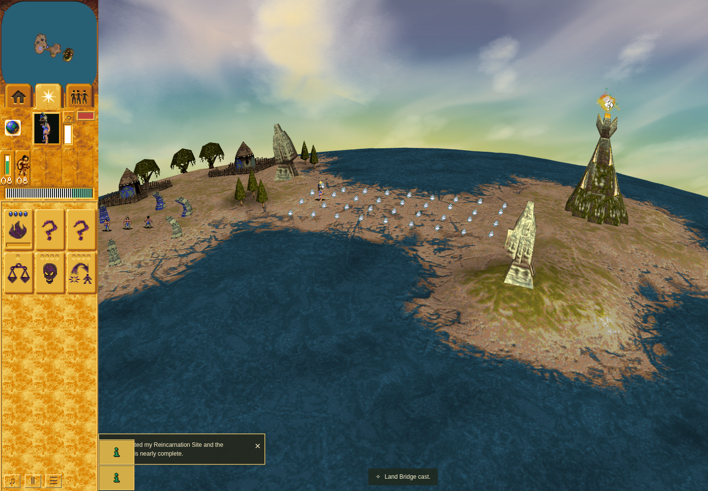

# Land Bridge cast acknowledgment

Product `501fcc1ac218d859551e286fd26219c98951f39b`, based on
`86c0dd37b1a7879a84d5a55ab9bca4b14beed029`; [PR #275](https://github.com/JohnDeved/populous-new-dawn/pull/275), refs #58.
Ordinary result independently accepted on 2026-10-08 at 21:20:47 UTC.
Final result verdict SHA-256:
`84fccb9bfb59560938e83cb6ca960e5836efd93ed0622bfbbdf894b6d5aeac37`.

The only product change replaces “The earth rises. Lead your followers across the
new Land Bridge.” with “Land Bridge cast.” The real projectile allocates its effect
at controller turn zero. The first controller visit initializes endpoints; later
visits deform terrain. The nine-second status and original campaign message
82/string 615 are unchanged. Retained `0050ee00 → 0050f010 → 0050ecc0` evidence
supports initialization and signed terrain changes, including lowering; it does
not establish a native success-text equivalent. No new original code was executed.

## Ordinary Mission 1 observation

QA source `e504f73f698bb852c4091fe004e5a043e583772e` has byte-identical product,
assets and package inputs to the product head. In a fresh Mission 1, the Shaman
earned a Bridge shot at turn 399. Trusted canvas release at 539 spent stock 1→0
and allocated projectile 1195. Effect 1256 and the acknowledgment appeared at turn
548/controller 0 with the unchanged nine-second deadline. The renderer consumed
the same effect/controller; the first observed visible status DOM was at
549/controller 1. No checkpoint was created; observer restoration, cleanup and
continuation checks passed, with no captured browser/witness/cleanup errors.

Unmodified after image: Chrome Headless Shell 154.0.8037.92, 1440×1000, DPR 1,
on QA source `e504f73f698bb852c4091fe004e5a043e583772e`. Screenshot observations
bracket turns 551–570/controller 3–22. The readable acknowledgment is visible
after terrain work began. This is not the first compositor frame, a pre-terrain
screenshot, a completed crossing or native pixel/performance equivalence. No
comparable before image was captured; the old text is retained in the red test
result. [Compact facts and hashes](facts.json) identify the original retained
receipts and these unchanged image bytes; raw receipts and browser data stay local.

## Verification

The red component test failed specifically on the original sentence. All three
Land Bridge tests passed on the product head: the labelled supplied-position/stock
production caller test, fixture-backed native controller lifetimes and refresh/stall
invariance. That supplied-state test is separate from the ordinary episode above.

All 12 fresh standard stages passed: typecheck, eight exhaustive test shards
(1,540/1,540 tests across 261 files), parity validation, orchestration validation and
build. Changed-file formatting passed. Strict lint remains failed with 25 Oxlint
and three ESLint diagnostics independently attributed to unchanged base lines.
Source, standard and ordinary evidence were independently accepted. The broader issue 58
remains open.
