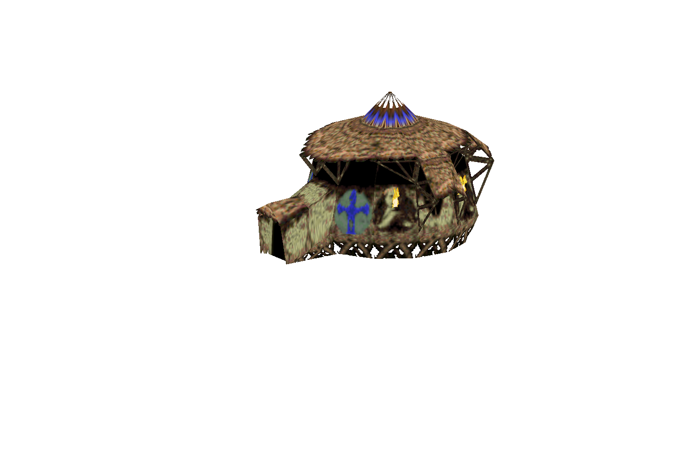
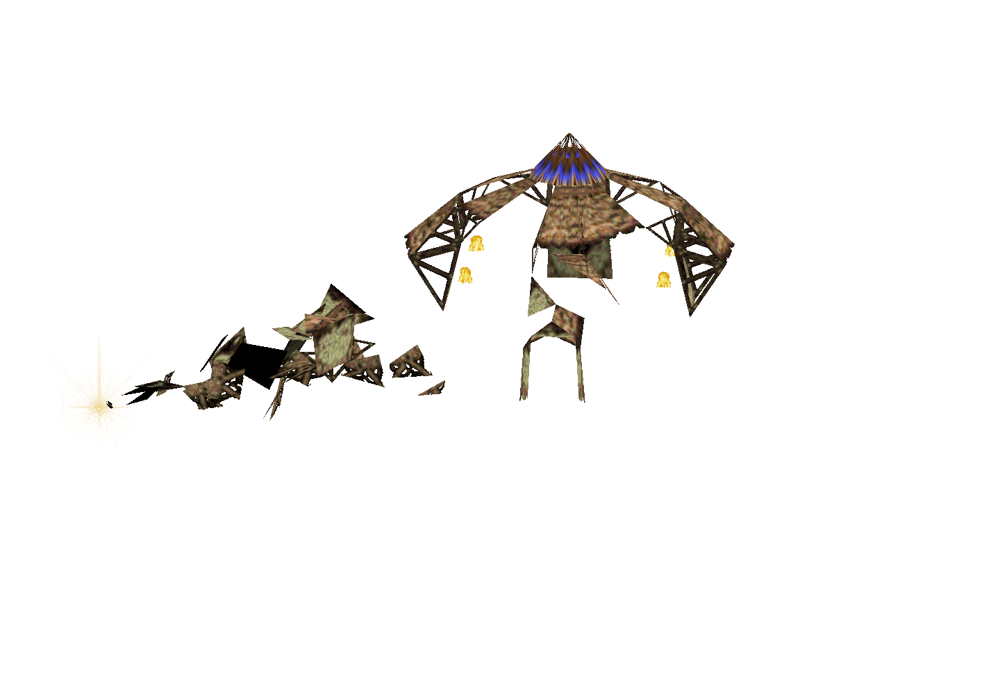
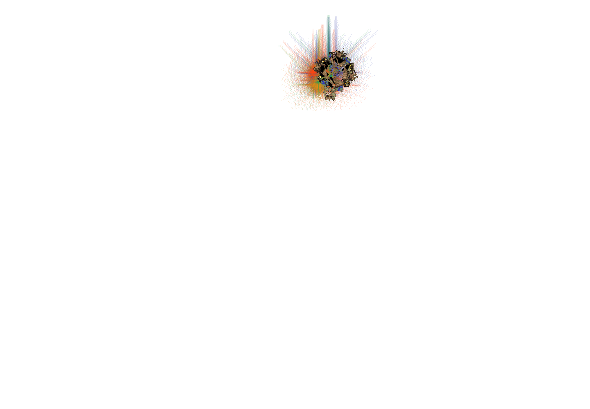

# Mission 3 Temple acquisition: partial ordinary evidence

The 2026-10-09 browser attempt is **FAILED and incomplete**. It reached the authored Temple acquisition, produced the natural frames below, saved the active controller, and loaded that genuine checkpoint. It then missed the required active-owner Restart witness because acquisition finished before the Restart click. PR278 remains blocked on the remaining ordinary proof.

Product source: `9d88d72126f64b96500b596792b7b938fc594aad`. Ordinary driver and maintained harness: `7025ead7d1cd9453ce4bdddbd4b43bffba26d1d5`. App tree: `b0b7f78c6292c202fe5ef7dfff794abac5d81727`. This used sandboxed official Chrome Headless Shell154.0.8037.92 on the cloud software renderer,1440×1000.

## Actual retained boundaries

- Public Save committed Mission3 turn1190/time99.16666666666667, full digest `0e5ebc6902e2834f4a296fd46d6df18e70263f2056e920984aa485ebb50afedf`. Gift3141 came from authored head91/reward92. The saved building controller was active, model95, phase4/visit14.
- Trusted Load synchronously restored the exact saved acquisition/gift/Blue-actor snapshot. Shared bank-p reset from epoch1 to epoch2, counter0/tile92. The early Scene observer attached once and restored its wrapper without errors.
- The resumed observer recorded the independent knowledge grant on turn1215,82 turns after gift birth1133.
- At the actual trusted Restart click, turn1263, the acquisition was already inactive (phase5) and its gift had expired. Restart kept epoch2/counter5/tile101, reset the World to turn0 and cleared acquisition. That supports this normal completed-state transition; it does **not** satisfy interruption of an active acquisition.
- Inner failure was terminal at01:47:54.482Z; outer exit1 at01:47:57.205Z. Browser errors were empty. Normal cleanup and continuation were verified, the owner lock was released, and the turn1190 Save remained the latest checkpoint. No fallback Save overwrote it. A secondary route-final read reported that its observer was already closed; this is retained separately from verified harness cleanup and the two restored, error-free acquisition epochs. Software-WebGL fallback, readPixels stall and two Three texture warnings were retained; the run did not use unsafe renderer flags. An exact GPU vendor string was not captured by this scenario.
- The preceding4190 startup attempt failed before browser launch and is retained separately. The repaired harness admitted4191 and reached readiness in17.928 seconds, with first/last attempt diagnostics retained.

## Natural rendered acquisition frames

These are unedited captures of the actual acquisition canvases at naturally rendered frames. Transparency is retained; they show the overlay layers, not the entire page/HUD or an original-game screenshot.

Whole Temple, including its animated-material faces:

Flying fragments and pulse sparkle after the genuine Load:

Another naturally selected shared resource tile:

## Later continuation03: active-building Restart accepted, tail still failed

A separately reviewed continuation on driver `305ad68cadee16ac73a47d2307799b95a5b2b986` loaded the genuine turn1190 checkpoint with adjacent trusted Load/Pause controls. At the subsequent trusted Restart, turn1218, the building controller was still active (phase4/visit100). Restart cleared acquisition and reset the World while retaining bank-p epoch1/counter3/tile95. The second Load restored the exact saved1190 state and reset the resource to epoch2/counter0/tile92. Companion/pulse were already inactive and knowledge was already granted before Restart; interruption credit is limited to the active building controller.

This continuation also **FAILED**, at its later ordinary home move. Preflight frame237 was clear with Shaman46 selected; the trusted pointerdown on frame238 hit Brave510. Camera/projection/terrain coordinates stayed unchanged, the actual acknowledgement selected510, and no new movement order was issued. The existing strict recipient/freshness predicate correctly stopped the attempt. A different home-perimeter setup point requires its own ordinary input/arrival evidence; no failed click is reclassified as accepted.

Outer exit1 was terminal at02:09:44.106Z. Cleanup and continuation were verified, browser errors were empty, the owner lock was released, and the genuine1190 Save remained intact. `continuation03-summary.json` binds this additional failed attempt and its accepted lifecycle partial.

## What remains open

Across the two attempts, ordinary Blue Temple construction, shared-resource world-Temple frames and final Save remain unaccepted. The acquisition observer's full final predicate was not reached. Raw source-bound evidence is retained locally; `partial-summary.json` binds these public images and records hashes without publishing any browser profile/storage.

The original static/source and data proofs have separate limits. This browser evidence does not establish original GPU equality, native wall-clock/24Hz/RAF cadence, hidden-tab scheduling, complete audio, other tribes or all construction stages. Campaign progress and passing tests do not imply full original-game parity.
