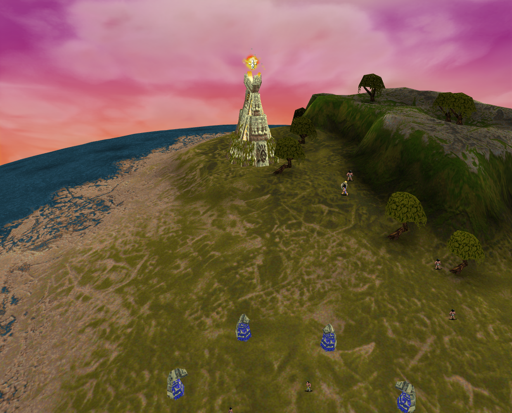
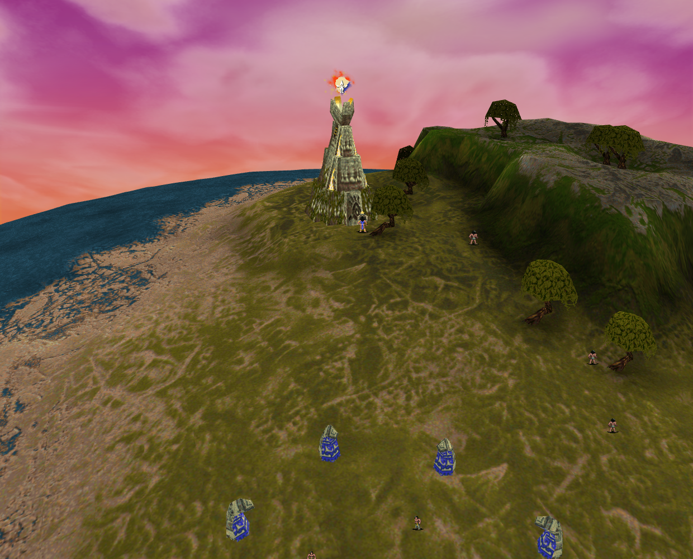
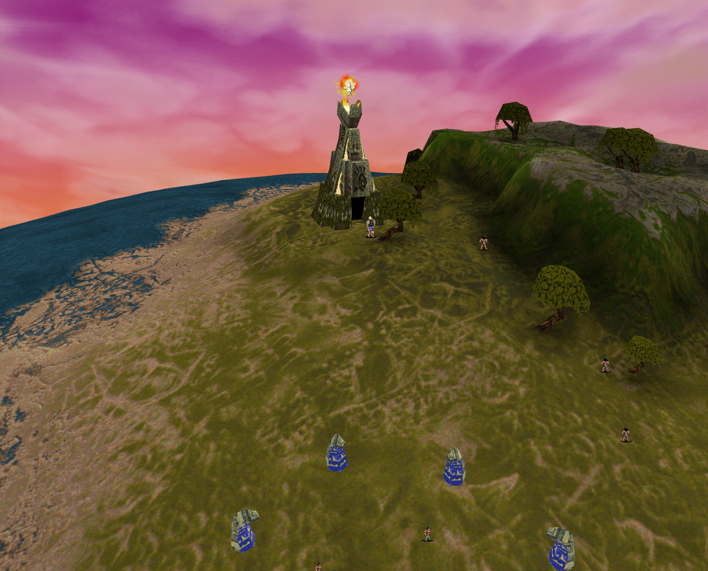

# Mission 3 Vault approach: ordinary03 evidence

The bounded ordinary03 input, endpoint/work/reward/departure sequence, all three natural images and cleanup are independently accepted for [PR #282](https://github.com/JohnDeved/populous-new-dawn/pull/282). Product `25441a1d0967b9e996d103929d7505276da345d9` also has accepted final standards. PR #282 merged as `2107ccfabc1737aed55aca3c5579a920dd63a667` at 07:56:33 UTC; the provider check completed successfully at 07:57:38 UTC on that exact merge.

The repair sends command 33 to the original shape-derived outside point and changes work admission with it. Mission 3's prayer goal changes from 58112/31488, inside the footprint, to 58112/30976, outside. New destinations precede arrival checks, saved dispatched goals retain ownership, and phase 9 departure derives from the same outside point. Retained original function/shape references, CPU caller tests and the current browser episode provide distinct evidence; no new native execution is claimed.

## Accepted ordinary03 observations

QA `f4f72326672afa4ee0c78ceaae091d2ecf39d852` has corresponding product application bytes. One ordinary 1024-pixel camera half-turn uses the actual heading, 1133→109, preserving center and selection. Trusted canvas input at turn 400 orders Shaman 46 to Vault 92. The same command 33/order 8 runs through 1,053 consecutive turn pairs:

- Executed phase 1 at 401 installs outside 58112/30976. At 883→884, prayer outside closed model 154 increases work 1→2, with no use or forced reward.
- Work reaches 100 before opening at 1277. Executed phase 4 at 1317 installs inside 58112/32000 after open model 153.
- One reward and gift 3141 appear at 1358. Its 82 decrement visits precede Temple unlock at 1440.
- Phase 7 at 1382 reinstalls the outside point; phase 9 at 1440 installs departure 58112/29952. The original order releases at 1453 without a replacement home command.

All 1,750 closed phase 1/2 sampled boundaries exclude the footprint. This is finite turn-sample evidence, not continuous or interpolated path-clearance proof. Errors and cleanup errors are empty; normal cleanup is recorded. The fresh episode performs no Save/Load.

These are unchanged 1240×1000 captures of actual game-canvas draws. The entry frame begins executed phase 4 while the interpolated Shaman pose remains at the outside endpoint; it does not show completed inside arrival. Invalid preload-as, software-WebGL, readPixels and missing-image warnings remain; no hardware-renderer equivalence is claimed.

## Retained attempts and validation

Ordinary01's endpoint/work/reward/departure semantics and cleanup are accepted. Its prayer 849 and entry 1282 images obscure the actor, so their pixel hold remains; their hashes are retained in the summary. Ordinary02 failed before a camera drag or Vault command because its actual heading 1136 differed from an unsupported fixed requirement 1153. That QA precondition failure had clean teardown and supplies no product or pixel result. Ordinary03 corrects only that camera assumption.

Final standards are independently accepted: **1594/1594 tests across 271 maintained files**, plus typecheck, parity-ledger, orchestration and build. Seven complete prior stages carry through reviewed correspondence; nine ran fresh. Typecheck was carried. The original shard timeout (exit 124) and 52/54 mission-batch assertion failure remain uncredited. The whole repeated mission shard passed 54/54; build finished at 07:34:27.498 UTC.

The mission failure was a real enemy Preacher encounter interrupting conversion. One ordinary staging waypoint and an observed defense-dispatch barrier corrected the verification setup; authored-victim, replacement, checkpoint, cancellation and display-schedule assertions stayed unchanged. Its qualification passed 3/3. Focused product tests passed 23/23, and the retained phase-2 model Save/Load passed through one reward and departure with task/order/RNG equivalence; other phase checkpoints cover three turns. None is browser persistence evidence.

Production formatting passed. Isolated ESLint 208→208 and Oxlint 289→285 add no findings, but inherited failures remain. The changed fixture's scoped ESLint passed. npm notices, build timing/chunk advisories and the vinext route-classification notice remain disclosed. Exact source, aggregate, review, receipt and image hashes are in `summary.json`; raw reports retain their original pre-review statuses.

## Limits and contents

This is one current Mission 3 Vault command 33 episode. Stone Head command 27 is already repaired; Temple training command 8 is distinct. Shared Vault collision registration, arbitrary relocated Vaults, complete navigation/native raster/audio parity and the exact structure reported in [issue #75](https://github.com/JohnDeved/populous-new-dawn/issues/75) remain unresolved. This packet does not close the issue.

Contents: this README, compact summary and three genuine ordinary03 PNGs. No raw archive, browser profile, receipt dump or standalone original asset is included.
