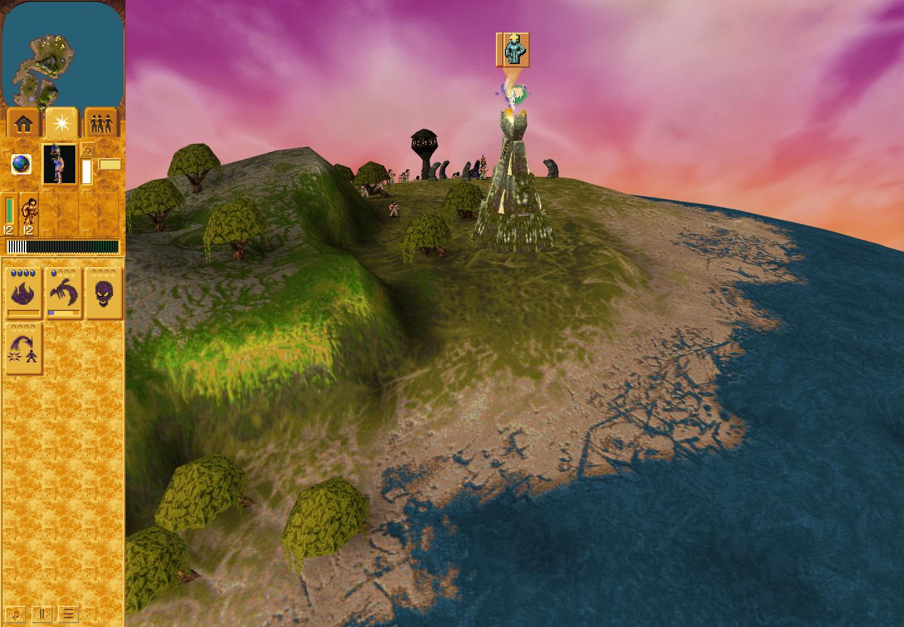
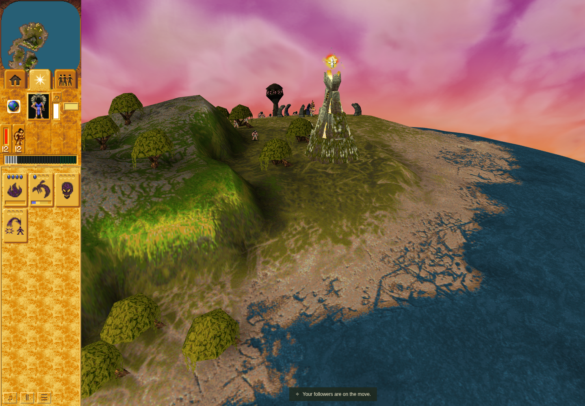
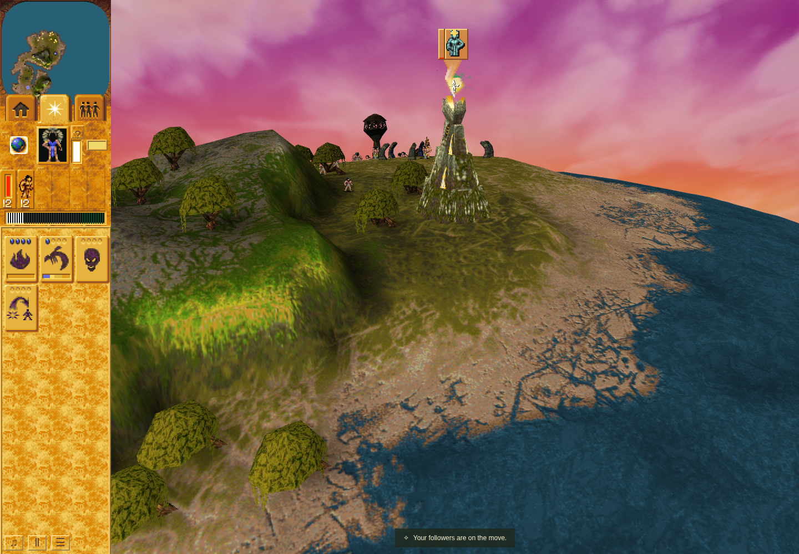
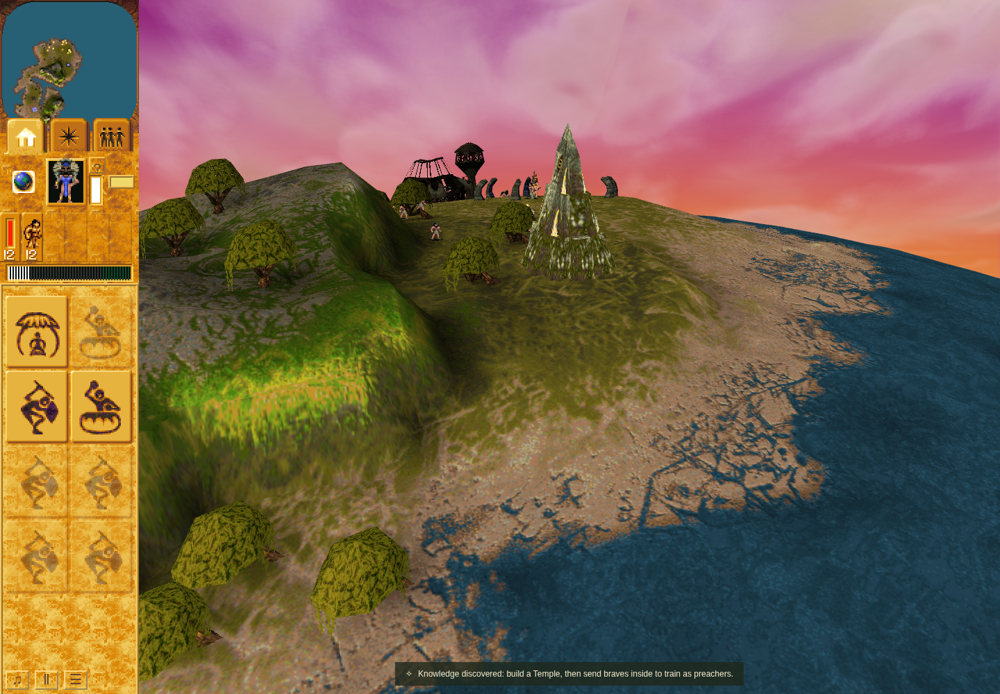

# Mission 3 automatic Vault prayer panel

PR [#310](https://github.com/JohnDeved/populous-new-dawn/pull/310), refs [#72](https://github.com/JohnDeved/populous-new-dawn/issues/72). This is a bounded slice; #72 remains open. Product PR310 merged2026-10-10T10:22:32Z as `35de8e6ca6864a98aff3bca0f263e87eee7fa65c`; its GitHub tree exactly matches the tested tree. [Integration readback](integration-readback.json) records provider status as in_progress at10:23:29Z; no provider-pass claim is made here.

Source: `79618d3323a6062dd2b7fc1c4e37e8055d2f86a0`, base `4754e12d3590bde18656416514871b033de164be`.

The original Mission3 Shaman's ordinary command33 now requests the existing prayer/progress panel before the Vault sampler replaces its cached local-player count. The controlled caller test sees old0/work0 at turn536 and rejects opening; at turn540 it sees old1/work1, creates phase−1 with hold16, then the sampler advances work to2. Cancellation expires the automatic panel and reissue recreates it. The authored finite-trigger retirement uses the existing combined Shrine active-state adapter.

## Verification

| Evidence | Result |
| --- | --- |
| Failure-first caller,189d394d | Expected FAILED: missing first0→1 request; original approach/work test passed |
| Initial consumer attempt,158ff2ed | FAILED:1 capacity-fixture setup error; retained, repaired without weakening assertions |
| Corrected caller,55948aa6 | PASSED11/11, including ordinary open/cancel/reissue/reward and supporting capacity/identity/load cases |
| Existing shared Camp/Temple callers,55948aa6 | PASSED53/53 |
| Independent source review | ACCEPTED product and reviewed QA carry into79618d33 |
| Fresh full standard profile,79618d33 | PASSED17/17 stages;1864/1864 tests across all300 standard files once; fresh typecheck, parity, orchestration and build |
| Scoped formatting | PASSED |
| Scoped ESLint / Oxlint | FAILED208 /287 inherited diagnostics; exact baseline attribution found no new identities |
| Ordinary rendered browser | PASSED and independently ACCEPTED, all4 images inspected, unchanged79618d33 |

The standard run finished2026-10-10T10:16:48.660Z. Build retained nonfatal proxy/npm, plugin-timing, large-chunk and route-classification warnings. The failed Oxlint stdin attempt is retained as a tool failure; the detached exact-base comparison supplies the valid attribution.

[Standard aggregate](standard-aggregate.json), [independent source, standard and rendered-result review](source-and-standard-review.txt), and [hash-bound verification summaries](verification.json) identify exact inputs, source, statuses and retained raw receipts. These summaries do not replace the retained raw logs. All product/caller bytes remain unchanged from55948aa6; the final candidate adds reviewed QA only. No original bytes, browser profiles, or raw large archive are included.

## Scope and limits

The implementation preserves work/reward/RNG algorithms, reuses the existing binding/painter/lifetime, admits automatic owners through the existing32-record/160-secondary count adapter, latches only successful creation/reuse, and reads post-sample activity on every elapsed phase1 visit. Loaded/replaced/disposed Scene ownership is transient. enabled=false alone does not hide a panel.

Retained original static evidence is in [worship-panel-auto-producer.md](../../../decomp/research/worship-panel-auto-producer.md) and generated004fb270,00509290,005092e0,00504060,00504920. Earlier original comparators intercepted requests; no composed original execution is claimed. The extra second-body/invalid-owner cases are explicitly supplied supporting coverage, separate from the ordinary Mission3 route.

Native mixed-class scheduling, physical allocator equivalence, exact Vault building socket anchors, clickable Vault glyphs, sinking, generic trigger retirement, original raster/audio fidelity and hardware performance remain separate. Nonzero model and active are documented browser body/trigger adapters. No art, geometry, imported asset or parity-ledger change.

## Ordinary lifecycle images

The sandboxed headless Chrome154.0.8037.92 run used a1440×1000 viewport and the existing1× clock. It created automatic records at turns736 and852, accepted trusted ground interruption at776 with work12, expired the first record at781, earned use at1330, unlocked Temple knowledge at1412 and released the original Shaman task/order at1425. The observer closed at1449. The observer recorded no errors/overflow; owned-profile cleanup and continuation checks passed. These are lifecycle views of the same source, not a before/after implementation pair.

[Browser summary and screenshot hashes](ordinary-browser.json) preserve source, launch, raw-report hashes and before/after observations. Screenshot time is bracketed because the game continued while capture ran. Software WebGL, ReadPixels-stall and missing-image update warnings remain explicit; this is no hardware-performance result.

Automatic prayer is visible without inspection, hover or focus. Capture interval745–761, followers1, work4–8/100; record1 is automatic, phase1, hold16.

The ground command interrupts prayer; the panel/latch/reservation have expired. Capture interval789–807, followers0, work9→5/100.

Ordinary reissue recreates the panel with a new record/DOM identity. Capture interval859–875, followers1, work3–7/100; record3 is automatic.

The Temple reward is earned and the original Shaman has departed. Capture interval1431–1448; the final observer closes at1449 with uses1, unlockedTemple=true and no panel, latch or reservation.

The command reporter produced an empty parityMeasurements list: the local-render scenario name is outside its current discovery convention. No computed parity credit or ledger change is claimed. Final independent product, ordinary-result and merge-scope review ACCEPTED. The retained raw summary names1449 as departureTurn, but that is observer closure;1425 is the actual task/order-release event. Raw reports were not rewritten.
