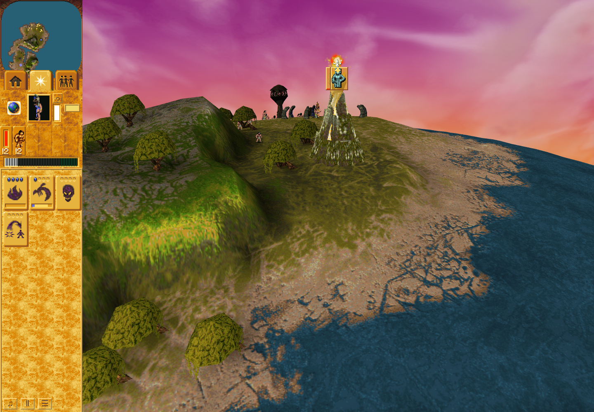
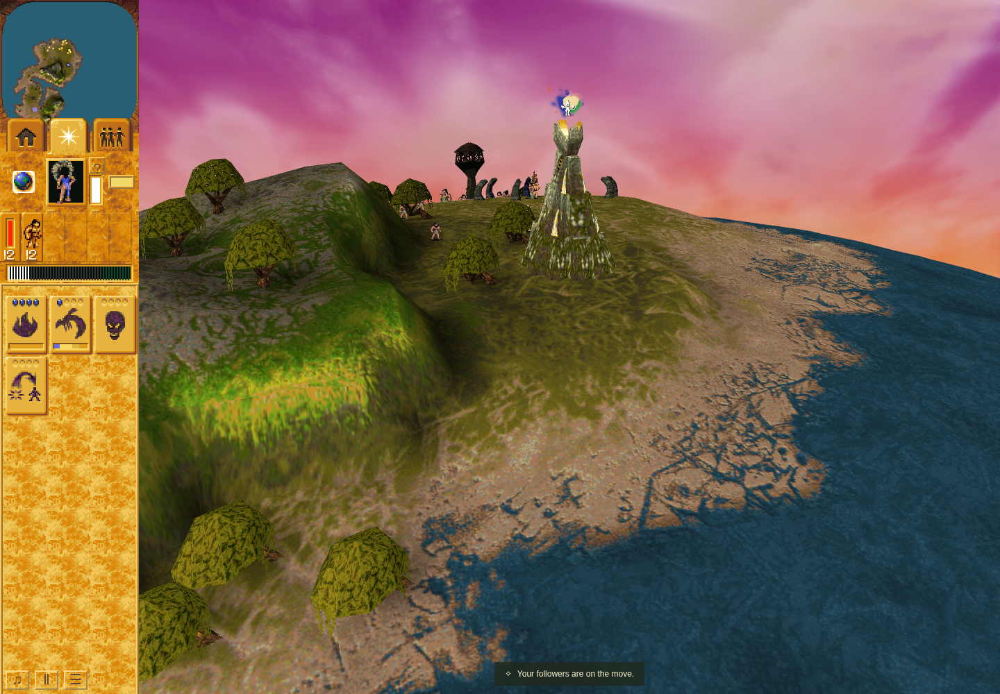
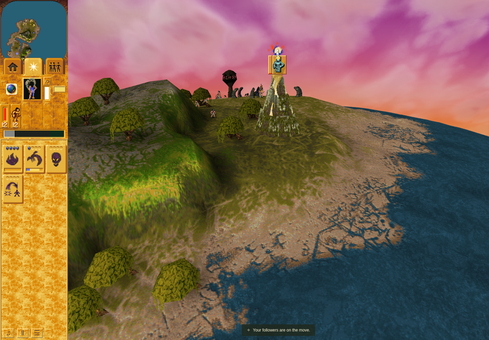
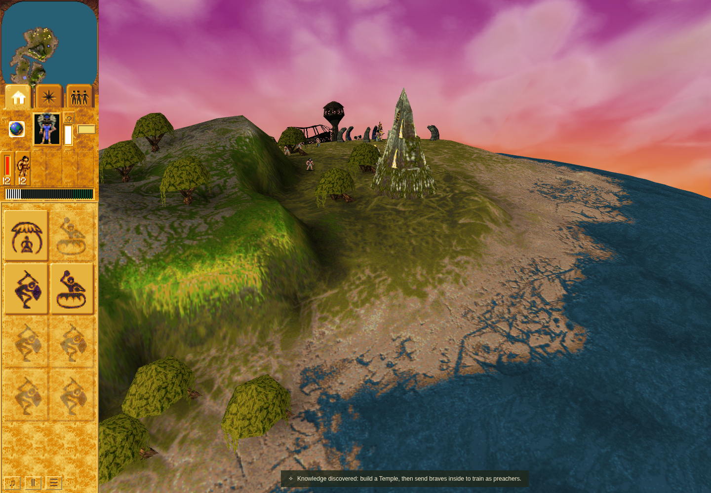

# Mission 3 Vault prayer-panel socket anchor

PR [#311](https://github.com/JohnDeved/populous-new-dawn/pull/311), refs [#72](https://github.com/JohnDeved/populous-new-dawn/issues/72). Product source: `a58a94a7313218e3811455e641a223d8dab8543c`, clean tree `14a34ccc6d70de0f74e761ea8ec937bcb35398ef`; base `35de8e6ca6864a98aff3bca0f263e87eee7fa65c`.

Completed authored M1/M3 Vault prayer panels now use building socket 0 at fresh terrain +480, correcting the scenery-height 1028 anchor. The separate reward marker keeps socket 1 (+1072). Existing shape geometry, terrain synchronization, projection and viewport clamps are reused. Request ordering, work, reward and lifetime retain their existing owners.

## Source and caller proof

The canonical executable's model-18 descriptor byte +0x33 is 00: VA `0x5a77b3`, file offset `0x1a55b3`. The bounded data read verified executable SHA-256 `3a5065c7420b3fcde208bf220bc86dfbac95e025ab2492caf9c7ea5308dfbe4f`; no executable bytes or new native execution are included. [Static proof summary](source-proof.json) and the [durable source contract](../../../decomp/research/vault-prayer-panel-anchor.md) retain descriptor identity, transforms and limits.

Identical corrected test bytes first fail against unchanged baseline runtime by 548 at four height assertions, then pass 26/26 against the candidate. The ordinary M3 command/prayer request reaches actual ObjectPanels, canvas painting and real GameScene.screen. Native XY is explicitly 58112/32000. The browser's canonical z=123 and authored z=-133 are periodic equivalents; RenderView owns camera-relative wrapping. M1 heading 512, both terrain refresh paths, every frame/quarter turn, viewport clamps and non-Vault scenery are covered.

[Verification summaries](verification.json) bind commands, source/input hashes, raw-log hashes and results. Earlier intro-fixture failures, the first green attempt's literal-coordinate mistake, and an ignored-path baseline lint attempt are retained as failures, not silently replaced. Summaries do not replace the retained raw receipts and logs.

## Verification

| Evidence | Result |
| --- | --- |
| Independent source, runtime, tests, QA and final review | ACCEPT |
| Corrected identical-test RED/GREEN | Expected baseline failure; candidate 26/26 passed |
| Fresh standard profile | 17 stages passed; 1,876 tests across all 301 current standard files once; zero failures, skips or cancellations |
| Fresh typecheck, parity, orchestration, production build | Passed |
| Changed app formatting; seven changed code/test/QA files ESLint | Passed |
| Full formatting | Failed on unchanged render-view.ts and viewport-bounds.ts |
| Full ESLint | Failed with 282 errors and 2 warnings outside changed paths |
| Full Oxlint | Failed with inherited diagnostics; eight ObjectPanels warnings exactly match base, none in vault-geometry |
| Ordinary browser, all four images and owned-profile cleanup | Passed and independently ACCEPTED |

[Standard aggregate](standard-aggregate.json) has SHA-256 `258697adb549e45ac5578a9c21b9389c12b4e53a6de6ca978b5290a8116fdddb`. Its 17 stages ran 10:53:52.125–11:00:33.180 UTC on 2026-10-10, with 384.254 command seconds over 401.055 elapsed seconds. Its browser-pending note records the aggregate's earlier creation time; the later accepted browser result is below. Nonfatal build warnings remain in the retained raw receipts.

The [ordinary browser summary](ordinary-browser.json) binds the outer command, raw harness/episode hashes, complete stage snapshots, browser identity, warnings and image hashes. The run completed 11:01:44.470–11:04:17.087 UTC on the exact clean candidate. Exactly two fresh automatic opens occurred at turns 664 and 800, with no manual or reused opens, observer errors or overflow. Trusted ground interruption at 714/work 14 led to expiry at 720. Earned use occurred at 1276, Temple unlock at 1358, and original Shaman task/order release at 1373. The raw summary's `departureTurn=1396` denotes observer closure; it is not the departure event. Raw reports were preserved unchanged.

## Ordinary lifecycle images

All four images show source `a58a94a7`, sandboxed headless Chrome 154.0.8037.92, 1440×1000 viewport, normal 1× speed and software WebGL. ReadPixels-stall and texture-update warnings are retained. These images do not certify hardware performance or original full-frame rendering. Capture intervals are bracketed because the game continues during capture.

Automatic prayer, turns 678–698: followers 1, work 5–10/100, automatic phase 1/hold 16, no inspection, hover or focus. At both bracket boundaries, terrain 229 + socket height 480 gives native height 709. The actual DOM tail exactly matches socket-0 projection at container-local (617.9375,286.875); inline CSS x rounding differs by 0.0005px.

After ordinary ground interruption, turns 730–750: followers 0, work 10→5/100; panel, latch and reservation are absent.

Ordinary command reissue recreates a fresh record. Turns 813–831: followers 1, work 5–9/100, new record identity, with the same exact socket-0/DOM agreement and the separate reward marker above.

Earned Temple knowledge and departure, turns 1378–1395: Temple HUD/message visible and no panel, latch or reservation. The Shaman already completed departure at turn 1373.

The [historical first-panel image from PR #310](https://raw.githubusercontent.com/JohnDeved/populous-new-dawn/b70c1b82a17231331f8021920828a84251bd97d8/references/verification/m3-vault-prayer-2026-10-10/vault-first-automatic-panel.png) is an unmatched-camera reference. The candidate's hypothetical legacy/reward projections differ vertically by 111.125/120.1875px under its own camera. These are candidate projection alternatives, not a measured historical before/after pixel displacement.

## Limits

Issue #72 stays partial. Modified-body/trigger binding, construction-state scaling, zero-height fallback, native mixed-class timing/physical allocation, sinking, original raster/audio and hardware performance remain separate. This correction claims completed authored M1/M3 anchors. Supporting CPU consumer tests and ordinary candidate browser observation establish distinct evidence. Existing PR #310 evidence is preserved. No imported assets, parity ledger, browser profile, raw large episode archive or original binary is included or changed.
