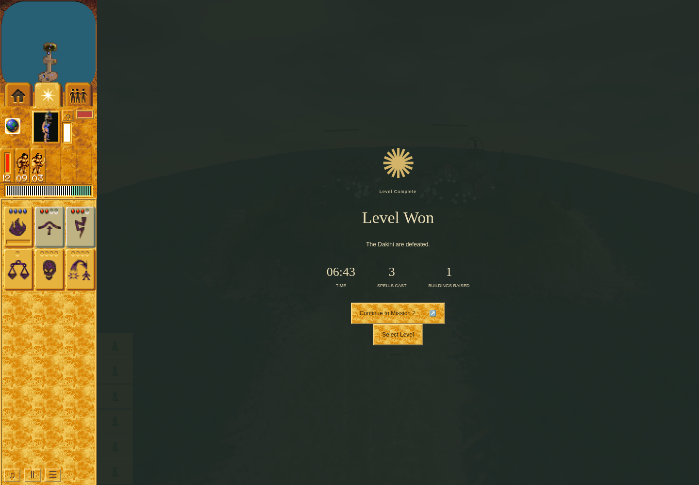

# Mission 1 ordinary-control observation, 2026-10-04

Refs [PND-11](https://github.com/JohnDeved/populous-new-dawn/issues/11). This is a
bounded gameplay observation with a separately pinned evidence archive. It is **not a clean passing
maintained checker**, a full-campaign acceptance, an original-pixel comparison,
a hardware-performance result, or a parity-ledger update.

## Evidence location

The complete, unchanged packet is preserved at commit
[`4186e9d`](https://github.com/JohnDeved/populous-new-dawn/tree/4186e9d2173fb865c5663efdf7169c9ca7dd61ea/references/verification/mission-one-controls-2026-10-04)
and pinned by tag `evidence/mission-one-controls-2026-10-04`. This integration
contains the report and one selected victory figure; all other images, raw
receipts, snapshots, logs and frozen inputs link to that exact evidence commit.
Issue #11 remains open; this is bounded evidence.

## Result

On tested application commit **b8465001a618b97ded7d7a7cd4afc4a1fc7240f5**
(tree `5f28029baf30cef61c8f71a84c79a8ce116d6115`), Mission 1 reached the visible
**Level Won** result using the shipped campaign selector, ordinary mouse/keyboard
controls and the real animation-frame clock. No direct simulation turns, model
orders, artificial clock, entity/resource/outcome/storage fixtures, or direct
camera/world-state injection were used.

The journey acquired Land Bridge stock, crossed to the central island, defeated
the guard, learned Warrior knowledge, built an eight-log Warrior Training Hut,
trained five Warriors, saved and loaded the actual checkpoint on a fresh page,
bridged north, fought the Dakini, and used one acquired Lightning against the
Dakini Shaman. Zero Dakini followers remained. The victory screen offered
**Continue to Mission 2**; that button was not activated in this scoped run.
A separate, awaited read found `{ version: 1, completed: [1] }` in the committed
campaign profile, matching the in-memory completed mission list.

Both exploratory process receipts deliberately remain **failed**. The first used
the wrong startup Load button. The second retained a timed-out wait after a
legitimately rejected out-of-range cast. The nearer-shore correction then reached
natural victory. The terminal guard refused to turn that second run into a clean
checker pass. No failed attempt was discarded or relabelled.



*Unedited 1440×1000 screenshot of tested b846500, captured
2026-10-04 12:37:41.555 UTC at observed turn 4837. The displayed mission time is
06:43, with three successful spells and one building raised. This is browser
output, not an original-game reference.*

## Source, environment and clock boundaries

- Application source fingerprint before and after run 2:
  `2cb9feee69ec050a09e1061d1cdd88a5e795f37c10160d246f0638eb56255303`.
  Both receipts report unchanged tracked/untracked application source.
- Chrome Headless Shell `154.0.8037.92`, sandbox enabled; only the reviewed
  harness's `--remote-debugging-pipe` launch argument. No unsafe renderer flags.
- Actual renderer: `ANGLE (Google, Vulkan 1.3.0 (SwiftShader Device (Subzero)
  (0x0000C0DE)), SwiftShader driver)`. Viewport 1440×1000; DPR 1; Linux; Node
  `v24.19.0`. This is software-rendered functional/visual evidence, not a modern
  GPU frame-rate or latency certification.
- Default authored Mission 1 settings. No difficulty selector or speed control
  was changed. The application initializes `speed: 1` in `app/world-state.ts:278`;
  the source-owned clock is 12 simulation turns per active second. This does not
  establish equivalence to a named original-game difficulty preset.
- The real frame loop advanced gameplay; normal Pause/Resume and menu controls
  accounted for inspection time. In the uninterrupted segment from bridge stock
  to knowledge, 795 turns elapsed over 66.244 wall-clock seconds; knowledge to
  completed construction was 908 turns over 75.660 seconds. These are journey
  observations, not paired performance measurements or an original timing oracle.
- Run 2 process: 12:24:28.559–12:39:31.261 UTC. Initial world ready/paused:
  12:24:59.844. Visible victory first captured at 12:37:41.555. Wall time includes
  loading, deliberate pauses, inspection and a 45-second failed wait. The 06:43
  result-screen time must not be confused with that full wall-clock duration.
- Read-only diagnostics bound React scene/store references, projected existing
  entities, inspected normal picking/placement results, inspected native spell
  range, and awaited IndexedDB reads. Picking refreshes its ordinary caches; it
  does not issue a game order. Camera movement used HUD focus and actual minimap
  clicks, never internal camera setters.
- No page/console errors were recorded. Retained warnings include software-WebGL
  fallback, ReadPixels GPU stalls, and texture-update warnings. They are not
  silently treated as hardware performance or original visual-parity proof.

The generic harness fingerprints application source, but ignored `work/` scenario
files are outside that fingerprint. Therefore this archive separately retains
**the exact executed checker inputs**, commands and SHA-256 values. See
[manifest.json](https://github.com/JohnDeved/populous-new-dawn/blob/4186e9d2173fb865c5663efdf7169c9ca7dd61ea/references/verification/mission-one-controls-2026-10-04/manifest.json), [run 2 input hashes](https://github.com/JohnDeved/populous-new-dawn/blob/4186e9d2173fb865c5663efdf7169c9ca7dd61ea/references/verification/mission-one-controls-2026-10-04/explore-02/scenario-inputs.json),
[run 2 raw receipt](https://github.com/JohnDeved/populous-new-dawn/blob/4186e9d2173fb865c5663efdf7169c9ca7dd61ea/references/verification/mission-one-controls-2026-10-04/explore-02/receipt.json), and
[run 1 raw receipt](https://github.com/JohnDeved/populous-new-dawn/blob/4186e9d2173fb865c5663efdf7169c9ca7dd61ea/references/verification/mission-one-controls-2026-10-04/explore-01/receipt.json). Archive copies remain byte-identical
to the retained local raw evidence. The manifest is an integrity inventory, not a
claim that the exploratory tests passed.

## Actual ordinary-control timeline

| UTC | Turn | Observed event | Evidence |
| --- | ---: | --- | --- |
| 12:24:59.844 | 115 | Shipped Select Mission 1 → Start Mission 1; only Hut construction available; Warrior Training Hut locked | [opening pixels](https://github.com/JohnDeved/populous-new-dawn/blob/4186e9d2173fb865c5663efdf7169c9ca7dd61ea/references/verification/mission-one-controls-2026-10-04/milestone-opening.png), [milestones](https://github.com/JohnDeved/populous-new-dawn/blob/4186e9d2173fb865c5663efdf7169c9ca7dd61ea/references/verification/mission-one-controls-2026-10-04/explore-02/milestones.json) |
| 12:25:51.978 | 728 | Shaman worshipped the southern head; four Land Bridge shots acquired | [milestones](https://github.com/JohnDeved/populous-new-dawn/blob/4186e9d2173fb865c5663efdf7169c9ca7dd61ea/references/verification/mission-one-controls-2026-10-04/explore-02/milestones.json) |
| 12:26:58.222 | 1523 | First bridge cast and crossed; guard defeated through ordinary combat; Vault knowledge unlocked camp | [exact preparation inputs](https://github.com/JohnDeved/populous-new-dawn/blob/4186e9d2173fb865c5663efdf7169c9ca7dd61ea/references/verification/mission-one-controls-2026-10-04/prepare-journey.mjs), [milestones](https://github.com/JohnDeved/populous-new-dawn/blob/4186e9d2173fb865c5663efdf7169c9ca7dd61ea/references/verification/mission-one-controls-2026-10-04/explore-02/milestones.json) |
| 12:28:13.882 | 2431 | Five selected Braves delivered eight logs and completed the placed camp | [built pixels](https://github.com/JohnDeved/populous-new-dawn/blob/4186e9d2173fb865c5663efdf7169c9ca7dd61ea/references/verification/mission-one-controls-2026-10-04/milestone-built.png), [milestones](https://github.com/JohnDeved/populous-new-dawn/blob/4186e9d2173fb865c5663efdf7169c9ca7dd61ea/references/verification/mission-one-controls-2026-10-04/explore-02/milestones.json) |
| 12:29:19.642 | 3213 | Ordinary completed-camp click trained five Warriors; four Lightning gifts also acquired | [trained pixels](https://github.com/JohnDeved/populous-new-dawn/blob/4186e9d2173fb865c5663efdf7169c9ca7dd61ea/references/verification/mission-one-controls-2026-10-04/milestone-trained.png), [milestones](https://github.com/JohnDeved/populous-new-dawn/blob/4186e9d2173fb865c5663efdf7169c9ca7dd61ea/references/verification/mission-one-controls-2026-10-04/explore-02/milestones.json) |
| 12:29:25.821 | 3229 | Actual Save → committed readback → page reload → Load Game; preserved the same five Warrior IDs, stocks, stats and completed camp | [restored pixels](https://github.com/JohnDeved/populous-new-dawn/blob/4186e9d2173fb865c5663efdf7169c9ca7dd61ea/references/verification/mission-one-controls-2026-10-04/milestone-restored.png), [milestones](https://github.com/JohnDeved/populous-new-dawn/blob/4186e9d2173fb865c5663efdf7169c9ca7dd61ea/references/verification/mission-one-controls-2026-10-04/explore-02/milestones.json) |
| 12:31:51.888 | 3842 | First northern cast had not spent stock or advanced bridge count; the checker wait timed out | [failed state](https://github.com/JohnDeved/populous-new-dawn/blob/4186e9d2173fb865c5663efdf7169c9ca7dd61ea/references/verification/mission-one-controls-2026-10-04/explore-02/003-failed.json), [failed command](https://github.com/JohnDeved/populous-new-dawn/blob/4186e9d2173fb865c5663efdf7169c9ca7dd61ea/references/verification/mission-one-controls-2026-10-04/explore-02/command-3.json) |
| 12:33:28.420 | 4073 | Ordinary retry at nearer dry shore completed the second bridge | [corrected input](https://github.com/JohnDeved/populous-new-dawn/blob/4186e9d2173fb865c5663efdf7169c9ca7dd61ea/references/verification/mission-one-controls-2026-10-04/explore-02/command-7.json), [state](https://github.com/JohnDeved/populous-new-dawn/blob/4186e9d2173fb865c5663efdf7169c9ca7dd61ea/references/verification/mission-one-controls-2026-10-04/explore-02/007.json) |
| 12:34:28.961 | 4329 | HUD-selected trained Warriors crossed north and entered live combat after an ordinary enemy-settlement click | [combat pixels](https://github.com/JohnDeved/populous-new-dawn/blob/4186e9d2173fb865c5663efdf7169c9ca7dd61ea/references/verification/mission-one-controls-2026-10-04/008.png), [state](https://github.com/JohnDeved/populous-new-dawn/blob/4186e9d2173fb865c5663efdf7169c9ca7dd61ea/references/verification/mission-one-controls-2026-10-04/explore-02/008.json) |
| 12:35:34.085 | 4398 | Red Warriors had fallen from 90 HP to 14.45 and 45.75 through normal fighting; Blue Warriors also took damage | [state](https://github.com/JohnDeved/populous-new-dawn/blob/4186e9d2173fb865c5663efdf7169c9ca7dd61ea/references/verification/mission-one-controls-2026-10-04/explore-02/010.json) |
| 12:36:39.444 | 4609 | Acquired Lightning killed the Dakini Shaman; regular combat left four enemy Braves | [input](https://github.com/JohnDeved/populous-new-dawn/blob/4186e9d2173fb865c5663efdf7169c9ca7dd61ea/references/verification/mission-one-controls-2026-10-04/explore-02/command-11.json), [state](https://github.com/JohnDeved/populous-new-dawn/blob/4186e9d2173fb865c5663efdf7169c9ca7dd61ea/references/verification/mission-one-controls-2026-10-04/explore-02/011.json) |
| 12:37:41.555 | 4837 | Further ordinary Warrior attack reached won; no Dakini remained; visible result and Continue to Mission 2 offer | [victory pixels](012.png), [state](https://github.com/JohnDeved/populous-new-dawn/blob/4186e9d2173fb865c5663efdf7169c9ca7dd61ea/references/verification/mission-one-controls-2026-10-04/explore-02/012.json) |
| 12:39:04.950 | 5838 | Victory celebration continued; awaited profile read confirmed persisted Mission 1 completion | [readback](https://github.com/JohnDeved/populous-new-dawn/blob/4186e9d2173fb865c5663efdf7169c9ca7dd61ea/references/verification/mission-one-controls-2026-10-04/explore-02/extra-13.json) |

The final profile diagnostic read observed turn 5837, and the subsequent snapshot
observed 5838. That one-turn difference is the continuing real celebration clock,
not a rewritten receipt or a claimed frozen snapshot.

### Fresh-page checkpoint identity

At saved turn 3213 and restored turn 3229, the five Blue Warrior IDs were
**3826, 3827, 3828, 3829, 3830**. Camp **1023** remained complete (`progress: 1`,
`logs: 8`), Warrior knowledge remained unlocked, and statistics and spell stocks
were equal. The corrected checker used the existing
`scripts/checkpoint-readback.mjs` sequential-await helper and asserted literal
`true` before reloading. The restored world then remained playable through the
second crossing and victory, which is stronger than merely observing a Load menu.

Task-category counts and camera orientation are not asserted as identical pixels:
the loaded world naturally resumed for 16 turns before the next ordinary Pause,
and the scene re-created its camera. Actor identities and acquired game state are
the bounded persistence claim.


*Tested b846500, turn 3213. The follower HUD shows five Warriors, with the built
camp visible on the home island. Shaman and gifts were also acquired naturally.*


*Tested b846500, turn 3229, after actual startup Load Game. The five Warrior
identities and acquired state are cross-checked in the raw milestones, rather
than inferred from a similar-looking screenshot.*


*Tested b846500, turn 4329. The trained group has crossed the second raised route
and is fighting an authored enemy Warrior; Pause was used for the captured frame.*

## Preserved failed attempts and correction

### Attempt 1: completed training, then wrong startup selector

[First receipt](https://github.com/JohnDeved/populous-new-dawn/blob/4186e9d2173fb865c5663efdf7169c9ca7dd61ea/references/verification/mission-one-controls-2026-10-04/explore-01/receipt.json) is failed. Its own snapshots show the
natural acquisition/build/training milestones, but `command-16.json` incorrectly
looked for **Load checkpoint** after page reload. That is the in-game menu label;
the actual startup button is **Load Game**. Its failure capture also attempted to
read an unbound scene. The later driver made startup failure capture safe.

The first attempt additionally had an early function-valued wait string in
command 2, preserved in [the limitation note](https://github.com/JohnDeved/populous-new-dawn/blob/4186e9d2173fb865c5663efdf7169c9ca7dd61ea/references/verification/mission-one-controls-2026-10-04/explore-01/attempt-2-limitation.txt).
Command 3 corrected that observation and actually waited for four shots. The first
attempt's async `waitForFunction` checkpoint read is **not accepted** as committed
save proof. The second run's sequential awaited read and genuine fresh-page load
are the persistence evidence used above.


*Tested b846500, first attempt. Actual startup UI exposes Load Game. This screenshot
is a checker-failure record, not an application regression.*

### Attempt 2: legitimate out-of-range rejection, ordinary correction, victory

At Shaman position `(-0.17578125, -6.5546875)`, the current height-dependent Land
Bridge range was **17.109375** scene units. The first chosen dry destination
`(0, -24)` was outside that range. Stock stayed at three and `stats.bridges` stayed
at one. The subsequent [read-only range diagnostic](https://github.com/JohnDeved/populous-new-dawn/blob/4186e9d2173fb865c5663efdf7169c9ca7dd61ea/references/verification/mission-one-controls-2026-10-04/explore-02/extra-6.json)
showed that `(0, -22)` was dry and in range. Command 7 clicked that nearer shore
through the ordinary spell HUD and pointer path; stock became two and the bridge
count became two. No range, resource, terrain or unit state was changed by the
checker to make it succeed.

The exact rejected input, failed wait, diagnosis and successful correction remain
in [actions.jsonl](https://github.com/JohnDeved/populous-new-dawn/blob/4186e9d2173fb865c5663efdf7169c9ca7dd61ea/references/verification/mission-one-controls-2026-10-04/explore-02/actions.jsonl), the individual command files,
[command-failures.json](https://github.com/JohnDeved/populous-new-dawn/blob/4186e9d2173fb865c5663efdf7169c9ca7dd61ea/references/verification/mission-one-controls-2026-10-04/explore-02/command-failures.json), and
[the correction note](https://github.com/JohnDeved/populous-new-dawn/blob/4186e9d2173fb865c5663efdf7169c9ca7dd61ea/references/verification/mission-one-controls-2026-10-04/explore-02/attempt-3-limitation.txt). The explicit finish
refused clean success because the failed wait remained in its failure list.
Accordingly, the [second raw receipt](https://github.com/JohnDeved/populous-new-dawn/blob/4186e9d2173fb865c5663efdf7169c9ca7dd61ea/references/verification/mission-one-controls-2026-10-04/explore-02/receipt.json) is failed even though
its retained game state and screenshot establish the natural victory above.

## Deliverable and verification disposition

- **Observed:** the stated ordinary-control Mission 1 route and victory, visible
  HUD/result, normal pause/resume, fresh-page checkpoint restoration and committed
  Mission 1 completion.
- **Failed:** both exploratory checker process receipts, with the precise reasons
  above. Neither is a maintained-regression pass.
- **Not run:** activation of Continue to Mission 2, a fresh-page reread of the
  post-victory profile, a second clean whole journey, native-executable comparison,
  hardware performance, or broader campaign completion.
- **Not applicable to this documentation-only change:** application typecheck,
  full tests/build, native gameplay gates and TypeScript quality tools. No
  application, production checker, imported asset, hosting, dependency, or parity
  source is changed. Structural/integrity checks and a fresh evidence review are
  the publication gates; their receipts remain separate from these historical
  browser receipts.
- Frozen `.mjs` files in the evidence packet are **archived exploratory inputs**, not a newly
  maintained automated regression. The outer harness cap was 30 minutes per run;
  exact launch commands are listed below. Continuation command files were supplied
  while the scenario was paused/observed, and their exact ordinary inputs are
  preserved. A future maintained checker must replace exploratory assumptions and
  earn its own passing final-source run.

```sh
# Both attempts used the reviewed harness, private port 4357, and private TMPDIR.
# Environment selected the recorded official Chrome Headless Shell via POPULOUS_BROWSER.
node scripts/local-render/harness.mjs --port 4357 \
  --output work/orchestration/mission-one-controls/explore-01 \
  --scenario work/orchestration/mission-one-controls/explore.mjs --timeout 1800000
node scripts/local-render/harness.mjs --port 4357 \
  --output work/orchestration/mission-one-controls/explore-02 \
  --scenario work/orchestration/mission-one-controls/explore.mjs --timeout 1800000
```

The two invocations used different, separately retained scenario bytes. Attempt 1
uses `explore-01/scenario.mjs`; attempt 2 uses the exact top-level `explore.mjs`
and `prepare-journey.mjs` copies, also retained under `explore-02/` with their
SHA-256 identities. Source excerpts and archived scripts describe what happened;
they do not provide authority to mutate the game or silently accelerate a replay.
