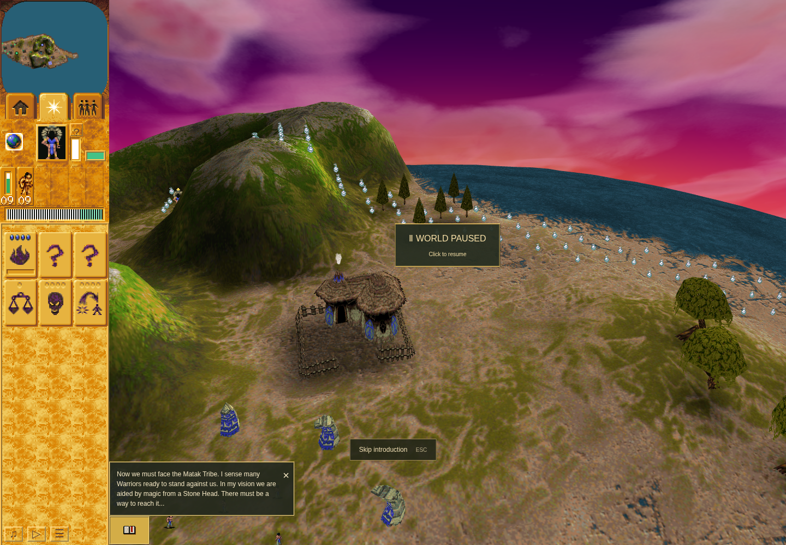

# Mission 2 linked bridge: ordinary-control baseline

This evidence-only branch preserves the incorrect old-main behavior for the linked-effect origin repair. It is not a full Mission 2 acceptance or native-parity pass.

## Observed result

Application `f0f8880127409df0c2aee569c48cfad45351faf0` (runtime identical to `b846500`) reproduced the source-level mismatch through normal play. Public **All missions → Mission 2**, Shaman HUD selection, a minimap click and a real canvas shrine click reached head 55. After ordinary Resume, the order was accepted at turn 370; worship had fired by turn 726. At paused turn 743 the live effect recorded:

- Effect position: shrine `(-113,113)`.
- Bridge start: native `(38656,34560)`, browser `(-113,113)`.
- Bridge target: native `(51968,24832)`, browser `(-61,-105)`.
- Controller turn: 19; shrine uses: 1.

The imported authored linked class-7/model-24 record instead starts at `(-77,-105)` and ends at `(-61,-105)`. The native-origin repair's separate executable probe establishes native composition; this archive establishes the old browser's ordinary live input path only.

The effect completed before the final paused turn 795. Comparing initial turn 337 with final turn 795 found **108 changed terrain heights**, within native coarse-cell bounds x150–202, y94–138. All three full terrain reads are in [extra-1.json](explore-02/extra-1.json). No player construction was ordered. A normal enemy Tower completed during the run (`stats.built=1`), so that counter must not be described as a player action or bridge-only counter. Its construction produced no height changes outside the erroneous bridge strip.



Unedited 1440×1000 software-rendered capture at turn 743. The sparkle trail crosses the home island because the linked effect starts at the distant shrine. The authored activation flyby is still active. A normal minimap click was attempted, but the scripted flyby owns this camera; no internal camera setter was used.

## Two attempts, distinct dispositions

1. [Attempt 1 receipt](explore-01/receipt.json): **failed**, 13:19:13–13:23:11 UTC. The checker clicked the shrine while UI-paused. `live-command.ts` correctly rejected the order, the Shaman stayed home, and the 180-second wait failed. No bridge result is established by this attempt. Its source, input, failure screenshot and explanatory note remain preserved.
2. [Attempt 2 receipt](explore-02/receipt.json): **passed bounded observation**, 13:26:10–13:27:46 UTC. The corrected input resumes before the world order, checks Shaman readiness, and immediately asserts an accepted worship order before waiting. The expected wrong-origin behavior was observed; a passing process does not mean that behavior matches the original.

Both receipts have identical before/after application source fingerprints and zero page/console errors. Warnings include software-WebGL fallback, ReadPixels stalls and texture-update messages. The driver inputs were separately archived and SHA-256-bound because ignored `work/` files are outside the application source fingerprint. The complete manifest records every copied input, action, screenshot and receipt.

## Controls, clock and environment limits

- Real elapsed animation-frame clock at unchanged speed 1 (12 simulation turns per active second). Normal Pause/Resume accounts for inspection time.
- No direct simulation turns, clock replacement, model commands, injected entities/resources/outcomes/terrain/storage, or direct camera setters.
- Read-only diagnostics bind existing React references, inspect Shaman eligibility and world state, project existing entities, call normal picking helpers, read terrain and validate canvas ownership. The normal picking cache is refreshed; it does not issue a game order.
- Chrome Headless Shell `154.0.8037.92`, sandbox enabled, only the reviewed `--remote-debugging-pipe` launch option.
- Actual renderer: `ANGLE (Google, Vulkan 1.3.0 (SwiftShader Device (Subzero) (0x0000C0DE)), SwiftShader driver)`. Linux, 1440×1000, DPR 1. Functional/software-rendered evidence, not hardware-performance certification.
- Mission 2 used the public direct-access tab, independent of campaign progress. No Mission 1→2 continuation, Tornado acquisition, construction/training, checkpoint, battle, victory or later campaign claim is made here.
- The native-origin fix and its corrected browser/native terrain acceptance are separate evidence. The full ordinary real-clock Mission 2 journey waits for that correction.

## Reproduction identity

The two exact scenario versions are copied under each attempt as `explore.mjs`. Each attempt also retains its exact `command-1.json`, action log, scope, input hashes and source-bound receipt. These are archived interactive inputs, not a newly maintained general regression.

Both invocations used the reviewed `scripts/local-render/harness.mjs`, private port 4360 and a distinct private TMPDIR. The first timeout was 480000 ms; the corrected retry was 360000 ms. For example:

```sh
node scripts/local-render/harness.mjs --port 4360 \
  --output work/orchestration/mission-two-controls/explore-02 \
  --scenario work/orchestration/mission-two-controls/explore.mjs --timeout 360000
```

The same invocation's guardian closed its browser and server before writing the terminal receipt. Both original exec sessions reached terminal exit statuses (first 1, second 0); the lane was released only after that evidence. No foreign processes were stopped.
