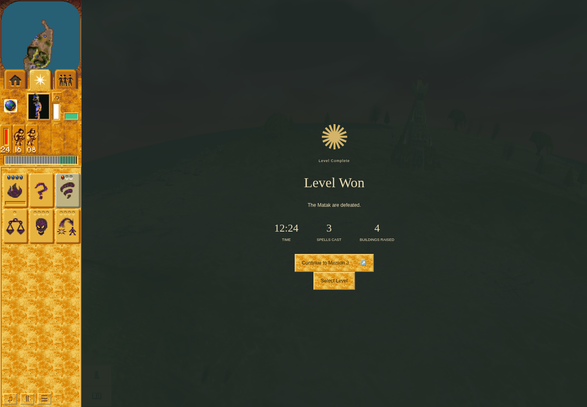

# Mission 2 ordinary-control observation, 2026-10-04

Refs [PND-11](https://github.com/JohnDeved/populous-new-dawn/issues/11). This is a
bounded observed victory, not a clean passing maintained checker, full native
parity, original-pixel comparison, hardware-performance result or parity-ledger update.

## Result and exact evidence

On application **ab6e857553fd2a534bbe34b4ba600df8a40872ff**, tree
`61fd90bb2eef7ae54325b1c8fa7c3a59fd746891`, Mission 2 reached natural `won`
at observed turn **8916**, with zero Green followers/buildings and eight surviving
Blue Warriors. The shipped All missions → Mission 2 entry was used. Ordinary
mouse/keyboard inputs and the real animation-frame clock drove all progression;
there were no direct simulation turns, commands, camera/world/storage injections.

The complete frozen driver, admitted commands, raw receipts, screenshots and
integrity manifest live on a separate evidence branch at
[`c94a819`](https://github.com/JohnDeved/populous-new-dawn/tree/c94a8194efd721d47401c9f2d649e15729545dba/references/verification/mission-two-controls-2026-10-04).
This integration contains only this note and one unedited figure. The raw archive
must not be merged wholesale into main.

*Unedited 1440×1000 browser output from ab6e857, captured 16:55:58.545 UTC at
turn8937, after the normal victory camera completed. It shows Level Won, Matak
defeated, three successful spells, four buildings raised, and Continue to Mission3.
The statistics include ordinary enemy construction. This is not an original-game image.*

## Observed journey and persistence

- Natural shrine55 worship used the corrected authored bridge origin. Nine Braves
  completed the eight-log Camp1022; the crossing was used to reach head56.
- Two followers worshipped head56 for all three Tornado gifts. Two added Huts
  supported three batches of five naturally trained Warriors, fifteen total.
- [Actual Save and fresh-page Load](https://github.com/JohnDeved/populous-new-dawn/blob/c94a8194efd721d47401c9f2d649e15729545dba/references/verification/mission-two-controls-2026-10-04/journey-02-recovery/milestones.json)
  recorded saved turn5729 and observed restored turn5747. Awaited committed IDB
  readback was asserted before reload. All21 Blue actor identities, four Blue
  building tuples, statistics and spell stocks were retained. Load normally
  auto-resumed for18 turns before the ordinary Pause.
- Actual Warrior attacks, two acquired Tornados and one Blast defeated the Matak.
  Blue losses occurred naturally; the final roster retained eight Warriors.
- The result screen visibly offered Continue to Mission3. A separate
  [awaited readonly IDB read](https://github.com/JohnDeved/populous-new-dawn/blob/c94a8194efd721d47401c9f2d649e15729545dba/references/verification/mission-two-controls-2026-10-04/journey-02-recovery/extra-25.json)
  returned committed profile `{version:1,completed:[2]}` atturn9373, matching
  memory, won status, zero Green actors/buildings and completed victory camera.
- The Continue button was then used once. Actual new scene/store identity and
  ready/selectable, actually selected Shaman46 were observed at Mission3 turn594.
  Later diagnostic-overlay failures contaminate this continuation check. It is
  a reached/selectable observation, **not clean M3 continuation or completion**.

## Failed envelope and retained corrections

Both [inner](https://github.com/JohnDeved/populous-new-dawn/blob/c94a8194efd721d47401c9f2d649e15729545dba/references/verification/mission-two-controls-2026-10-04/journey-02-recovery/receipt.json)
and [outer](https://github.com/JohnDeved/populous-new-dawn/blob/c94a8194efd721d47401c9f2d649e15729545dba/references/verification/mission-two-controls-2026-10-04/journey-02-recovery.outer.json)
terminal receipts remain **failed**, outer exit1. Seven failed batches are retained,
individually explained in [failure analysis](https://github.com/JohnDeved/populous-new-dawn/blob/c94a8194efd721d47401c9f2d649e15729545dba/references/verification/mission-two-controls-2026-10-04/failure-analysis.md):

| Batch | Actual failure and boundary |
| --- | --- |
| 4 | Camera focus cleared Hut targeting; corrected map-first batch6 built it. |
| 9 | First Tower click did not register; legacy target assertion was unsuitable for model19. Cause of missed click unproven; batch11 accepted an actual central-roof click. |
| 14 | Blast target was legitimately outside range; no cast occurred. Normal closer move/cast16 succeeded. |
| 21 | Shaman was occluded by overlapping actors. A visible enemy Warrior was clicked instead in22; normal pursuit reached victory. |
| 26 | Earlier page reload cleared the diagnostic readiness alias; its missing-function error triggered the dev overlay after Continue3. |
| 27 | The collapsed diagnostic error indicator covered Pause; normal click timed out. Ready/selected Shaman had already been observed. |
| 30 | Ordinary Dismiss succeeded, but expecting overlay host removal timed out. Remaining read/Pause/mark/finish actions never executed. The batch's finish marker caused terminal rejection of this failure. |

Batch24's non-invoked arrow read returned null and supplies no persistence proof;
batch25 is the valid awaited read. The browser error array is **not empty**:
it retains the batch26 diagnostic TypeError. Expanded overlay text/stack traces it
to the checker expression, not application code. No failed step was deleted or
relabelled. No new gameplay bug is established by these checker mistakes. The bounded
[diagnostic lifecycle repair is tracked in #194](https://github.com/JohnDeved/populous-new-dawn/issues/194).

## Source, clock and cleanup boundaries

- Inner source fingerprint before/after:
  `3d8be2c406f53e4f4cf0027b8f480b07f40ca0c52a400681fab659d5601522dc`.
  Tracked application source, frozen driver and explicitly bound inputs were unchanged.
- Driver SHA256: `cfae31661d7c4ec8335e8e6124fae2ee80e4080acbba805e136342be0b349a55`.
  Potentially mutating route/range/placement diagnostics use detached world clones.
- Sandboxed Chrome Headless Shell154.0.8037.92, software ANGLE/SwiftShader,
  1440×1000 viewport. Software-WebGL/ReadPixels/texture warnings remain in the receipt.
- Speed1 and real RAF throughout; normal Pause/Resume accounts for inspection.
  About73 wall minutes to victory includes extensive pauses/diagnosis, not an
  estimated gameplay duration. The Camp attack segment advanced314 turns over
  26.153 seconds, consistent with12 source-owned turns per active second.
- The run started15:41:54.775 and terminated17:01:21.393 UTC, before its90-minute
  resource cap. Harness cleanup completed; private4362 then refused connections,
  with no matching owned runtime processes. The earlier reset-interrupted23001
  remains **unknown**, untouched, and separately documented in the archive.

This docs-only integration changes no application/build inputs. Focused evidence
integrity, command-prefix, figure correspondence and Markdown-link checks apply;
no new application check/build or long journey is claimed. The prior accepted
main build can be traced to [PR191 evidence](https://github.com/JohnDeved/populous-new-dawn/blob/cfdf764631ab42173b0b4191abdbdd3c34d0d1e5/references/verification/authored-bridge-origin-2026-10-04/build-final.json)
(source4170e24 has the same application tree61fd90bb). Issue11 remains open.
