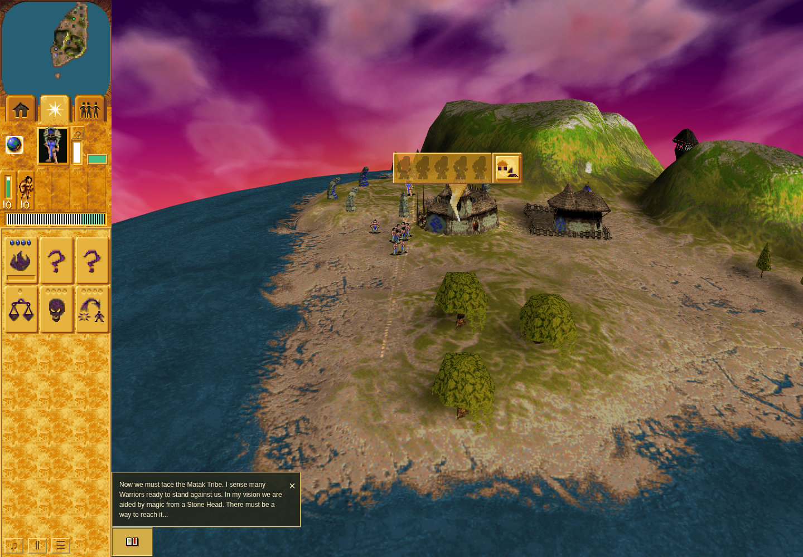
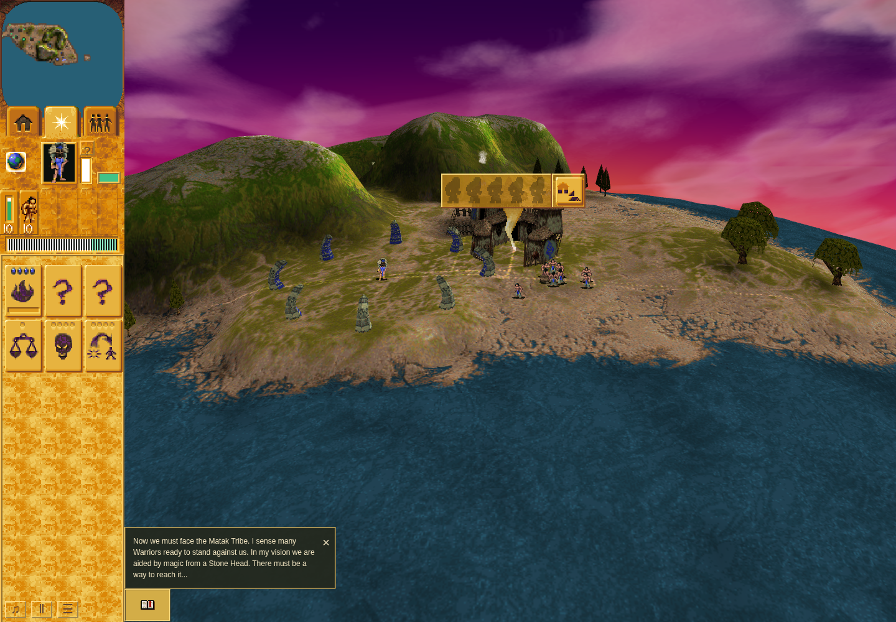

# Mission 2 Warrior Training Hut inspection

The bounded ordinary episode is independently **ACCEPTED** on product
`4e8356ef043d9963abd16a840c3246abc972fe48` and QA
`191c37ae497b0cb2093d1bee99469303cd8deba2`. The product application is byte-identical
to reviewed implementation `b34e79e341a1ef754a812a1adedf67ad1319941a`.
[Exact result review](result-review.md) · [Image/source manifest](manifest.json).

Real Mission 2 controls placed camp 1022 and assigned nine selected Braves. Each
observed construction owner retained the model-6 order for that camp. Natural RAF
progressed from turn 455/progress 0 to turn 1130/progress 1; all workers had left
and occupancy/entry ownership was empty before manual inspection began.

Hover displayed imported Warrior Training Hut string 912 and created a manual
record. Stationary right-button down/up reused it and cleared held ownership.
The actual dismantle control remained visible for the 29-visit asserted hold
boundary (72 held visits over the full phase); it was not activated. Leaving
resumed normal expiry, and returning created a fresh record.

The actual typed Save at turn 1423 exactly matched committed IndexedDB. Public
Load retained stable world data and the Page session, cleared transient
reservations, and recreated the empty panel. Both observer epochs closed without
errors and restored their input wrappers. This was an ephemeral browser context;
it proves committed Save/Load within that session.

## Natural glyph and empty panel

These exact natural canvas PNGs belong to separate paint boundaries. They do not
claim that a later full-screen composite simultaneously contained the tooltip.

## Actual control hold

## After public Load

The after-close capture receives glyph-only credit because its panel was absent.
Initially empty ordinary inspection is the accepted scope. Active/manual
coexistence has separate controlled caller coverage; natural automatic training
and occupied ordinary interaction remain unproved. Unsupported HUD/cell/panel
history stays explicit. No native timing/pool, audible or hardware-performance
claim is made.

The first episode remains a failure: its native-only observer missed the actual
`builder.person` queue owner after construction dispatch. It established placement
and builder slots but cannot establish per-worker attachment. The narrow observer
repair passed 31 composed helper contracts before the fresh accepted episode.
Raw multi-megabyte reports and browser state are not included in this packet.
