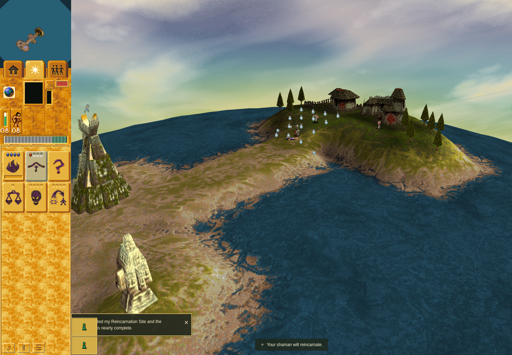
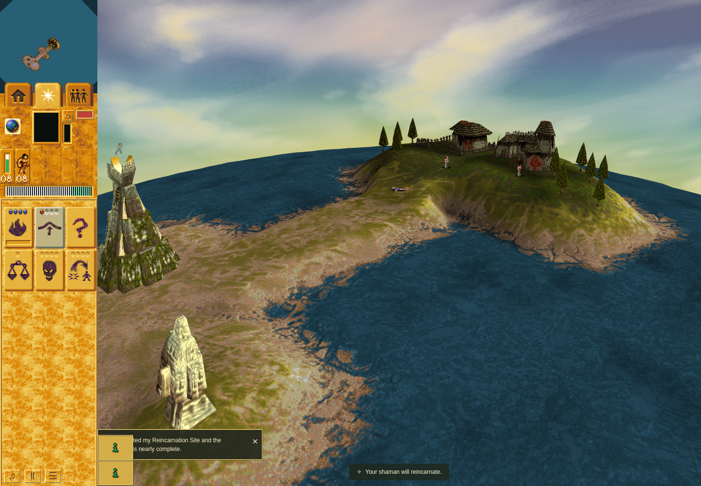

# Combined worship and Shaman ground gate

Application/checker `8b6039811adf58e4a4196fae48b56efc80613f19` normally adopts accepted main `596475b6839c948604897f8b68ff89c6290cf39d`. The registered Shaman-ground check now progresses through complete unmodified application Scene.animate frames at normal game speed, including the worship presentation clock. Historical PR212 fixed-tick receipts retain their original method and source identity.

The [independent final combined review](independent-review.md) accepts this bounded result; its [audit](independent-audit.json) binds the original raw evidence.

The terminal [render2 receipt](render2/receipt.json) and [complete observed report](render2/shaman-ground.json) pass after 2,302 elapsed frames. The first actual Bridge request/body at turn 254 arrives at 270, pays on the next ordinary turn 271 and retires at 273. Public worship earns four Bridge shots by 607. Three public casts spend stock 4→3→2→1 at turns 638, 846 and 1052; native target cells are (1,3), (1,-21) and (1,-29). Ordinary combat injures the living caster to 37 HP, the third Bridge controller starts while she still has 22.05 HP, and she dies at 1083.

Phase 1 begins at 1087. All 64 subsequent World after-turn observations match separate post-Scene frame observations through 1151. Ground changes 184→185→186 while stored height and body height remain exactly equal to it; actual visible frame-352 mesh height remains ground/128. The death anchor is stable, eight Braves survive, the outcome remains playing, and an isolated post-frame diagnostic attributes 219 framebuffer pixels to the same effect. These screenshots show the beginning and end of that same candidate observation interval, not a before-fix comparison:

The first shore probe retained the failure: the exact (0,20) projection hit Stone Head 29, and the nearest unobstructed point was 1.216 units away, outside the unchanged 0.35 threshold. One public ArrowLeft rotation changed bearing 256→1784, preserving exact object turn, stock, previous timestamp and the complete acquisition clock. The same target then passed at distance zero. Movement person/object/DOM ownership gates were preserved; only one rotation was needed in this run.

The source-reviewed scheduler holds RAF and supplies bounded 1000/24 ms complete Scene frames with timer yields. Explicit zero-elapsed camera preparation is assisted setup. Public controls own selection, worship, movement, attacks and casts. No HP, stock, mana, actor, terrain, gift or outcome is injected. Ground state is sampled after the ordinary World turn; mesh claims are sampled only after the complete frame. Observer and RAF restoration pass, with no page/console errors or presentation diagnostics. Sandboxed official Chrome 154.0.8037.92 and unchanged source/runtime bytes are bound by the outer command; browser/server shutdown completed normally.

[Full check/build at 659d16d](standard-659d16d/standard-gates-659d16d.md) passed typecheck, all 1,109 tests, parity, orchestration and production build. [Exact Git tree/blob correspondence](final-source-correspondence.json) preserves those source labels: the subsequent 8b60398 change affects only the registered camera/picking checker. Its 50 focused cases and scoped four-file ESLint check pass. The current application, assets, package files, frame/observer helpers and registry metadata are byte-identical to 659d16d.

[Failed render1](standard-659d16d/failed-render1/receipt.json) remains failed at the shore selector. Its first-Bridge observations do not imply a completed combat/ground row. The [independent failure review](standard-659d16d/failed-render1-review.md) and all raw failure observations are retained. The accepted ordinary/staged/save-load/hidden/cost matrix at cfa remains separately source-labeled in the parent evidence directory.

This is controlled-elapsed combined browser acceptance with a bounded pixel-contribution observation. It does not establish a real-clock journey, an independent full native raster oracle, hardware performance or complete issue 30 parity. Portable copies replace local paths and retain original raw SHA-256 identities; no private profiles, dependencies, original-game binaries or tools are included.

The user-reported broad sprite-animation speed issue is tracked separately in [issue214](https://github.com/JohnDeved/populous-new-dawn/issues/214). This packet establishes the stated acquisition/controller and Shaman-ground integration only; its passing checks do not resolve or attribute broad sprite timing. No speculative slowdown is included.
