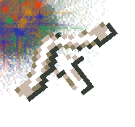
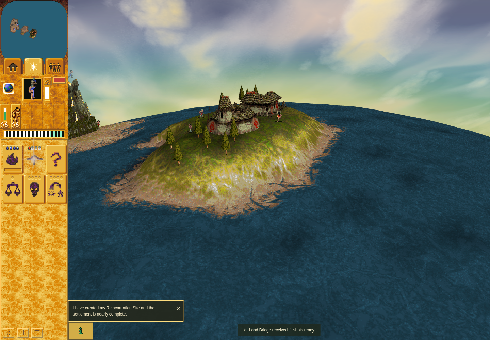

# Ordinary Bridge offscreen fallback and tab interruption

Accepted bounded candidate row at application `cfa86a32f03d021cd1ad725eed9f458ab239d56b`,
driver `e85cabfa7fbf3d4202b2261985f1d3ad5575d60c`. Terminal harness/outer command pass,
unchanged inputs, original callbacks restored and owned browser cleanup verified.

A real Brave worship order starts the authored Bridge reward. Public Focus Dakini
moves its raised anchor offscreen: cached x = -185.25 is outside the viewport left
edge 200. The handoff therefore uses logical viewport midpoint (410,250), while
mounting Spells and preserving Hut mode. A real public Followers-tab interruption
during flight is followed by arrival reopening Spells. Handoff turn 350, arrival
clamp 366, one next-turn stock/count payout 367; all presentation owners retire.

Sandboxed official Chrome Headless Shell 154.0.8037.92/SwiftShader, 1440 × 1000,
DPR 1, four CPU affinity slots and real RAF. Callback overlay crops retain actual
flight pixels. The historically named phase-zero-composite file is a host-stage
screenshot and already shows payout; it is not an exact handoff-turn capture.

Exact Canvas primitive inputs, draw arguments, browser matrix representation and
canonical Bridge source decode pass. This run has zero eligible opaque destination
samples, explicitly unproved. No full raster/native GPU/hardware-performance claim,
no new baseline pair, and no remaining-matrix/PR completion claim follow. See the
independent review and retained redacted receipts; original raw receipts remain
available to the reviewer. No game/tool binaries or browser profiles are included.
