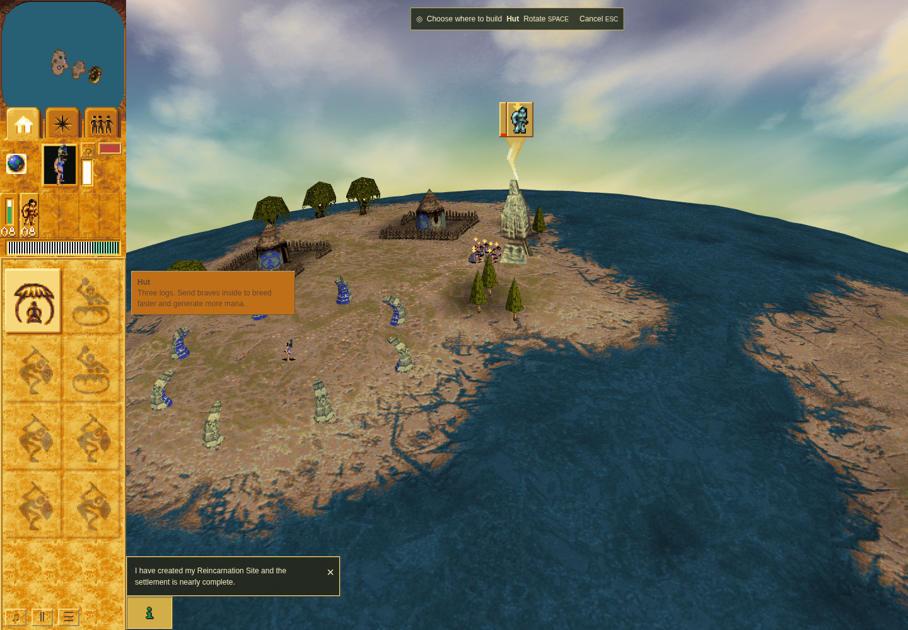
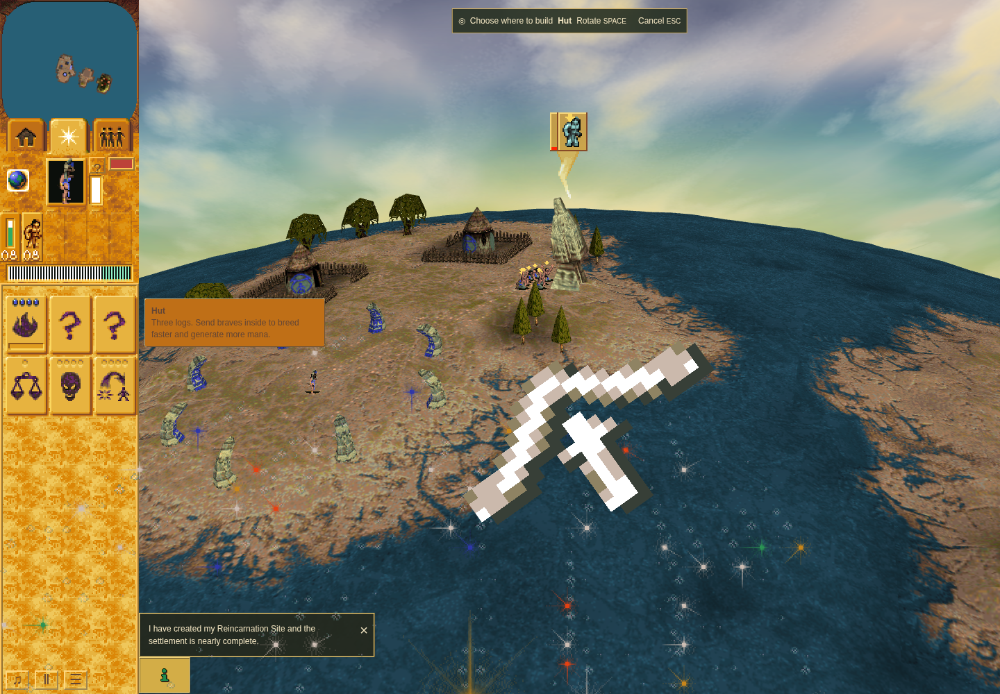

# Ordinary Mission 1 Land Bridge acquisition

A real public Brave worship order completes at the authored Land Bridge head in both
runs. The before image is from `89c9629991489fd1ce6dc52e938d1cec346bfead`, driver
`ca25d684c3d5a895be5f81cb540a7095a3ff9648`; the after image is from
`cfa86a32f03d021cd1ad725eed9f458ab239d56b`, driver
`47b432e34b8064adf3ba7524fece5ef499695a0e`. Both terminal browser and outer command
receipts passed, with verified owned cleanup and unchanged source/runtime inputs.
An independent reviewer accepted this bounded row. This is not the whole PR acceptance.

## Comparable rendered images

Both use sandboxed official Chrome Headless Shell 154.0.8037.92, SwiftShader,
1440 × 1000, DPR 1, four CPU affinity slots, a fresh game-only profile and real RAF.
Camera focus assistance precedes one trusted canvas pointer order. The images are
host-stage captures after phase zero, not a claim that they represent the same
exact simulation turn or original-game GPU pixels.

Before: ordinary gift waits in the world, Buildings remains selected with Hut mode.

After: the original-art body animates over the game and the measured Spells panel
opens automatically while Hut mode remains selected.

## Observed boundaries

- Baseline: gift born on turn 328, phase zero 334, stock payout 410 after 82 object turns.
- Candidate: phase-zero handoff 330, arrival clamp 346, exactly one stock payout on
  the next ordinary turn 347. Body, companion, pulse and overlay subsequently retire.
- Candidate draw observations include native nonzero rotation, a genuine intermediate
  pose and final leg. Exact original Canvas translate/rotate inputs match the
  analytically expected inputs, and matrices match a detached Canvas using those
  expected inputs. Canonical original-body RGBA SHA-256 matches.
- Candidate 2 had no eligible zero-angle scaled sample, so independent opaque-texel
  sampling is explicitly **unproved in this run**. Alpha output and retained overlay
  PNGs establish actual output; this does not establish a full independent raster oracle.
- No page errors, acquisition diagnostics, changed world/RNG state during overlay draw,
  duplicate stock payout or unverified cleanup were observed.

The failed candidate 1 matrix-comparison attempt is retained separately and is not
reclassified as passed. Its eight opaque source/destination texels were independently
checked against the retained PNGs and canonical decode; they are supplementary
observations from that failed run, not samples from candidate 2. Its fixed 1e-5 comparison wrongly applied a mathematical
translation to Canvas's float input representation. A separate 36-case Chrome Canvas
probe established the boundary, and the reviewed driver adds exact primitive-input
checks plus the browser representation comparison without widening tolerance or
changing any pixel expectation. The baseline execution path is unchanged by that delta.

Mission 1 Lightning, Mission 2 Tornado, offscreen anchors, interruptions, display
changes and checkpoint/restart/fault cases require their own receipts. Software
rendering cannot establish hardware frame performance or complete original raster parity.

`manifest.json` pins every PNG, source/driver commit, scenario and original raw
receipt. Portable receipts remove only local/private process/profile metadata;
original raw receipts and logs remain retained for the independent review. The
scenario copies are exact frozen checker bytes. No game data, tool binaries,
dependency trees or browser profiles are distributed in this packet.
